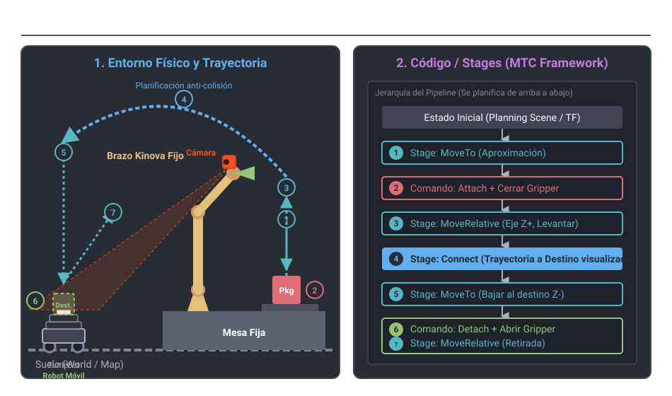

# 🍔 Burger Delivery (ROS 2 Jazzy)

[🇪🇸 Español](README.md) | [🇬🇧 English](README_en.md)



> **Project Context**: An open-source **applied research and advanced robotics education** framework built on **ROS 2 Jazzy**. It centralizes models, simulation environments, and control pipelines for a collaborative work cell where a **Kinova Gen3** manipulator spatially interacts with **differential mobile robots** (TurtleBots). The entire ecosystem coordinates dynamic transformations via `tf2`, visual localization using **AprilTags**, motion planning with **MoveIt 2**, wireless-optimized **micro-ROS** protocols, and Vision-Language Models (**Gemini Robotics-ER 1.6**) for 3D spatial reasoning.

---

## 🏛️ Core Pillars

| Pillar | Focus | Key Content |
|---|---|---|
| 🔬 **Applied Research** | Experimental testbed for Embodied AI, zero-shot 3D spatial perception, and DDS/micro-ROS network QoS determinism. | [`docs/research/`](docs/research/), [`docs/architecture/`](docs/architecture/), [`docs/manipulation/`](docs/manipulation/), [`network_setup/`](network_setup/) |
| 🎓 **Educational Ecosystem (Living Lab)** | Talent training and experimental stress testing in collaborative workcells, aligned with **ABET** criteria. | [`education/syllabus/`](education/syllabus/), [`education/talleres/`](education/talleres/), [`education/guias_laboratorio/`](education/guias_laboratorio/) |

---

## 🎯 Current Scope

This repository serves as the description package (`burger_description`), experimental platform, and documentation center:

- ✅ **Buildable ROS 2 package** with URDFs of the collaborative scene and mobile carts.
- ✅ **Vendored 3D meshes** (Kinova Gen3, Robotiq 85 grippers, and mobile carts).
- ✅ **Launch environment** for dynamic TFs, `robot_state_publisher`, and RViz2.
- ✅ **Hybrid Web Network Monitor** (`network_setup/monitor_red/`) for real-time QoS telemetry, WiFi jitter, and micro-ROS agent tracking.
- ✅ **VLM AI Perception Module** for semantic inference and 3D de-projection with Gemini Robotics.
- ✅ **Native hardware scripts** for low-latency driver patching and inertial jitter elimination.
- ✅ **Academic syllabus and lab guides** ready for university courses and research incubators.

---

## 🚀 Quick Start

### Prerequisites
- Ubuntu 24.04 with **ROS 2 Jazzy** installed. (Check `install_ros2.sh` and the guide in `ros2_setup/`).
- `colcon` build tool and ROS 2 desktop packages (`rviz2`, `joint_state_publisher_gui`, `xacro`).

### Compilation
Clone this repository into your workspace `src` folder (e.g., `~/ros2_ws/src`):

```bash
cd ~/ros2_ws
source /opt/ros/jazzy/setup.bash
colcon build --packages-select burger_description
source install/setup.bash
```
*(Alternative: run `./build_burger.sh`).*

### Execution & Visualization
Launch the base scene in RViz2:

```bash
./lanzar_robot.sh
```

Or manually:
```bash
ros2 launch burger_description display.launch.py
```

### 🌐 Network & ROS 2 Telemetry Monitor (Web Dashboard)
To monitor router-connected devices (AX12), WiFi latency/jitter, DDS domain traffic, and micro-ROS agent status (port 8888) in real-time:

```bash
bash network_setup/iniciar_monitor.sh
```
*(Automatically opens the dashboard at `http://127.0.0.1:8080`).*

---

## 📂 Project Structure

```text
burger_delivery/
├── burger_description/            # Main ROS 2 package (URDFs, visual/collision meshes, launch files)
│   ├── urdf/                      # Fixed scene and cart descriptions
│   ├── launch/                    # display.launch.py with mode switch
│   └── rviz/                      # RViz2 visualization configs
├── scripts/                       # Python tools for physical validation and driver patching
├── network_setup/                 # Hybrid web network monitor, DDS QoS, telemetry, configs
├── vision_setup/                  # RTSP camera pipeline and AprilTag localization architecture
├── ros2_setup/                    # Jazzy setup notes, Kortex installation, dependency maps
│
├── docs/                          # 🔬 Technical and Research Documentation
│   ├── research/                  # 3D spatial reasoning with Gemini Robotics
│   ├── architecture/              # System architecture and ROS 2 fundamentals
│   └── manipulation/              # MoveIt 2 planning, MTC, Kinova kinematics
│
├── education/                     # 🎓 Educational Ecosystem (Living Lab / ABET)
│   ├── syllabus/                  # Official course syllabus (ABET format)
│   ├── talleres/                  # ROS 2 CLI and URDF/TF2 guided workshops
│   ├── guias_laboratorio/         # Lab guides and editable templates
│   ├── proyectos_evaluables/      # MoveIt & Delivery integration project spec
│   └── metodologias/              # SuperStudent engineering skill log
│
├── visual/ & vendor/              # Visual resources and vendored 3D robot meshes
├── conceptos_core/                # Interactive HTML tools and visualizers
└── git-fundamentals/              # Interactive web modules for version control
```

---

## 📚 Categorized Documentation Index

### 🔬 1. Research & AI Spatial Reasoning
- [**3D Spatial Reasoning Study with Gemini Robotics**](docs/research/EXPERIMENTO_IA_LOCALIZACION_GEMINI.md) *(Zero-shot localization and affordances)*
- [**Gemini ER Integration Proposal**](ros2_setup/PROPUESTA_GEMINI_ER.md)

### 📐 2. System Architecture & Kinematics
- [**Quick Usage Guide**](burger_description/GUIA_DE_USO.md)
- [**Technical Architecture Document (Burger Delivery)**](docs/architecture/ros_burger_delivery.md)
- [**ROS 2 Fundamentals & Networking**](docs/architecture/ros.md)
- [**Web URDF Visualizer**](docs/architecture/VISUALIZAR_URDF_WEB.md)

### 🦾 3. Manipulation & Motion (Kinova & MoveIt 2)
- [**MoveIt 2 Conceptual Framework**](docs/manipulation/MARCO_CONCEPTUAL_MOVEIT2.md)
- [**MTC Motion Improvements & Ghost Visualizer**](docs/manipulation/MEJORAS_MOVIMIENTO_KINOVA.md)
- [**Motion Tests & CLI Cartesian Coordinates**](docs/manipulation/PRUEBAS_MOVIMIENTO.md)
- [**Joint Types & Kinematics**](docs/manipulation/joints.md)
- [**Kortex Driver Stack Installation**](ros2_setup/INSTALACION_KORTEX.md)

### 👁️ 4. Computer Vision & Localization
- [⭐ **AprilTag Localization Architecture**](vision_setup/LOCALIZACION_APRILTAG.md) *(Dynamic TF tree & perspective cancellation)*
- [**Native Camera Diagnostics**](vision_setup/VERIFICACION_CAMARA.md)
- [**Visual Latency Isolation (TCP vs ROS 2)**](vision_setup/DIAGNOSTICO_RED_VISION.md)

### 🌐 5. Networking, micro-ROS & Telemetry
- [⭐ **Hybrid Web Network Monitor**](network_setup/iniciar_monitor.sh)
- [**ROS 2 Network Diagnostics Guide**](network_setup/DIAGNOSTICO_RED.md)
- [**Recommended Network Configuration**](network_setup/ROS2_NETWORK_CONFIG.md)
- [**TP-Link Archer AX12 Configuration Guide**](network_setup/router_tplink_ax12_config.md)

### 🎓 6. Educational Framework & Training (ABET)
- [**Education Hub README**](education/README.md)
- [**Course Syllabus (ABET Format)**](education/syllabus/SYLLABUS_ROS2_ROBOTICA.md)
- [**URDF & TF2 Step-by-Step Workshop**](education/talleres/TALLER_URDF_TF.md)
- [**ROS 2 CLI Guided Workshop**](education/talleres/TALLER_ROS2_CLI.md)
- [**MoveIt 2 & Delivery Project Spec**](education/proyectos_evaluables/PROYECTO_INTERMEDIO_MOVEIT2_DELIVERY.md)
- [**SuperStudent Engineering Methodology**](education/metodologias/SKILL_SUPERSTUDENT.md)

---

## ⚙️ Launch Modes (Dynamic TF)

| Mode | Launch Command | When to use it |
|---|---|---|
| **Production** (Default) | `ros2 launch burger_description display.launch.py` | Real operation. The carts dynamically attach to the map when the AprilTag localization node publishes the TFs (`tag_mesa -> tag_carrito*`). |
| **Debug / Visual** | `ros2 launch burger_description display.launch.py use_static_carts:=true` | Useful if the localization node is not running. It forces the publication of static TFs to visualize the full scene. |

> ⚠️ **TF Warning**: Never publish `map -> car_base_link` if the AprilTag system is already publishing `tag_carrito -> car_base_link`. It will break the TF tree.

---

## 🛠️ Hardware & Physical Debugging Scripts
In `scripts/`:
- `apply_kinova_smooth_movement.py`: Injects low-latency parameters into C++ drivers, suppressing inertial jittering.
- `test_kinova_pose.py`: Validates Cartesian [X,Y,Z] coordinates against kinematic limits prior to MoveIt execution.
- `test_kinova_camera.py`: GStreamer/OpenCV extractor to evaluate RTSP camera feed without ROS overhead.

---

## 🖼️ System Diagrams

- **AprilTag Localization:** `vision_localizacion_whiteboard.svg`
- **Turtlebot Nav2 Architecture:** `turtlebot_nav_service.svg`
- **Transformation Tree (TF):** `tf_tree_diagram.svg`
- **ROS 2 Network Diagram:** `network_setup/ros_network_diagram.svg`
- **Software & AI Dependency Maps:** `ros2_setup/MAPA_DEPENDENCIAS.svg` and `ros2_setup/MAPA_DEPENDENCIAS_AI.svg`

---

## 📄 Citation & DOI

If you use this software in your research or educational courses, please cite it as:

```bibtex
@software{burger_delivery_2026,
  author = {Roncancio Velandia, Henry Antonio},
  title = {burger_delivery: Collaborative robotics environment in ROS 2 with Kinova Gen3 manipulation, AprilTag perception and AI model integration},
  year = {2026},
  publisher = {Zenodo},
  doi = {10.5281/zenodo.xxxxxxx},
  url = {https://github.com/roncanciovl/burger_delivery}
}
```
*(See also [CITATION.cff](CITATION.cff) and [.zenodo.json](.zenodo.json)).*
