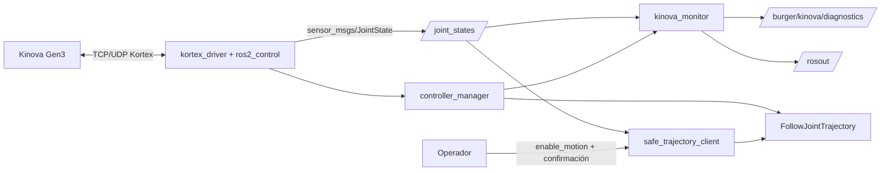

# `burger_kinova_connection`

Package ROS 2 de **pruebas de conectividad** entre el proyecto `burger_delivery` y un
manipulador **Kinova Gen3 de 7 grados de libertad**.

Verifica, monitorea y utiliza de forma controlada el enlace con el robot: confirma que el
driver y sus controladores están disponibles, valida la telemetría articular, publica un
diagnóstico comprensible y envía una trayectoria de prueba únicamente bajo condiciones
explícitas de seguridad. Incluye el **subsistema completo de logging, trazabilidad y caja
negra** descrito en [`docs/TEORIA_LOGGING_ROS2.md`](docs/TEORIA_LOGGING_ROS2.md).

> Este package **no** reimplementa el driver. Su responsabilidad empieza en las interfaces
> ROS 2 que publica `ros2_kortex`; no toca el protocolo propietario ni la API Kortex.

---

## 1. Dependencias

| Dependencia | Origen | Necesaria para |
|---|---|---|
| `rclpy`, `sensor_msgs`, `diagnostic_msgs` | ROS 2 Jazzy | Núcleo del monitor |
| `control_msgs`, `trajectory_msgs` | ROS 2 Jazzy | Cliente de trayectoria |
| `controller_manager_msgs` | `ros2_control` | Consulta de controladores |
| `rcl_interfaces`, `std_srvs` | ROS 2 Jazzy | Parámetros en caliente y servicios de la caja negra |
| `launch`, `launch_ros` | ROS 2 Jazzy | Launch unificado |
| `kortex_bringup` | [`ros2_kortex`](https://github.com/Kinovarobotics/ros2_kortex) | Sólo cuando `start_driver:=true` |
| `rosbag2_py`, `rosbag2_storage_mcap`, `rqt_console` | ROS 2 Jazzy | Evidencia y análisis post-mortem |

MoveIt 2 **no** es dependencia de este package: la planeación cartesiana está fuera del
alcance del corte 1.

Requisito de workspace — el driver de Kinova debe estar al mismo nivel que
`burger_delivery`:

```bash
cd ~/ros2_ws/src
git clone https://github.com/Kinovarobotics/ros2_kortex.git   # si aún no lo tienes
cd ~/ros2_ws
rosdep install --from-paths src --ignore-src -y
```

---

## 2. Compilación

Siempre desde la **raíz del workspace**, nunca desde una carpeta interna:

```bash
cd ~/ros2_ws
colcon build --packages-select burger_kinova_connection --symlink-install
source install/setup.bash
```

Verificación de que quedó instalado (los ejecutables deben resolverse desde `install/`,
no desde `src/`):

```bash
ros2 pkg executables burger_kinova_connection
# burger_kinova_connection kinova_monitor
# burger_kinova_connection safe_trajectory_client

ros2 launch burger_kinova_connection kinova_connection.launch.py --show-args
```

Pruebas unitarias y de estilo:

```bash
cd ~/ros2_ws
colcon test --packages-select burger_kinova_connection
colcon test-result --verbose --test-result-base build/burger_kinova_connection
```

---

## 3. Arquitectura



### Distribución entre estaciones

```text
Estación A  ── Ethernet ──> Kinova Gen3
  └─ kortex_bringup (start_driver:=true, robot_ip:=<IP verificada>)
        │
        │  DDS (mismo ROS_DOMAIN_ID, misma red)
        ▼
Estación B
  └─ burger_kinova_connection (start_driver:=false)
       kinova_monitor + safe_trajectory_client + RViz2
```

> ⚠ **Regla de unicidad del driver.** Sólo la estación conectada físicamente al robot
> ejecuta el driver. Dos instancias compiten por la única sesión de control en tiempo real
> (1 kHz) de la API Kortex —provocando *Session already in use*, timeouts de heartbeat y
> paradas de seguridad— y además duplican `/joint_states`, `/controller_manager` y el
> servidor de acción dentro del mismo `ROS_DOMAIN_ID`.
> En simulación (`use_fake_hardware:=true`) cada equipo puede usar `start_driver:=true`
> **sólo si aísla su `ROS_DOMAIN_ID`** (`export ROS_DOMAIN_ID=11`, `12`, ...).

### Tráfico Kortex frente a tráfico DDS

| | Kortex TCP/UDP | DDS |
|---|---|---|
| Extremos | Estación A ↔ IP del robot | Estación A ↔ Estación B |
| Naturaleza | Sesión propietaria punto a punto | Descubrimiento multicast + datos unicast |
| Concurrencia | **Una sola** sesión de control a 1 kHz | Múltiples nodos y suscriptores |
| Configuración | `robot_ip` | `ROS_DOMAIN_ID`, `RMW_IMPLEMENTATION` |

DDS **no sustituye** la conexión con el robot: si la estación B ve `/joint_states` es
porque la estación A los está publicando.

---

## 4. Interfaces ROS 2

### Consumidas

| Nombre | Tipo | QoS | Uso |
|---|---|---|---|
| `/joint_states` | `sensor_msgs/msg/JointState` | `sensor_data` (BEST_EFFORT, KEEP_LAST/5) | Posición y nombres de las articulaciones |
| `/controller_manager/list_controllers` | `controller_manager_msgs/srv/ListControllers` | — | Confirmar controladores activos |
| `/joint_trajectory_controller/follow_joint_trajectory` | `control_msgs/action/FollowJointTrajectory` | — | Enviar y supervisar la trayectoria |

### Publicadas

| Nombre | Tipo | QoS | Uso |
|---|---|---|---|
| `/burger/kinova/diagnostics` | `diagnostic_msgs/msg/DiagnosticArray` | **RELIABLE**, VOLATILE, depth 10 | Estado consolidado del enlace |
| `/rosout` | `rcl_interfaces/msg/Log` | estándar de ROS 2 | Cronología de eventos y transiciones |

### Servicios ofrecidos por `kinova_monitor`

| Servicio | Tipo | Uso |
|---|---|---|
| `~/dump_flight_recorder` | `std_srvs/srv/Trigger` | Volcar la caja negra en nivel `DEBUG` |
| `~/trigger_anomaly` | `std_srvs/srv/SetBool` | Inyectar o despejar una anomalía de ensayo |
| `~/rehabilitar_movimiento` | `std_srvs/srv/Trigger` | Rehabilitación **explícita** tras un bloqueo |

#### Justificación de las decisiones de QoS

- **`/joint_states` con perfil de datos de sensor.** Es un flujo periódico de alta
  frecuencia: ante congestión preferimos perder una muestra antigua a acumular
  retransmisiones que envejezcan la telemetría. Un suscriptor `BEST_EFFORT` es compatible
  con el publicador `RELIABLE` del driver, así que la elección no impide el
  descubrimiento.
- **`/burger/kinova/diagnostics` con comunicación fiable.** Un diagnóstico es un *evento*,
  no una muestra. Perder la transición a `ERROR` invalidaría la evidencia del incidente,
  así que se exige entrega garantizada.

---

## 5. Parámetros

Todos residen en [`config/kinova_connection.yaml`](config/kinova_connection.yaml) y se
sobrescriben desde el launch o con `--ros-args -p`.

| Parámetro | Tipo | Valor seguro | Propósito |
|---|---|---:|---|
| `start_driver` | bool | `false` | Incluir `kortex_bringup` en esta estación |
| `robot_ip` | string | `0.0.0.0` | IP del robot cuando el driver arranca localmente |
| `use_fake_hardware` | bool | `true` | Validar sin movimiento físico |
| `launch_rviz` | bool | `false` | Abrir RViz como observador |
| `enable_motion` | bool | `false` | Habilitación explícita de comandos físicos |
| `joint_state_timeout_s` | double | `1.0` | Edad máxima tolerada de `/joint_states` |
| `min_joint_state_hz` | double | `20.0` | Frecuencia mínima aceptada |
| `max_joint_delta_rad` | double | `0.10` | Cambio máximo permitido por articulación |
| `trajectory_duration_s` | double | `5.0` | Duración mínima de la trayectoria |
| `diagnostic_rate_hz` | double | `1.0` | Frecuencia del diagnóstico |
| `safe_joint_positions_rad` | double[7] | aprobada en laboratorio | Meta de la prueba controlada |
| `joint_min_rad` / `joint_max_rad` | double[7] | límites aprobados | Validación local previa al envío |
| `dry_run` | bool | `true` | El cliente valida sin contactar el action server |
| `require_operator_confirmation` | bool | `true` | Confirmación por teclado antes de enviar |
| `log_level` | string | `info` | Nivel de log, cambiable **en caliente** |
| `log_throttle_period_s` | double | `2.0` | Periodo de los logs limitados en frecuencia |
| `enable_flight_recorder` | bool | `true` | Búfer circular de telemetría en RAM |
| `flight_recorder_samples` | int | `200` | Tamaño del búfer de la caja negra |
| `log_state_transitions` | bool | `true` | Emitir sólo los cambios de estado a `/rosout` |

**Validación al iniciar.** Un valor ausente, inválido o fuera de rango impide el
movimiento y produce un mensaje de error claro. En particular, `robot_ip:=0.0.0.0` se
rechaza cuando `start_driver:=true` y `use_fake_hardware:=false`, y el launch se detiene
antes de arrancar el driver.

**Sin credenciales.** Ninguna IP, usuario o contraseña vive en el código Python, y no hay
rutas absolutas dependientes del computador del desarrollador.

> ⚠ **Precedencia de parámetros: por qué casi todo vive bajo `/**` en el YAML.**
> ROS 2 da **más precedencia a una sección con el nombre del nodo dentro de un
> `--params-file` que a un override `-p` de la línea de comandos** (este último se
> registra bajo el comodín `/**`). Si `dry_run` estuviera bajo `safe_trajectory_client:`,
> el comando documentado `-p dry_run:=false` se ignoraría **en silencio** y la prueba
> PA-08 nunca enviaría la meta. Por eso todo lo que se sobrescribe desde la CLI vive bajo
> `/**`, y las secciones con nombre de nodo se reservan para el ajuste fino que nadie
> cambia sobre la marcha. Verifica siempre el valor efectivo en la línea de arranque del
> nodo (`dry_run=False | enable_motion=True`) antes de dar por buena una prueba.

---

## 6. Modos de ejecución

### 6.0. Antes de cada sesión de pruebas: entorno y daemon

En WSL el daemon de la CLI de ROS 2 se queda bloqueado con frecuencia (`ros2 node list`,
`ros2 topic list` o `ros2 param set` terminan en `TimeoutError`). **Reinícialo siempre al
comenzar**, siguiendo [`TROUBLESHOOTING.md`](../TROUBLESHOOTING.md):

```bash
timeout 5s ros2 daemon stop
pgrep -af '_ros2_daemon'          # si quedó vivo: kill <PID>
ros2 daemon start
timeout 5s ros2 daemon status
```

Y carga el entorno acordado del curso **en todas las terminales**:

```bash
source /opt/ros/jazzy/setup.bash
source ~/ros2_ws/install/setup.bash
export ROS_DOMAIN_ID=0                      # dominio de pruebas del curso
export RMW_IMPLEMENTATION=rmw_cyclonedds_cpp
export CYCLONEDDS_URI="file://$HOME/ros2_ws/src/burger_delivery/network_setup/cyclonedds.xml"
```

> El descubrimiento se deja en su valor por defecto (`ROS_AUTOMATIC_DISCOVERY_RANGE=SUBNET`):
> las estaciones del laboratorio se descubren por la subred. **No** lo cambies a
> `LOCALHOST`; eso aislaría la estación B y rompería la operación distribuida (RF-07).
> El daemon queda asociado al `ROS_DOMAIN_ID` y al RMW con los que arrancó, así que
> detenlo antes de cambiar cualquiera de los dos.

### 6.1. Validación sin robot (modo fake)

```bash
ros2 launch burger_kinova_connection kinova_connection.launch.py \
  start_driver:=true \
  robot_ip:=0.0.0.0 \
  use_fake_hardware:=true \
  enable_motion:=false
```

> **La pinza se omite automáticamente en modo fake.** El bloque `ros2_control` del
> Robotiq 2F-85 de `ros2_kortex` declara `command_interface` sobre cinco articulaciones
> `mimic` cuando el xacro conmuta a `mock_components/GenericSystem`. ROS 2 Jazzy lo
> rechaza y **aborta** el `ros2_control_node`:
>
> ```text
> terminate called after throwing an instance of 'std::runtime_error'
>   what():  Joint 'robotiq_85_right_knuckle_joint' has mimic attribute not set to false:
>            Activated mimic joints cannot have command interfaces.
> ```
>
> Es una incompatibilidad de `ros2_kortex` con Jazzy, no de este package, y no puede
> corregirse aquí porque el requisito de calidad prohíbe modificar `ros2_kortex`. Como la
> pinza además está fuera del alcance del corte 1, el launch la omite en modo fake, lo
> avisa por consola y valida el brazo de 7 GDL completo. **Con hardware real la pinza sí
> se transfiere**: en esa rama del xacro las articulaciones `mimic` no llevan
> `command_interface` y el driver arranca sin problema.
>
> Para reproducir el fallo a propósito: `force_gripper_in_fake:=true`.
> Para pedir el brazo solo también con hardware real: `gripper:=none`.

### 6.2. Driver y monitor en la misma estación

```bash
ros2 launch burger_kinova_connection kinova_connection.launch.py \
  start_driver:=true \
  robot_ip:=192.168.1.10 \
  use_fake_hardware:=false \
  enable_motion:=false
```

La IP anterior es un ejemplo del laboratorio: ajústala a la configuración verificada el
día de la práctica.

### 6.3. Monitor como cliente en una segunda estación

```bash
export ROS_DOMAIN_ID=<dominio_del_equipo>
ros2 launch burger_kinova_connection kinova_connection.launch.py \
  start_driver:=false \
  enable_motion:=false
```

### 6.4. Ejecutables sueltos

```bash
ros2 run burger_kinova_connection kinova_monitor --ros-args \
  --params-file $(ros2 pkg prefix burger_kinova_connection)/share/burger_kinova_connection/config/kinova_connection.yaml

ros2 run burger_kinova_connection safe_trajectory_client --ros-args \
  --params-file $(ros2 pkg prefix burger_kinova_connection)/share/burger_kinova_connection/config/kinova_connection.yaml \
  -p dry_run:=true
```

---

## 7. Cómo interpretar `/burger/kinova/diagnostics`

```bash
ros2 topic echo /burger/kinova/diagnostics
```

El array trae cuatro `DiagnosticStatus`:

| `name` | Qué reporta |
|---|---|
| `estado general` | `OK`/`WARN`/`ERROR` consolidado, modo fake o real, habilitación de movimiento, último error y nivel de log vigente |
| `telemetría /joint_states` | Edad, frecuencia estimada, intervalo máximo, articulaciones detectadas y faltantes, mensajes rechazados, interrupciones, muestras en la caja negra y **acción recomendada** |
| `controladores ros2_control` | Disponibilidad del servicio, controladores requeridos, cuáles no están activos y el estado individual de cada uno |
| `habilitación de movimiento` | `enable_motion`, si hay bloqueo enclavado y por qué, anomalía inyectada y el comando exacto de rehabilitación |

### Criterio de clasificación

| Estado | Condición |
|---|---|
| `OK` | Telemetría fresca, siete articulaciones y frecuencia ≥ `min_joint_state_hz` |
| `WARN` | Enlace vivo pero degradado: frecuencia baja o mensajes rechazados |
| `ERROR` | Sin telemetría, telemetría vencida, articulaciones faltantes o controlador requerido inactivo |

Cada transición queda registrada una sola vez en `/rosout`:

```
[INFO]  [TRANSICIÓN] INICIO -> OK  | telemetría saludable: 40.0 Hz, edad 0.012 s, 7/7 articulaciones
[ERROR] [TRANSICIÓN] OK -> ERROR   | telemetría vencida: 1.35 s sin mensaje válido (límite 1.00 s)
[INFO]  [TRANSICIÓN] ERROR -> OK   | telemetría saludable: 39.8 Hz, edad 0.010 s, 7/7 articulaciones
```

---

## 8. Prueba articular segura

El cliente ejecuta siete pasos: valida la configuración → espera telemetría fresca →
construye la meta desde la pose aprobada en YAML → valida límites, delta y duración →
muestra el resumen al operador → espera al servidor de acción → envía y reporta.

### Paso 1 — modo seco (obligatorio antes de cualquier movimiento)

```bash
ros2 run burger_kinova_connection safe_trajectory_client --ros-args \
  --params-file .../config/kinova_connection.yaml -p dry_run:=true
```

Se ejecuta **toda** la validación y **no** se contacta el servidor de acción. Salida
esperada cuando algo bloquea:

```
── Resumen de la trayectoria de prueba ──
  Duración solicitada: 5.00 s
  articulación        actual [rad]     meta [rad]      Δ [rad]
  joint_1                   0.0012         0.0000      -0.0012
  ...
  Estado: META BLOQUEADA antes de contactar el servidor de acción:
    ✗ movimiento deshabilitado (enable_motion=false). En modo fake habilítalo de forma
      explícita para completar la prueba
```

### Paso 2 — ejecución supervisada

```bash
ros2 run burger_kinova_connection safe_trajectory_client --ros-args \
  --params-file .../config/kinova_connection.yaml \
  -p dry_run:=false -p enable_motion:=true
```

El cliente pide confirmación por teclado (`si`) cuando corre en una terminal interactiva.

### Requisitos de seguridad (no negociables)

1. `enable_motion` arranca siempre en `false`.
2. La primera validación se hace con `use_fake_hardware:=true`.
3. Toda prueba física requiere espacio despejado, parada de emergencia accesible y
   autorización del responsable del laboratorio.
4. Velocidad y aceleración quedan limitadas por la configuración aprobada del controlador.
5. No se desactivan límites articulares ni protecciones del fabricante.
6. No se limpian fallas automáticamente para continuar una prueba.
7. Con estado articular vencido, incompleto o fuera de límites, el envío se bloquea.
8. Tras una pérdida de comunicación el movimiento permanece bloqueado hasta una
   rehabilitación explícita:
   ```bash
   ros2 service call /kinova_monitor/rehabilitar_movimiento std_srvs/srv/Trigger
   ```

### Códigos de salida del cliente

| Código | Significado |
|---:|---|
| `0` | Éxito, o validación en modo seco superada |
| `1` | Meta bloqueada por seguridad |
| `2` | Fallo de infraestructura (sin telemetría, sin servidor de acción) |
| `3` | Meta rechazada, abortada o vencida por timeout |

---

## 9. Logging, evidencia y análisis post-mortem

La teoría completa está en [`docs/TEORIA_LOGGING_ROS2.md`](docs/TEORIA_LOGGING_ROS2.md).
Resumen operativo:

```bash
# Nivel de log en caliente, sin reiniciar el nodo:
ros2 param set /kinova_monitor log_level debug
ros2 param set /kinova_monitor log_throttle_period_s 0.5

# Flujo estructurado de logs de toda la red y consola gráfica filtrable:
ros2 topic echo /rosout
ros2 run rqt_console rqt_console

# Formato de consola con archivo y línea de origen (antes de lanzar el nodo):
export RCUTILS_COLORIZED_OUTPUT=1
export RCUTILS_CONSOLE_OUTPUT_FORMAT="[{severity}] [{time}] [{name} -> {function_name}:{line_number}]: {message}"

# Caja negra: inyectar anomalía, volcar el historial previo y rehabilitar:
ros2 service call /kinova_monitor/trigger_anomaly std_srvs/srv/SetBool "{data: true}"
ros2 service call /kinova_monitor/dump_flight_recorder std_srvs/srv/Trigger
ros2 service call /kinova_monitor/trigger_anomaly std_srvs/srv/SetBool "{data: false}"
ros2 service call /kinova_monitor/rehabilitar_movimiento std_srvs/srv/Trigger

# Grabación quirúrgica de evidencia (MCAP + zstd, tópicos explícitos):
ros2 run burger_kinova_connection record_kinova_bag.sh dataset_pa03 60
# o directamente:
ros2 bag record -s mcap --compression-mode file --compression-format zstd \
  -o dataset_pa03 /joint_states /burger/kinova/diagnostics /rosout
ros2 bag info dataset_pa03
```

> Graba `/rosout` junto a `/joint_states`: la caída de la telemetría y la línea `ERROR`
> que la explica quedan así en el mismo archivo, con marcas de tiempo correlacionadas.

---

## 10. Diagnóstico de fallas

Recorre las capas **en este orden**; no saltes ninguna.

| # | Síntoma | Verificación | Causa habitual |
|---|---|---|---|
| 1 | `estado_general = ERROR`, `edad_s = sin_datos` | `ros2 node list`, `ros2 topic list` | Driver no arrancado, o `ROS_DOMAIN_ID` distinto entre estaciones |
| 2 | Nodos visibles pero sin telemetría | `ros2 topic hz /joint_states` | Firewall o multicast DDS bloqueado en la red del laboratorio |
| 3 | `frecuencia_hz` por debajo del mínimo | `ros2 topic hz /joint_states`, `top` | WiFi saturado o CPU al límite; considera Ethernet |
| 4 | `articulaciones_faltantes` no vacío | `ros2 topic echo /joint_states --once` | Bringup lanzado sin `dof:=7` o con el modelo equivocado |
| 5 | Controladores no activos | `ros2 control list_controllers` | El spawner falló; revisa el log del bringup |
| 6 | `[INFRAESTRUCTURA] servidor de acción no apareció` | `ros2 action list` | `joint_trajectory_controller` inactivo o nombre de acción distinto |
| 7 | `META BLOQUEADA` | Informe del cliente en modo seco | Cada motivo aparece con su valor concreto |
| 8 | Telemetría con saltos temporales | `ros2 node list \| grep -c kortex` | **Dos drivers** para el mismo robot: viola la regla de unicidad |
| 9 | `ros2 node/topic/param` termina en `TimeoutError` | `timeout 15s ros2 node list --no-daemon` | Daemon de la CLI bloqueado en WSL: reinícialo (sección 6.0) |
| 10 | `ros2_control_node` aborta con `Activated mimic joints cannot have command interfaces` | `use_fake_hardware:=true` con pinza | Incompatibilidad `ros2_kortex`/Jazzy: el launch ya la evita en modo fake (sección 6.1) |
| 12 | Overruns del `controller_manager`, `BaseCyclicClient::Refresh` timeout, pérdidas de telemetría | `ping -c 500 -i 0.02 <robot>`: mira **mdev y max**, no avg | La estación del driver está por WiFi. Pásala a cable |
| 11 | Un `-p` de la CLI parece ignorarse | Lee la línea `... iniciado \| dry_run=... \| enable_motion=...` | La sección con nombre de nodo del YAML gana sobre `-p` (sección 5) |

Referencias del repositorio:
[diagnóstico de red](../network_setup/DIAGNOSTICO_RED.md) ·
[configuración de red ROS 2](../network_setup/ROS2_NETWORK_CONFIG.md) ·
[instalación de Kortex](../ros2_setup/INSTALACION_KORTEX.md).

---

## 11. Lista de verificación para el Kinova real

Todo lo anterior queda validado en simulación. Para la sesión con el robot físico:

1. **Antes de tocar nada**, reinicia el daemon y carga el entorno de la sección 6.0 en
   todas las terminales de las dos estaciones.
2. Confirma que **una sola** estación tendrá `start_driver:=true`. Dos drivers contra el
   mismo Kinova compiten por la única sesión de control a 1 kHz de la API Kortex.
   **Esa estación debe estar conectada por cable Ethernet, no por WiFi.** No es una
   recomendación de rendimiento: medido sobre el robot real, por WiFi el ciclo de
   control se rompe (132 overruns, un hueco de 3.25 s y 2 pérdidas de telemetría en
   120 s), mientras que por cable el peor intervalo fue de 20.6 ms y no hubo ninguna
   pérdida. Las estaciones cliente (`start_driver:=false`) sí pueden ir por WiFi: sólo
   consumen telemetría por DDS. Detalle en
   [`docs/EXPERIMENTO_ENLACE_WIFI_VS_ETHERNET.md`](docs/EXPERIMENTO_ENLACE_WIFI_VS_ETHERNET.md).
3. Verifica la ruta física antes del launch:
   ```bash
   ping -c 4 192.168.1.10        # ajusta a la IP verificada el día de la práctica
   ```
4. Ajusta en `config/kinova_connection.yaml` la pose aprobada y los límites reales:
   `safe_joint_positions_rad`, `joint_min_rad`, `joint_max_rad`. El launch rechaza
   `robot_ip:=0.0.0.0` con `use_fake_hardware:=false`, así que la IP es obligatoria.
5. **Primera pasada sin movimiento** (estación A):
   ```bash
   ros2 launch burger_kinova_connection kinova_connection.launch.py \
     start_driver:=true robot_ip:=192.168.1.10 use_fake_hardware:=false \
     enable_motion:=false
   ```
   Espera `[TRANSICIÓN] INICIO -> OK` y `[CONTROLADORES] ... =active`. La pinza 2F-85 sí
   se transfiere en este modo.
6. **Estación B como cliente**, sin driver:
   ```bash
   ros2 launch burger_kinova_connection kinova_connection.launch.py start_driver:=false
   ```
7. **Modo seco obligatorio** antes de cualquier movimiento, y sólo entonces la prueba
   supervisada con espacio despejado y parada de emergencia accesible (sección 8).
8. Graba la evidencia con `scripts/record_kinova_bag.sh` desde antes de lanzar el driver.

## 12. Pruebas de aceptación

| ID | Prueba | Comando / procedimiento | Resultado esperado |
|---|---|---|---|
| PA-01 | Compilación limpia | `colcon build --packages-select burger_kinova_connection` y `colcon test` | Sin errores de compilación, importación ni estilo |
| PA-02 | Grafo en modo fake | Modo 6.1 + `ros2 node list`, `ros2 topic list` | Monitor activo, siete articulaciones, diagnóstico publicado |
| PA-03 | Telemetría real | Modo 6.2 + `ros2 topic hz /joint_states` durante 60 s | Siete articulaciones, sin interrupciones, frecuencia > mínimo |
| PA-04 | Controladores | `ros2 control list_controllers` y el estado del diagnóstico | Broadcaster y controlador de trayectoria `active` |
| PA-05 | Pérdida de enlace | Detener el driver o aislar la red | `[TRANSICIÓN] OK -> ERROR` tras el timeout, sin caída del monitor |
| PA-06 | Recuperación | Restaurar el driver o la red | `[TRANSICIÓN] ERROR -> OK` sin reiniciar el monitor |
| PA-07 | Validación de meta | Modo seco con pose incompleta, límite excedido y movimiento deshabilitado | Las tres metas se bloquean antes de contactar el action server |
| PA-08 | Movimiento autorizado | Paso 2 de la sección 8, con supervisión | Meta aceptada, movimiento lento, `error_code=SUCCESSFUL` |
| PA-09 | DDS distribuido | Driver en estación A, monitor en estación B | Descubrimiento, telemetría y diagnóstico funcionales |
| PA-10 | Reproducibilidad | Seguir este README desde un workspace limpio | Otra persona compila, lanza y repite las pruebas |

Resultados medidos de esta base: [`docs/VALIDACION_CORTE_1.md`](docs/VALIDACION_CORTE_1.md)
— PA-01, PA-02, PA-04, PA-05, PA-06, PA-07 y PA-08 verificados en simulación con el driver
oficial; PA-03, PA-09 y PA-10 quedan marcados como pendientes del robot real y de la
segunda estación. Cada equipo documenta ahí sus propios resultados, con comandos, fecha,
entorno y observaciones.

---

## 13. Estructura del package

```text
burger_kinova_connection/
├── package.xml
├── setup.py / setup.cfg
├── README.md
├── resource/burger_kinova_connection
├── burger_kinova_connection/
│   ├── __init__.py
│   ├── kinova_monitor.py           # nodo monitor y publicador de diagnóstico
│   ├── safe_trajectory_client.py   # cliente de acción con validación de seguridad
│   ├── link_metrics.py             # métricas y clasificación del enlace (lógica pura)
│   ├── safety.py                   # validación de metas y configuración (lógica pura)
│   ├── logging_support.py          # niveles, throttling, nivel dinámico, transiciones
│   └── flight_recorder.py          # caja negra: búfer circular y volcado post-mortem
├── launch/kinova_connection.launch.py
├── config/kinova_connection.yaml
├── docs/
│   ├── TEORIA_LOGGING_ROS2.md      # teoría del subsistema de logging de ROS 2
│   ├── VALIDACION_CORTE_1.md       # registro de las pruebas de aceptación
│   └── EXPERIMENTO_ENLACE_WIFI_VS_ETHERNET.md   # A/B del enlace sobre el robot real
├── scripts/
│   ├── record_kinova_bag.sh        # grabación quirúrgica de evidencia
│   ├── benchmark_enlace_kinova.sh  # una rama de un experimento A/B del enlace
│   └── analizar_enlace.py          # distribución insesgada de intervalos
└── test/                           # pruebas unitarias + estilo (flake8, pep257, copyright)
```

La lógica de validación vive en módulos **sin dependencia de `rclpy`**, de modo que las
pruebas de mensajes incoherentes, timeouts y límites de meta se ejecutan con `colcon test`
sin robot ni grafo ROS 2 activo.

---

## 14. Licencia

Apache-2.0. Parte del proyecto educativo `burger_delivery` — Universidad Militar Nueva
Granada.
