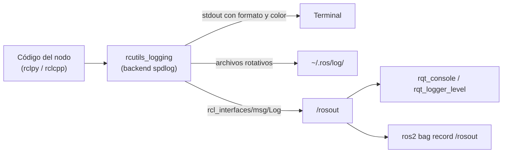
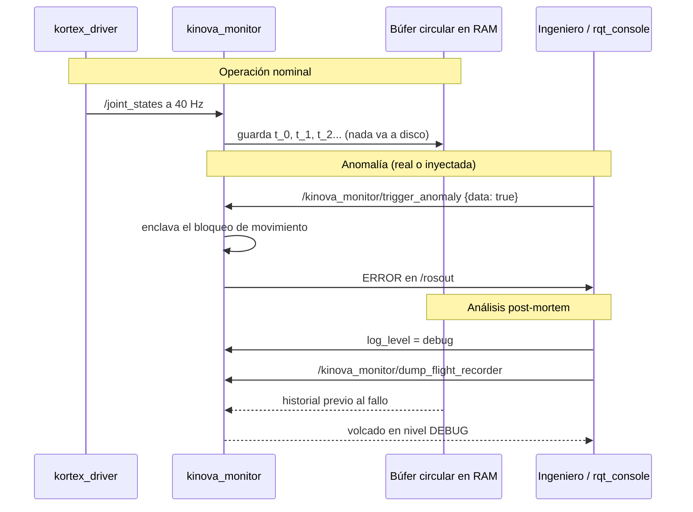
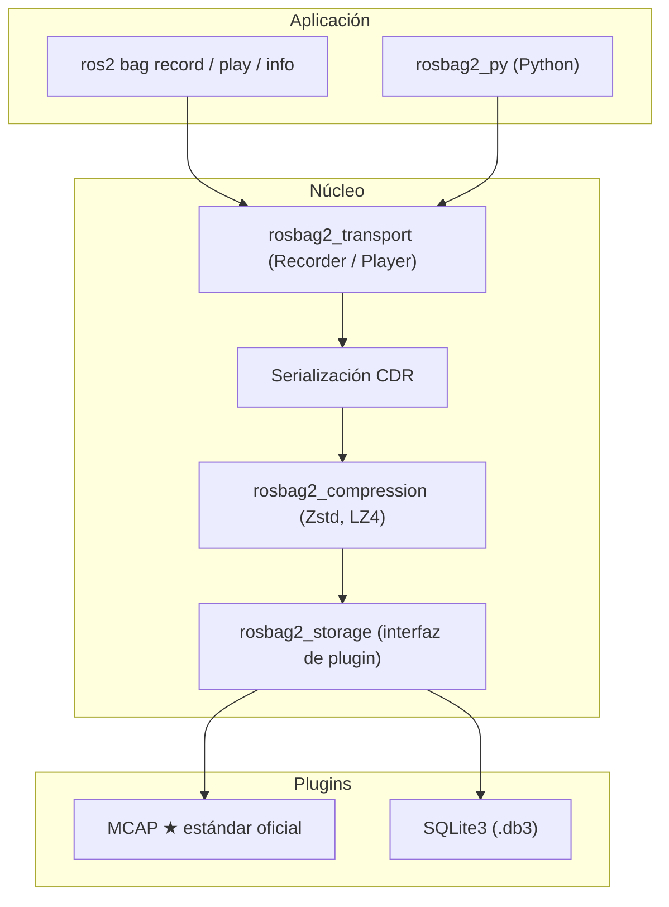

# Teoría del subsistema de logging de ROS 2 aplicada al enlace con el Kinova Gen3

> Documento de referencia del package `burger_kinova_connection`.
> Desarrolla la teoría del taller [`TALLER_ROSBAG_LOGGING_DEBUGGING.md`](../../education/talleres/TALLER_ROSBAG_LOGGING_DEBUGGING.md)
> y la conecta con el código que la implementa dentro de este package.

---

## 0. Por qué el logging es parte de la prueba de conectividad

Un enlace con un manipulador puede fallar en cinco capas distintas —cable Ethernet,
sesión TCP/UDP de la API Kortex, `ros2_control`, descubrimiento DDS y lógica del nodo—
y el síntoma visible es casi siempre el mismo: *"el robot no se mueve"*.

La **regla de oro** del taller es depurar **por capas**: nunca culpar al algoritmo de
control sin haber verificado antes el transporte y la sincronización con trazas
estructuradas. Este package materializa esa regla: cada estado del enlace se registra
con una severidad, un motivo y una **acción recomendada** concreta, y la evidencia
resultante se puede grabar, reproducir y analizar sin el robot presente.

---

## 1. Arquitectura del subsistema

El logging de ROS 2 **no** es un `print()`. Está construido sobre la biblioteca de alto
rendimiento `rcutils` con backend `spdlog`, y distribuye cada mensaje a tres destinos
independientes:



| Destino | Persistencia | Uso típico en el proyecto |
|---|---|---|
| Consola | Efímera | Observación en vivo durante la práctica |
| `~/.ros/log/` | Rotativa en disco | Evidencia post-mortem de una sesión completa |
| `/rosout` | Tópico ROS 2 | Filtrado con `rqt_console` y grabación con `rosbag2` |

Que `/rosout` sea un **tópico** es la propiedad clave: los logs de todos los nodos de la
red —incluidos los de la estación A cuando el driver corre allí— pueden observarse desde
la estación B y grabarse en la misma bolsa que la telemetría, con marcas de tiempo
correlacionadas.

> **Implementado en:** [`logging_support.py`](../burger_kinova_connection/logging_support.py),
> función `describe_logging_environment()` y `log_logging_banner()`, que reportan al
> arrancar qué formato, qué nivel y qué directorio de logs produjeron cada captura.

---

## 2. Los cinco niveles de severidad

| Nivel | Valor | Criterio | Ejemplo real en `burger_kinova_connection` |
|---|---:|---|---|
| `DEBUG` | 10 | Trazas por ciclo. **Desactivado en operación normal** para no degradar el determinismo. | Posición de las siete articulaciones en cada mensaje, delta calculado por articulación, volcado de la caja negra |
| `INFO` | 20 | Progreso verificable | `kinova_monitor iniciado`, `Meta ACEPTADA por el controlador`, cambio en la lista de controladores |
| `WARN` | 30 | Condición inesperada pero recuperable | Frecuencia de `/joint_states` por debajo del mínimo, `list_controllers` todavía no disponible |
| `ERROR` | 40 | Falla funcional que impide la tarea | Telemetría vencida, meta rechazada, límite articular excedido, servidor de acción ausente |
| `FATAL` | 50 | Condición crítica de seguridad | Excepción no controlada que termina el nodo. **Nunca** se usa para "recuperarse solo" |

El valor numérico es exactamente el que viaja en el campo `level` de
`rcl_interfaces/msg/Log`, y es por el que filtra `rqt_console`.

> **Implementado en:** diccionarios `SEVERITY_VALUE` y `SEVERITY_POLICY` de
> `logging_support.py`. La política de uso está escrita **en el código** para que la
> revisión por pares del pull request pueda verificar que un mensaje está en el nivel
> correcto, en lugar de discutirlo de memoria.

### Regla de seguridad asociada

El requisito §11.6 prohíbe limpiar fallas automáticamente para continuar una prueba. Por
eso un `ERROR` en este package **nunca** se auto-despeja: el bloqueo de movimiento queda
enclavado (*latch*) y sólo una acción humana explícita lo libera.

---

## 3. Control dinámico del nivel en caliente

En una misión real no se puede detener el robot y recompilar sólo para añadir una traza.
ROS 2 ofrece cuatro caminos para cambiar la verbosidad, del más estático al más dinámico:

```bash
# 1. Al arrancar el proceso (estático):
ros2 run burger_kinova_connection kinova_monitor --ros-args --log-level DEBUG

# 2. Sólo para un nodo concreto dentro de un launch con varios nodos:
ros2 run burger_kinova_connection kinova_monitor --ros-args \
    --log-level kinova_monitor:=DEBUG

# 3. En caliente, por parámetro (el mecanismo que implementa este package):
ros2 param set /kinova_monitor log_level debug
ros2 param set /kinova_monitor log_throttle_period_s 0.5

# 4. En caliente, por servicio estándar de rcl:
ros2 service call /kinova_monitor/set_logger_levels \
    rcl_interfaces/srv/SetLoggerLevels \
    "{levels: [{name: 'kinova_monitor', level: 10}]}"

# 5. En caliente, con interfaz gráfica:
ros2 run rqt_logger_level rqt_logger_level
```

El camino 3 es el que se documenta en el README del package porque además de cambiar el
nivel **deja constancia del cambio en `/rosout`**, con la política de uso del nivel
recién activado. Un `DEBUG` activado a mitad de un experimento queda así registrado en la
misma línea de tiempo que la anomalía que se estaba investigando.

> **Implementado en:** clase `DynamicLogLevel` de `logging_support.py`. Registra un
> callback `add_on_set_parameters_callback` que valida el nombre del nivel, lo rechaza con
> un motivo legible si es inválido, y lo aplica sin reiniciar el nodo.

---

## 4. Formato y color de la salida de consola

El formato de consola se controla por variables de entorno leídas por `rcutils` al
arrancar el proceso:

```bash
export RCUTILS_COLORIZED_OUTPUT=1
export RCUTILS_CONSOLE_OUTPUT_FORMAT="[{severity}] [{time}] [{name} -> {function_name}:{line_number}]: {message}"
export RCUTILS_LOGGING_BUFFERED_STREAM=0   # 0 = sin búfer: útil al depurar caídas
```

| Marcador | Contenido |
|---|---|
| `{severity}` | Nivel del mensaje |
| `{name}` | Nombre del logger (normalmente el del nodo) |
| `{message}` | Texto del mensaje |
| `{time}` | Marca de tiempo en segundos |
| `{function_name}`, `{line_number}`, `{file_name}` | Origen exacto en el código |

Incluir `{function_name}:{line_number}` permite saltar del síntoma a la línea de código
sin buscar a ciegas. `RCUTILS_LOGGING_BUFFERED_STREAM=0` importa cuando se depura una
caída: con búfer, las últimas líneas antes del `abort` pueden perderse.

> ⚠ Estas variables se leen **al arrancar el proceso**: cambiarlas en la terminal no
> afecta a un nodo ya en ejecución. Por eso el package las reporta en el banner de
> arranque: una captura de consola sin esa información no es evidencia reproducible.

> **Implementado en:** `RECOMMENDED_CONSOLE_FORMAT` y `describe_logging_environment()`.

---

## 5. Throttling: por qué un `info()` puede congelar un robot

`/joint_states` del Kinova llega a decenas de Hz. Un `get_logger().info()` sin límite
dentro de ese callback produce miles de líneas por minuto, satura la CPU con formateo de
cadenas y escritura a disco, y **retrasa el propio callback**, degradando la frecuencia
que se pretendía medir. El instrumento acaba alterando la medición.

`rclpy` ofrece modificadores para cada llamada de log:

| Modificador | Efecto |
|---|---|
| `throttle_duration_sec=T` | Como máximo un mensaje cada `T` segundos |
| `once=True` | Sólo la primera vez |
| `skip_first=True` | Omite la primera ocurrencia (útil cuando el primer ciclo siempre falla) |
| `throttle_time_source_type` | Reloj usado para el límite (sistema o tiempo ROS) |

Este package centraliza la decisión en una sola clase para que el periodo se ajuste desde
el YAML y no editando cada llamada:

```python
self._log = ThrottledLogger(self.get_logger(), period_s=2.0)

self._log.debug('traza por ciclo')            # limitada por defecto
self._log.warn('frecuencia degradada')        # limitada por defecto
self._log.info('meta aceptada', throttle=False)  # evento único: siempre se emite
```

**Criterio:** las trazas periódicas se limitan; los **eventos** (transiciones de estado,
resultado de una meta, bloqueos de seguridad) **nunca** se limitan, porque perder el
instante exacto de un evento invalida la evidencia.

> **Implementado en:** clase `ThrottledLogger` de `logging_support.py` y su uso en los
> callbacks `_on_joint_state` de ambos nodos.

---

## 6. Registro por transición de estado

Un monitor que repite `ERROR: sin telemetría` a 1 Hz genera miles de líneas idénticas y
**esconde** el instante real del fallo. Registrando sólo el cambio de estado, `/rosout`
contiene la cronología limpia del incidente:

```
[INFO]  [TRANSICIÓN] INICIO -> OK    | telemetría saludable: 40.0 Hz, edad 0.012 s, 7/7 articulaciones
[ERROR] [TRANSICIÓN] OK -> ERROR     | telemetría vencida: 1.35 s sin mensaje válido (límite 1.00 s)
[INFO]  [TRANSICIÓN] ERROR -> OK     | telemetría saludable: 39.8 Hz, edad 0.010 s, 7/7 articulaciones
```

Tres líneas describen por completo las pruebas de aceptación **PA-05** (pérdida de
enlace) y **PA-06** (recuperación), con marcas de tiempo utilizables como evidencia.

> **Implementado en:** clase `StateTransitionLogger` de `logging_support.py`.

---

## 7. Patrón *Flight Recorder* (caja negra)

En robótica industrial y espacial el robot mantiene un **búfer circular en RAM** con los
últimos segundos de telemetría. No se escribe nada a disco durante la operación nominal
—eso saturaría almacenamiento y red DDS—, pero cuando ocurre una anomalía el búfer se
vuelca para el análisis *post-mortem*.



Procedimiento completo:

```bash
# 1. Inyectar la anomalía (ensayo del procedimiento, sin dañar el robot):
ros2 service call /kinova_monitor/trigger_anomaly std_srvs/srv/SetBool "{data: true}"

# 2. Subir la verbosidad para poder ver el volcado:
ros2 param set /kinova_monitor log_level debug

# 3. Volcar el historial previo al fallo:
ros2 service call /kinova_monitor/dump_flight_recorder std_srvs/srv/Trigger

# 4. Despejar la anomalía y rehabilitar el movimiento de forma EXPLÍCITA:
ros2 service call /kinova_monitor/trigger_anomaly std_srvs/srv/SetBool "{data: false}"
ros2 service call /kinova_monitor/rehabilitar_movimiento std_srvs/srv/Trigger
```

El paso 4 es el que materializa el requisito §11.8: **después de una pérdida de
comunicación el movimiento permanece deshabilitado hasta una nueva habilitación
explícita.**

> **Implementado en:** [`flight_recorder.py`](../burger_kinova_connection/flight_recorder.py).
> La clase `FlightRecorder` no importa `rclpy`, lo que permite probar el desbordamiento
> circular y el volcado con `colcon test` sin robot ni grafo ROS 2.

---

## 8. `rosbag2` y el estándar MCAP

En ROS 1 `rosbag` usaba un formato binario cerrado que exigía tener compiladas las
definiciones de mensaje para poder leerlo. `rosbag2` se rediseñó como una arquitectura de
**plugins** desacoplada:



| Característica | SQLite3 (`.db3`) | MCAP (`.mcap`) ★ |
|---|---|---|
| Esquemas embebidos | ❌ requiere ROS instalado para interpretar los mensajes | ✅ autocontenido (schemas ROS 2 / Protobuf / JSON) |
| Indexación | Índices B-Tree SQL, corruptibles ante cierre abrupto | ✅ índice lineal de *chunks*, sin corrupción al cortar energía |
| Escritura | Limitada por bloqueos transaccionales de la base de datos | ✅ *streaming* zero-copy para alta tasa de datos |
| Visualización externa | Requiere plugins pesados | ✅ Foxglove Studio, PlotJuggler, Rerun, navegador |
| Compresión | Limitada | ✅ Zstandard por *chunks*, transparente |

**Para este proyecto se usa MCAP**, y la razón es concreta: la evidencia de las pruebas
PA-03, PA-05 y PA-06 debe poder abrirse meses después, posiblemente en un computador sin
el workspace del curso compilado. Sólo un formato con esquemas embebidos lo garantiza.

### Grabación quirúrgica

Grabar con `ros2 bag record -a` en un laboratorio con cámaras y LiDAR satura el disco y la
red DDS. Las reglas del taller:

1. **Nunca** grabar `sensor_msgs/msg/Image` crudo: usar `CompressedImage` o telemetría ya
   procesada (`JointState`, `PoseStamped`, `DiagnosticArray`).
2. Seleccionar tópicos por nombre o por expresión regular.
3. Usar MCAP con compresión Zstd por *chunks*.
4. Fragmentar la bolsa por duración o tamaño (*splitting*).
5. **Respetar los perfiles de QoS**: un tópico con durabilidad `TRANSIENT_LOCAL` (mapas,
   parámetros estáticos) debe grabarse y reproducirse con el mismo perfil, o los nodos
   que arranquen después no recibirán el mensaje histórico.

```bash
# Evidencia mínima de una sesión de conectividad (telemetría + diagnóstico + logs):
ros2 bag record -s mcap \
    --compression-mode file --compression-format zstd \
    --max-bag-duration 60 \
    -o dataset_conexion_kinova \
    /joint_states /burger/kinova/diagnostics /rosout

# Toda la telemetría del proyecto mediante regex:
ros2 bag record -s mcap -e "/burger/kinova/.*" -o dataset_flota_completa

# Inspección de metadatos: plugin, conteo por tópico, serialización y compresión
ros2 bag info dataset_conexion_kinova
```

> **Nota:** grabar `/rosout` junto a `/joint_states` es lo que convierte la bolsa en una
> evidencia completa: la caída de la telemetría y la línea `ERROR` que la explica quedan
> en el mismo archivo, con marcas de tiempo correlacionadas.

El script [`scripts/record_kinova_bag.sh`](../scripts/record_kinova_bag.sh) del package
encapsula esta invocación con los valores recomendados.

---

## 9. Reproducción determinista

```bash
# Reproducción a mitad de velocidad, con controles interactivos de teclado:
ros2 bag play dataset_conexion_kinova --rate 0.5
#   Espacio         -> pausar / reanudar
#   s o flecha der. -> avanzar mensaje a mensaje (single step) estando en pausa
#   + / -           -> acelerar / ralentizar al vuelo

# Reproducción con reloj simulado a 50 Hz:
ros2 bag play dataset_conexion_kinova --clock 50
# y en otra terminal, cualquier nodo que deba consumir ese tiempo histórico:
ros2 run burger_kinova_connection kinova_monitor --ros-args -p use_sim_time:=true

# Reproducción con remapeo, para comparar contra el flujo en vivo sin colisionar:
ros2 bag play dataset_conexion_kinova --remap /joint_states:=/joint_states_replay
```

> ⚠ **Nunca** reproduzcas una bolsa con `/joint_states` sin remapear mientras el driver
> real está corriendo en el mismo `ROS_DOMAIN_ID`: tendrías dos publicadores con marcas de
> tiempo desfasadas sobre el mismo tópico, exactamente la corrupción de telemetría que la
> regla de unicidad del driver busca evitar.

> **Nota sobre `use_sim_time` en este package:** las métricas de salud del enlace usan
> deliberadamente el **reloj monótono del sistema** (`time.monotonic()`), no el reloj de
> ROS. Medir la edad de la telemetría con un reloj que puede pausarse haría que un enlace
> caído pareciera saludable mientras el bag está en pausa.

---

## 10. Extracción programática con `rosbag2_py`

Reproducir una bolsa en tiempo real sólo para capturar un CSV desperdicia minutos y
contamina la red DDS. La API `rosbag2_py` abre el archivo directamente:

```python
import rosbag2_py
from rclpy.serialization import deserialize_message
from rosidl_runtime_py.utilities import get_message

reader = rosbag2_py.SequentialReader()
reader.open(
    rosbag2_py.StorageOptions(uri='dataset_conexion_kinova', storage_id='mcap'),
    rosbag2_py.ConverterOptions(input_serialization_format='cdr',
                                output_serialization_format='cdr'),
)
type_map = {t.name: t.type for t in reader.get_all_topics_and_types()}

stamps = []
while reader.has_next():
    topic, data, timestamp_ns = reader.read_next()
    if topic == '/joint_states':
        deserialize_message(data, get_message(type_map[topic]))
        stamps.append(timestamp_ns * 1e-9)

gaps = [b - a for a, b in zip(stamps, stamps[1:])]
print(f'muestras={len(stamps)} hz_medio={len(gaps)/sum(gaps):.2f} '
      f'intervalo_maximo={max(gaps):.4f} s')
```

Ese cálculo del **intervalo máximo entre mensajes** es exactamente el entregable 6 del
proyecto: *registro breve de frecuencia, pérdida y recuperación de `/joint_states`*.
El repositorio incluye un lector equivalente en
[`scripts/read_mcap_telemetry.py`](../../scripts/read_mcap_telemetry.py).

---

## 11. Depuración por capas del enlace con el Kinova

Cuando "el robot no se mueve", recorre las capas **en este orden** y no saltes ninguna:

| # | Capa | Comando de verificación | Qué dice el diagnóstico del package |
|---|---|---|---|
| 1 | Red física / IP | `ping 192.168.1.10` | — (fuera del alcance ROS 2) |
| 2 | Sesión Kortex TCP/UDP | ¿arrancó `kortex_bringup` sin errores? | `ultimo_error` del estado general |
| 3 | Descubrimiento DDS | `ros2 node list`, `ros2 topic list` | `estado_general = ERROR`, edad `sin_datos` |
| 4 | Telemetría | `ros2 topic hz /joint_states` | `frecuencia_hz`, `edad_s`, `interrupciones` |
| 5 | `ros2_control` | `ros2 control list_controllers` | estado `controladores ros2_control` |
| 6 | Servidor de acción | `ros2 action list` | error `[INFRAESTRUCTURA]` del cliente |
| 7 | Lógica de la meta | `safe_trajectory_client` con `dry_run:=true` | informe `META BLOQUEADA` con cada motivo |

Todo el diagnóstico se lee sin adivinar:

```bash
ros2 topic echo /burger/kinova/diagnostics
ros2 run rqt_console rqt_console          # filtrado por nivel y por nodo
ros2 topic echo /rosout                   # flujo estructurado de logs de toda la red
```

### Distinguir tráfico Kortex de tráfico DDS

Es el punto donde más equipos se equivocan (RF-07):

- **Kortex TCP/UDP** va entre la estación A y la IP del robot (`192.168.1.10`). Es una
  sesión propietaria, punto a punto, y admite **una sola** sesión de control en tiempo
  real a 1 kHz.
- **DDS** va entre las estaciones ROS 2 mediante multicast de descubrimiento y unicast de
  datos, dentro del mismo `ROS_DOMAIN_ID`.

DDS **no sustituye** la conexión con el robot: si la estación B ve `/joint_states` es
porque la estación A los está publicando, no porque B hable con el Kinova.

---

## 12. Correspondencia con las pruebas de aceptación

| Prueba | Evidencia de logging que la respalda |
|---|---|
| **PA-01** Compilación limpia | Salida de `colcon test`, incluidas las pruebas de estilo |
| **PA-02** Grafo en modo fake | Banner de arranque + primer `[TRANSICIÓN] INICIO -> OK` |
| **PA-03** Telemetría real 60 s | Bolsa MCAP de `/joint_states` + `frecuencia_hz` e `intervalo_maximo_s` |
| **PA-04** Controladores | Línea `INFO [CONTROLADORES] ...` y el estado `controladores ros2_control` |
| **PA-05** Pérdida de enlace | `[TRANSICIÓN] OK -> ERROR` con marca de tiempo, sin caída del nodo |
| **PA-06** Recuperación | `[TRANSICIÓN] ERROR -> OK` + `[RECUPERACIÓN]`, mismo PID de nodo |
| **PA-07** Validación de meta | Tres informes `META BLOQUEADA` del cliente en modo seco |
| **PA-08** Movimiento autorizado | `[ENVÍO]`, `Meta ACEPTADA`, `[FEEDBACK]` y `error_code=SUCCESSFUL` |
| **PA-09** DDS distribuido | `/rosout` de la estación A visible y grabable desde la estación B |
| **PA-10** Reproducibilidad | Banner con formato, nivel, `ROS_DOMAIN_ID` y RMW usados |

---

## 13. Reglas de oro (resumen operativo)

1. **Depura por capas.** No culpes al control sin verificar antes transporte y
   sincronización.
2. **No contamines la red.** Nunca grabes imágenes crudas; graba comprimido o telemetría
   procesada.
3. **Respeta el QoS al grabar y reproducir.** `TRANSIENT_LOCAL` debe conservarse en ambos
   extremos.
4. **Aplica throttling.** Un log sin límite en un bucle de control satura la CPU y falsea
   la medición.
5. **Registra transiciones, no repeticiones.** El valor de `/rosout` es la cronología.
6. **Nunca ocultes un error subiendo el umbral.** Si un `WARN` molesta, corrige la causa;
   no lo bajes a `DEBUG`.
7. **Un `FATAL` es una parada, no un reintento.** No hay recuperación automática de fallas
   en este proyecto.

---

## 14. Referencias

- *ROS 2 Jazzy Documentation — Logging and logger configuration.*
- *ROS 2 Design — rosbag2 storage plugins and recording architecture.* (Open Robotics)
- *Foxglove MCAP File Format Specification for Robotics & Autonomous Systems.*
- Taller del curso: [`education/talleres/TALLER_ROSBAG_LOGGING_DEBUGGING.md`](../../education/talleres/TALLER_ROSBAG_LOGGING_DEBUGGING.md)
- Heurísticas: [`education/metodologias/SKILL_SUPERSTUDENT.md`](../../education/metodologias/SKILL_SUPERSTUDENT.md)
