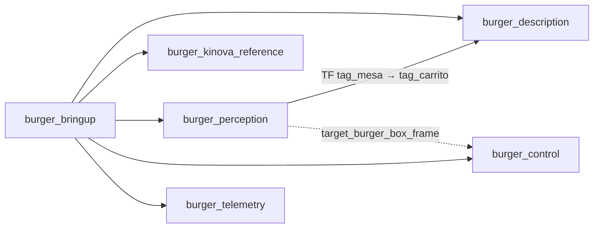

# Paquetes ROS 2 de Burger-Cell

El workspace se separó en paquetes especializados (TODO.md §2). Cada uno se compila y se
prueba por separado, y `burger_bringup` los une con argumentos de modo.

| Paquete | Tipo | Contenido | Depende de |
| :--- | :--- | :--- | :--- |
| `burger_description` | ament_cmake | URDF de la escena y los carritos, mallas, RViz, `display.launch.py` | robot_state_publisher, rviz2 |
| `burger_kinova_reference` | ament_python | Conexión con el driver, monitor de salud, clientes de trayectoria segura, flight recorder | kortex_bringup (sólo en la anfitriona) |
| `burger_perception` | ament_python | Localizador AprilTag: `apriltag_localizer` publica `/<ns>/pose2d` y, con `publish_tf`, el TF `tag_mesa -> tag_carrito1` | OpenCV |
| `burger_control` | ament_cmake (C++) | `pick_place_node`: pick & place de la caja con MoveIt Task Constructor | MTC, `kinova_gen3_6dof_robotiq_2f_85_moveit_config` |
| `burger_telemetry` | ament_cmake (launch) | Monitor de red web, agente micro-ROS, grabación MCAP de telemetría | micro_ros_agent (opcional) |
| `burger_bringup` | ament_cmake (launch) | `bringup.launch.py` | todos los anteriores |



## `burger_bringup`

| Argumento | Defecto | Efecto |
| :--- | :--- | :--- |
| `simulation` | `true` | `true`: escena en RViz y localizador simulado. `false`: conexión con el Kinova |
| `use_apriltag` | `true` | Localizador con `publish_tf:=true` (sustituye a `use_static_carts`) |
| `apriltag_params` | config simulada | Con cámara real: `<repo>/vision_setup/tags_fisicos.yaml` |
| `use_vlm` | `false` | Nodo Gemini (llega en el branch del VLM) |
| `use_moveit` | `false` | `burger_control` en modo **sólo planificar** |
| `use_telemetry` | `false` | Monitor de red y grabación MCAP |
| `start_driver`, `robot_ip`, `use_fake_hardware`, `launch_rviz` | `false`, `0.0.0.0`, `true`, `false` | Se pasan a `kinova_connection.launch.py` con `simulation:=false` |

## `burger_control`: pick & place con MTC

1. Sin robot: driver en modo fake y la tarea sólo planificada.

   ```bash
   ros2 launch kortex_bringup gen3.launch.py dof:=6 gripper:=robotiq_2f_85 \
       robot_ip:=0.0.0.0 use_fake_hardware:=true launch_rviz:=false
   ros2 launch burger_control pick_place.launch.py
   ```

   En RViz, añade el panel *Motion Planning Tasks* (`moveit_task_constructor_visualization`)
   para recorrer las etapas: `open hand`, `move to pick`, `pick object` (aproximación,
   agarre desde arriba, cierre, *attach*, elevación), `move to place`, `place object` y
   `return home`.
2. Con el robot: el driver lo lanza la anfitriona; en la estación,
   `ros2 launch burger_control pick_place.launch.py use_fake_hardware:=false` y, sólo después
   de revisar el plan en RViz, `execute:=true`. La velocidad va escalada a 0.1.

Parámetros en `burger_control/config/pick_place.yaml`. La caja se toma del TF
`base_link -> target_burger_box_frame` si existe (lo publicará el nodo Gemini) y, si no, de
`object_xyz`. **Pendiente de medir en el robot:** `tcp_offset_m`, la distancia de
`end_effector_link` al punto de agarre de la 2F-85 (0.15 m en el modelo).

## Compatibilidad

- `scripts/apriltag_fixed_camera_localizer.py` sigue existiendo como envoltorio del nodo de
  `burger_perception`, así que los talleres no cambian de comando.
- El monitor de red sigue en `network_setup/monitor_red/`; `burger_telemetry` lo lanza desde
  ahí (argumento `repo_path` o variable `BURGER_REPO`). Mudar su código dentro del paquete
  queda para después: lo citan más de 20 documentos.
- `burger_control` añade MoveIt y MTC a las dependencias: el CI (`ros2-ci.yml`) tarda más.
