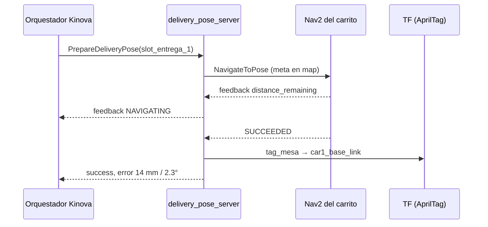

# Navegación de los carritos y acción de entrega

Implementa TODO.md §3: zonas de parada seguras sincronizadas con el Kinova, la acción
`/<car>/prepare_delivery_pose` con feedback, el acople dinámico de TF del carrito y la
configuración de SLAM y Nav2. Paquetes `burger_interfaces` y `burger_navigation`.

**Estado:** sin probar con robots. La lógica geométrica tiene pruebas unitarias y el
servidor se ejercitó con dobles de ROS (llegada, fuera de tolerancia, sin TF, slot
desconocido).

## Piezas

| Pieza | Qué hace |
| :--- | :--- |
| `burger_interfaces/action/PrepareDeliveryPose.action` | Meta: `slot_id` o `target_pose`, tolerancias. Feedback: `state`, `distance_remaining`, `current_pose`. Resultado: `success`, mensaje, pose final y errores |
| `car_tf_coupler` | `/<ns>/pose2d` del localizador → TF `tag_mesa -> tag_carritoN`. Deja de publicar si la pose vence (0.5 s). Opcional: corrección `map -> odom` para Nav2 |
| `delivery_pose_server` | La acción: Nav2 (`use_nav2:=true`) o sólo verificación (`false`), y confirmación con el AprilTag |
| `config/delivery_slots.yaml` | Zonas de entrega en `tag_mesa` (pendientes de medir) |
| `mapeo_celda.launch.py`, `navegacion_celda.launch.py` | slam_toolbox y Nav2 con ajustes para un carrito pequeño |



## Relación con el proyecto intermedio

`PROYECTO_INTERMEDIO_MOVEIT2_DELIVERY.md` §2.2 define un **servicio**
`/car1/prepare_delivery_pose`. La acción conserva el nombre y la información (pose objetivo,
tolerancia, éxito y diagnóstico) y añade feedback y cancelación. Si el curso mantiene el
servicio, la acción puede quedar como implementación de referencia del docente.

## Pruebas propuestas, de menos a más

1. **Acople de TF, carrito quieto** (sólo cámara y localizador):
   ```bash
   python3 scripts/apriltag_fixed_camera_localizer.py --ros-args --params-file vision_setup/tags_fisicos.yaml
   ros2 launch burger_description display.launch.py      # sin use_static_carts
   ros2 launch burger_navigation entrega_carrito.launch.py car:=car1 pose_topic:=/burger_car_01/pose2d
   ros2 run tf2_ros tf2_echo map car1_base_link
   ```
   El carrito debe aparecer en RViz donde está. Al tapar su tag, a los 0.5 s el TF deja de
   actualizarse y el nodo lo avisa.
2. **Acción sin Nav2**: llevar el carrito a mano a `slot_entrega_1` y
   `ros2 action send_goal /car1/prepare_delivery_pose burger_interfaces/action/PrepareDeliveryPose "{slot_id: slot_entrega_1}" --feedback`.
   Repetir desplazándolo 5 cm: debe fallar con «fuera de tolerancia».
3. **Mapeo con SLAM** (TurtleBot3 con LiDAR): `mapeo_celda.launch.py`, recorrer la celda con
   teleoperación y guardar con `map_saver_cli`. Revisar que mesa y patas queden cerradas.
4. **Nav2 con mapa**: `navegacion_celda.launch.py car:=car1 map:=... base_frame:=... odom_frame:=...`,
   meta desde RViz (*2D Goal Pose*), después la acción con `use_nav2:=true`.
5. **Integración**: el orquestador del Kinova pide el slot, espera `success` y ejecuta el
   pick & place hacia la bandeja.

## Qué hay que medir o decidir en el laboratorio

- Coordenadas reales de las zonas de entrega (alcance cómodo del Gen3 sobre la bandeja).
- `tag_height_m` del acople si el tag del carrito no está a la altura del `tag_mesa`.
- Si los carritos ESP32 publican odometría (`odom -> base`): sin ella, Nav2 trabaja sólo con
  la pose del tag, que llega a la frecuencia de la cámara y se pierde si el brazo tapa la vista.
