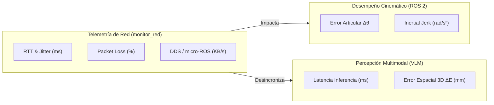

# Protocolo Experimental: Impacto de la Calidad de Red (QoS, Jitter y Packet Loss) en la Telemetría y Cinemática de una Celda Robótica Heterogénea

## 1. Contexto Científico y Motivación

En la literatura actual de robótica colaborativa y manufactura flexible (*Industry 4.0 / 5.0*), la gran mayoría de algoritmos de manipulación y percepción son evaluados bajo el supuesto de una **red cableada ideal con ancho de banda infinito y latencia nula**. Sin embargo, las celdas robóticas del mundo real integran componentes inalámbricos heterogéneos:

- Manipuladores industriales de 7-DOF con buses Ethernet/WiFi en tiempo real (**Kinova Gen3**).
- Plataformas móviles autónomas (AMR) y microcontroladores basados en **micro-ROS** y ESP32 operando sobre canales WiFi (2.4 GHz / 5 GHz).
- Nodos de razonamiento espacial multimodal (**VLM / Gemini Robotics**) que transmiten ráfagas masivas de datos y tensores.

La congestión en el espectro inalámbrico, el desbordamiento de colas en el router y el comportamiento no determinista del protocolo DDS (Data Distribution Service) generan **Jitter (variación de latencia)**, descarte de paquetes RTPS y desincronización en el árbol de transformadas **TF2**, provocando tirones mecánicos (*jerk* articular), paradas de emergencia por *heartbeat timeout* o fallos en el agarre (*grasping*).

Este documento formaliza el protocolo experimental para evaluar cuantitativamente la degradación del canal de red y demostrar la efectividad de las políticas de **QoS (Quality of Service)** de la arquitectura **Burger-Cell**.

---

## 2. Preguntas de Investigación e Hipótesis

### Preguntas de Investigación:
1. **PI-1:** ¿Cómo se correlaciona el incremento del Jitter en la red WiFi con el error cuadrático medio ($\text{RMSE}$) del seguimiento de trayectorias articulares en el manipulador Kinova Gen3?
2. **PI-2:** ¿En qué umbral de pérdida de paquetes ($L\%$) y latencia RTT el pipeline de percepción VLM (Gemini Robotics) produce desincronización en el árbol de transformadas estáticas y dinámicas de TF2?
3. **PI-3:** ¿Qué combinación de perfiles de QoS en el middleware DDS (*Reliability*, *Durability*, *History Keep Last*) maximiza el determinismo temporal frente a ráfagas de telemetría concurrentes?

### Hipótesis Formal:
- **Hipótesis Nula ($H_0$):** Las políticas de QoS y la degradación de la red inalámbrica no generan variaciones estadísticamente significativas ($p > 0.05$) en la suavidad de trayectoria articular ni en la tasa de éxito de agarre de la celda robótica.
- **Hipótesis Alterna ($H_1$):** La aplicación de perfiles de QoS optimizados (`Best Effort` en estados articulares de alta frecuencia y `Transient Local` en TF2) reduce en más de un $40\%$ la varianza del error articular y previene desincronizaciones de percepción espacial bajo escenarios de congestión inalámbrica severa ($\text{Jitter} > 30\text{ ms}$, Pérdida $> 10\%$).

---

## 3. Formulación Matemática de las Métricas



### A. Métricas de Telemetría de Red (Capturadas por `monitor_red`):
1. **Latencia RTT ($Round\text{-}Trip\text{ }Time$):**
   $$\text{RTT}_{\mu} = \frac{1}{N} \sum_{i=1}^{N} \text{RTT}_i \quad [\text{ms}]$$
2. **Jitter de Dispersión (`mdev`):**
   $$J = \sqrt{\frac{1}{N} \sum_{i=1}^{N} (\text{RTT}_i - \text{RTT}_{\mu})^2} \quad [\text{ms}]$$
3. **Tasa de Pérdida de Paquetes ($L$):**
   $$L = \left( \frac{P_{\text{transmitidos}} - P_{\text{recibidos}}}{P_{\text{transmitidos}}} \right) \times 100\%$$

### B. Métricas de Control Cinemático:
1. **Error de Seguimiento Articular ($\Delta \theta_j$):**
   $$\Delta \theta_j(t) = |\theta_{cmd,j}(t) - \theta_{meas,j}(t)| \quad [\text{rad}]$$
2. **Suavidad Cinemática (*Inertial Jerk* Articular $J_k$):**
   $$J_k(t) = \frac{d^3 \theta_j(t)}{dt^3} \quad [\text{rad/s}^3]$$
   *(Valores elevados indican tirones violentos producidos por recepción retrasada de comandos).*

### C. Métricas de Percepción VLM:
1. **Error Euclidiano 3D de Posicionamiento ($\Delta E$):**
   $$\Delta E = \sqrt{(X_{vlm} - X_{ground\_truth})^2 + (Y_{vlm} - Y_{ground\_truth})^2 + (Z_{vlm} - Z_{ground\_truth})^2} \quad [\text{mm}]$$
2. **Latencia Total de Percepción ($T_{perception}$):**
   $$T_{perception} = T_{captura} + T_{inferencia\_api} + T_{tf\_lookup} \quad [\text{ms}]$$

---

## 4. Matriz de Escenarios Experimentales

El banco de pruebas evaluará 3 condiciones de canal de red controladas, ejecutando $N = 30$ ensayos independientes por escenario:

| Escenario | Condición del Canal WiFi | Parámetros Inyectados | Descripción Operativa |
|---|---|---|---|
| **E1: Línea Base** | Canal WiFi 6 Limpio (AX12) | $\text{RTT} < 2\text{ ms}$, $\text{Jitter} < 0.5\text{ ms}$, Pérdida $0\%$ | Comunicación directa PC-Robot sin interferencia concurrente. |
| **E2: Carga Típica** | Multi-Robot / Micro-ROS activo | $\text{RTT} \approx 20\text{ ms}$, $\text{Jitter} \approx 8\text{ ms}$, Pérdida $3\text{-}5\%$ | Tráfico concurrentemente generado por 2 ESP32 y transmisión de estados. |
| **E3: Estrés Severo** | Congestión y Descarte Forzado | $\text{RTT} > 60\text{ ms}$, $\text{Jitter} > 25\text{ ms}$, Pérdida $15\%$ | Degradación simulada en router mediante colas saturadas y ráfagas UDP. |

### Políticas Middleware en Comparación:
- **Perfil A (ROS 2 Vanilla Default):** Políticas estándar de DDS (`Reliable` universal, colas por defecto de 10 mensajes).
- **Perfil B (Burger-Cell QoS Optimized):**
  - `/joint_states` & `/kinova/joint_trajectory`: `Best Effort`, `Keep Last(1)`, sin colas bloqueantes.
  - `/tf_static` & `/burger_box_frame`: `Reliable`, `Transient Local`, buffer histórico.
  - Sockets Kortex con parche de timeout reducido (baja latencia C++).

---

## 5. Arquitectura de la Herramienta de Telemetría (`monitor_red`)

Para este experimento, el módulo `network_setup/monitor_red` ha sido adaptado para funcionar como un **Data Recorder de Telemetría Científica**:

```
network_setup/monitor_red/
├── server.py                 # API REST con endpoints /api/benchmark/start, /stop, /status, /download
├── traffic_sniffer.py        # Muestreador UDP/TCP/DDS con cálculo de RTT, Jitter y Pérdida
├── device_scanner.py         # Descubrimiento ARP/ICMP y mapeo de dominios ROS 2
├── benchmark_logs/           # Directorio donde se persisten los datasets en CSV
└── static/
    ├── index.html            # UI con panel de control de benchmark y selector de escenarios
    ├── app.js                # Lógica de muestreo a 1 Hz y descarga de datasets
    └── app.css               # Estilos con indicadores visuales de grabación (REC)
```

### Estructura del Dataset Generado (`.csv`):
Cada ensayo genera un archivo estandarizado con la siguiente cabecera:
```csv
timestamp_iso,elapsed_sec,session_name,scenario,total_kbps,dds_kbps,microros_kbps,tcp_kbps,udp_kbps,bytes_recv_rate,bytes_sent_rate,packets_recv_rate,packets_sent_rate,gateway_latency_ms,gateway_jitter_ms,gateway_loss_percent,dds_latency_ms,dds_jitter_ms,dds_loss_percent,active_dds_domains,microros_active
2026-08-06T13:40:01Z,1.0,ensayo_01_kinova,Linea_Base_WiFi6,124.5,95.2,0.0,29.3,95.2,64200.0,60300.0,85.0,82.0,1.2,0.3,0.0,1.4,0.4,0.0,42,1
```

---

## 6. Procedimiento Paso a Paso de Ejecución

1. **Iniciar el Monitor de Red:**
   ```bash
   cd ~/ros2_ws/src/burger_delivery
   bash network_setup/iniciar_monitor.sh
   ```
2. **Abrir la Interfaz Web:**
   Navegar a `http://localhost:8080` (o la IP del Host en la subred `192.168.1.X`).
3. **Configurar el Ensayo en la UI:**
   - Seleccionar el Escenario (ej. `1. Línea Base (WiFi 6 AX12 Limpio)`).
   - Ingresar el identificador (ej. `ensayo_01_baseline_moveit`).
   - Hacer clic en **"▶ Iniciar Grabación"**.
4. **Ejecutar el Pipeline Robótico en ROS 2:**
   ```bash
   # Terminal 1: Lanzar nodo de percepción VLM
   python3 scripts/test_gemini_vision_local.py

   # Terminal 2: Ejecutar ciclo de manipulación
   python3 scripts/apply_kinova_smooth_movement.py
   ```
5. **Finalizar y Exportar Dataset:**
   - Al concluir los 30 ciclos, hacer clic en **"⏹ Detener y Exportar"**.
   - Hacer clic en **"📥 Descargar CSV"**.
   - El archivo quedará respaldado automáticamente en `network_setup/monitor_red/benchmark_logs/`.

---

## 7. Plan de Análisis Estadístico y Gráficas de Publicación

Con los archivos `.csv` recolectados, se ejecutará el script de análisis para generar las figuras del artículo científico:

1. **Diagramas de Caja y Bigotes (Boxplots):**
   - Comparación de Jitter y Latencia RTT entre los 3 escenarios.
   - Comparación del Error de Seguimiento Articular ($\Delta \theta$) entre Perfil Vanilla vs. Burger-Cell QoS.
2. **Gráfico de Dispersión y Regresión (Scatter Plot):**
   - *Jitter (ms)* vs. *Error Euclidiano de Percepción $\Delta E$ (mm)*.
   - Demostración del umbral crítico de pérdida de paquetes a partir del cual el árbol TF2 sufre *extrapolation error*.
3. **Prueba de Hipótesis:**
   - Test ANOVA de una vía y prueba post-hoc de Tukey para validar la significancia estadística ($p < 0.01$).

---

## 8. Entregables del Experimento

1. **Dataset Abierto en Zenodo:** Repositorio de datos `.csv` con metadatos y DOI asociado para reproducibilidad.
2. **Sección de Resultados del Paper:** Figuras vectoriales (`.pdf` / `.svg`) y tablas de rendimiento listas para incluir en el artículo para el grupo de investigación.
3. **Demostrador en Vivo (MVP):** Dashboard web interactivo para mostrar a revisores y evaluadores el comportamiento de la red en tiempo real.
