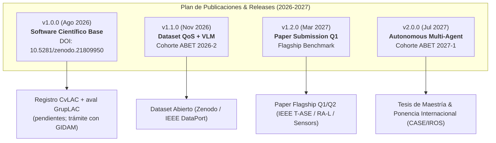

# PLAN ESTRATÉGICO DE PUBLICACIONES CIENTÍFICAS, GESTIÓN DE DATASETS Y CRONOGRAMA DE RELEASES ZENODO (2026 - 2027)

**Proyecto:** Burger-Cell: Heterogeneous ROS 2 Collaborative Robotics Framework  
**Institución:** Universidad Militar Nueva Granada — Facultad de Ingeniería — Campus Nueva Granada  
**Ruta vigente de aval institucional:** GIDAM (Categoría A - MinCiencias), Universidad Militar Nueva Granada — solicitud en trámite; pendiente de decisión y formalización
**Investigador Principal:** Prof. Henry Antonio Roncancio Velandia (`henry.roncancio@unimilitar.edu.co`) — ORCID: [0009-0009-9954-9813](https://orcid.org/0009-0009-9954-9813)  
**Concept DOI Persistente (Zenodo / DataCite):** [`10.5281/zenodo.21809949`](https://doi.org/10.5281/zenodo.21809949)  

---

## 1. Justificación y Fundamentos del Plan de Releases

En la investigación moderna en robótica y ciencias computacionales, el repositorio de código y datos no es únicamente un entorno de trabajo colaborativo, sino un **instrumento de reproducibilidad científica y un producto tecnológico verificable** ante organismos de indexación y acreditación (MinCiencias, Scopus, Web of Science, DataCite y ABET).

### 1.1 Diferencia Fundamental entre Git Releases y Zenodo Releases
A diferencia del desarrollo de software comercial (donde se generan tags continuos para despliegue ágil), en la investigación científica los releases en **Zenodo / DataCite** conllevan responsabilidades editoriales y normativas:

* **Inmutabilidad Absoluta:** Una vez emitido un release y asignado un DOI de versión (ej. `10.5281/zenodo.21809950`), el archivo comprimido (`.zip`), el hash criptográfico y los metadatos quedan congelados permanentemente en los servidores del CERN. No pueden ser eliminados ni modificados.
* **Trazabilidad de Citas (Citable Snapshots):** Cualquier artículo científico, tesis o informe institucional que cite un *Version DOI* garantiza que cualquier par evaluador en el mundo accederá al código y datos exactos con los que se obtuvieron los resultados reportados.
* **Concept DOI como Eje Transversal:** El *Concept DOI* (`10.5281/zenodo.21809949`) resuelve siempre a la versión más reciente del software, permitiendo visibilidad global continua en el perfil de investigación, mientras que los *Version DOIs* preservan la historia experimental.

### 1.2 Regla de Cadencia Editorial
* **Cadencia recomendada:** **1 a 3 releases oficiales por año**.
* **Criterio de activación:** Un release en Zenodo **solo se genera ante la culminación de un hito científico formal** (envío de paper, publicación de dataset abierto, cierre de ciclo pedagógico ABET o entrega de producto MinCiencias).

---

## 2. Ruta institucional vigente: GIDAM

Desde el 20 de agosto de 2026, la ruta institucional vigente para gestionar el aval del proyecto es el **Grupo de Investigación GIDAM (Categoría A - MinCiencias) de la UMNG**. La solicitud fue remitida por Henry Roncancio a William Gómez y escalada al director de GIDAM; al 31 de agosto de 2026 continúa **en trámite**. Esta condición no equivale todavía a aceptación, vinculación, aval GrupLAC ni registro en CvLAC.

La [propuesta de vinculación y aval académico a GIDAM](PROPUESTA_VINCULACION_GIDAM.md) concentra la ruta institucional vigente.



---

## 3. Cronograma Maestro de Releases y Publicaciones (2026 - 2027)

| Versión | Fecha Meta | Hito Científico Asociado | Identificador / DOI | Productos Entregables |
|---|---|---|---|---|
| **v1.0.0** | **Agosto 2026** *(Completado)* | **Línea Base del Framework y preservación con DOI** | `10.5281/zenodo.21809950` | • Paquete `burger_description` y cinemática Kinova.<br>• Monitor de Red Web con telemetría CycloneDDS.<br>• Guías docentes base y syllabus ABET.<br>• Aval y registro institucional pendientes; trámite vigente con GIDAM. |
| **v1.1.0** | **Noviembre 2026** | **Dataset Abierto de Telemetría QoS e Inferencia VLM** | Nuevo DOI asignado por Zenodo | • Pipeline completo Gemini Robotics VLM + MoveIt 2.<br>• Dataset consolidado de 500+ ciclos (DDS vs VLM vs RMSE).<br>• Cierre y consolidación de evidencias ABET 2026-2.<br>• Publicación en IEEE DataPort / Zenodo Data. |
| **v1.2.0** | **Marzo 2027** | **Snapshot Oficial: Envío de Flagship Paper Q1/Q2** | Nuevo DOI asignado por Zenodo | • Código congelado y verificado para reproducibilidad del paper principal.<br>• Scripts de análisis estadístico automatizado (`analyze_telemetry_benchmark.py`).<br>• Manuscrito enviado a revista indexada (IEEE T-ASE / RA-L / Sensors). |
| **v2.0.0** | **Julio 2027** | **Arquitectura Multi-Agente Autónoma y Cierre de Tesis** | Nuevo DOI asignado por Zenodo | • Celda multi-robot con micro-ROS en hardware ESP32-S3.<br>• Validación multi-cámara y evitación de colisiones dinámica.<br>• Sustentación de Tesis de Maestría / Pregrado.<br>• Envío a conferencia internacional (IEEE CASE / IROS). |

---

## 4. Detalle de los Hitos Editoriales y Científicos

### Hito 1: Versión v1.0.0 — *Foundation & Preserved Scientific Software* (Completado)
* **Fecha:** Agosto 2026
* **DOI Inmutable:** [`10.5281/zenodo.21809950`](https://doi.org/10.5281/zenodo.21809950)
* **Alcance:**
  1. Definición completa del URDF cinemático de la celda colaborativa (Kinova Gen3 7-DOF + gripper Robotiq 2F-85 + carritos diferenciales).
  2. Publicación de árboles de transformación dinámicos (`tf2`) acoplados por visión AprilTag.
  3. Dashboard Web interactivo (`network_setup/monitor_red/`) con métricas QoS de red en tiempo real.
  4. Protocolo de laboratorio y syllabus alineado a criterios ABET (Student Outcomes 1, 6 y 7).
* **Destino de Citación:** DOI público verificable. El registro en CvLAC y el aval en GrupLAC continúan pendientes y deben cerrarse como trámites separados.

---

### Hito 2: Versión v1.1.0 — *Open Experimental Dataset & Multimodal Perception*
* **Fecha Programada:** Noviembre 2026 (Semana 16 del Periodo Académico 2026-2)
* **Alcance:**
  1. Integración formal del nodo de inferencia espacial zero-shot con **Gemini Robotics-ER 1.6** para estimación de affordances de agarre en coordenadas 3D.
  2. Ejecución de la campaña experimental masiva en laboratorio: registro sincronizado a $1\text{ Hz}$ de latencia RTT, jitter WiFi 6, tráfico RTPS/DDS, tiempo de respuesta VLM y error de seguimiento articular (RMSE).
  3. Exportación y curaduría del **Dataset Abierto Unificado** en formatos `.csv` y `.parquet` con metadatos normalizados.
  4. Incorporación del informe de logros de aprendizaje de la cohorte estudiantil 2026-2.
* **Destino de Citación:** Repositorio de datos abiertos en **Zenodo / IEEE DataPort** con DOI propio para citación de datos abiertos.

---

### Hito 3: Versión v1.2.0 — *Flagship Paper Benchmark & Reproducibility Snapshot*
* **Fecha Programada:** Marzo 2027
* **Alcance:**
  1. Congelamiento estricto del código fuente, modelos, prompts y semillas aleatorias utilizadas para generar las tablas y figuras del artículo principal.
  2. Generación automática de figuras vectoriales (`.svg`, `.pdf`) mediante scripts en `scripts/` para inclusión directa en LaTeX/Overleaf.
  3. Envío del manuscrito insignia:
     > *"VLM-Guided 3D Spatial Reasoning Under Network QoS Uncertainty: A Real-Time Telemetry and Manipulation Benchmark in Heterogeneous ROS 2 Robotic Cells"*
  4. Target Journals: *IEEE Transactions on Automation Science and Engineering (T-ASE)* / *IEEE Robotics and Automation Letters (RA-L)* / *Sensors (MDPI)*.
* **Destino de Citación:** Sección de "Data & Code Availability Statement" en el paper sometido a revisión por pares.

---

### Hito 4: Versión v2.0.0 — *Full Autonomous Collaborative Cell & Multi-Agent Network*
* **Fecha Programada:** Julio 2027 (Cierre del Periodo Académico 2027-1)
* **Alcance:**
  1. Despliegue de nodos embebidos distribuidos con micro-ROS en tarjetas físicas **ESP32-S3** con soporte de transporte WiFi / Serial nativo.
  2. Implementación del stack de percepción multi-cámara (cámara muñeca Kinova + cámara cenital de celda) con fusión sensorial 3D.
  3. Incorporación de las tesis de grado de pregrado y maestría dirigidas en el marco del proyecto.
  4. Envío de artículo de conferencia a *IEEE International Conference on Automation Science and Engineering (CASE)* o *IEEE/RSJ IROS*.
* **Destino de Citación:** Capítulos metodológicos de tesis de posgrado y memoria de congreso indexado Scopus.

---

## 5. Matriz de Criterios de Decisión para Releases en Zenodo

Para evitar la fragmentación de versiones y mantener la calidad del registro en Zenodo, se establece la siguiente matriz de decisión:

```text
¿Se debe generar un nuevo Release en Zenodo?
 │
 ├── ¿Es solo corrección de estilo, typo en docs o ajuste menor de código?
 │    └── ❌ NO -> Hacer commit normal en 'main' o rama 'feat/'.
 │
 ├── ¿Se corrigió un bug interno sin alterar resultados experimentales?
 │    └── ❌ NO -> Hacer commit/tag interno en Git (ej. patch v1.0.1) SIN disparar Zenodo.
 │
 ├── ¿Se completó un hito formal (Paper, Dataset, Cierre Semestral o Nueva Arquitectura)?
 │    └── ✅ SÍ -> Proceder con el Checklist de Release Zenodo.
```

---

## 6. Protocolo Operativo y Checklist Técnico Pre-Release

Antes de generar un tag de release en GitHub vinculado a Zenodo, el investigador principal o el equipo delegado debe verificar de forma estricta los siguientes 6 pasos:

### Paso 1: Validación Técnica del Código y Simulación
- [ ] Compilación en limpio del workspace sin errores ni advertencias (`colcon build --packages-select burger_description`).
- [ ] Ejecución exitosa de los scripts de validación cinemática y cámara (`python3 scripts/test_kinova_pose.py` y `python3 scripts/test_kinova_camera.py`).
- [ ] Verificación de lanzamiento en RViz2 (`./lanzar_robot.sh`).

### Paso 2: Actualización de Metadatos de Citación ([`CITATION.cff`](../../CITATION.cff))
- [ ] Actualizar el campo `version: "X.Y.Z"`.
- [ ] Actualizar el campo `date-released: "YYYY-MM-DD"`.
- [ ] Verificar que los autores, afiliaciones (UMNG) y ORCID estén vigentes.

### Paso 3: Actualización de Metadatos de Zenodo ([`.zenodo.json`](../../.zenodo.json))
- [ ] Verificar la descripción del paquete y el resumen de novedades de la versión.
- [ ] Confirmar la inclusión de colaboradores, estudiantes tesistas o asistentes de investigación.
- [ ] Revisar que las palabras clave (*keywords*) reflejen las tecnologías agregadas.

### Paso 4: Creación del Tag y Release en GitHub
- [ ] Crear el tag en Git con firma anotada: `git tag -a vX.Y.Z -m "Release vX.Y.Z — Descripción del Hito Científico"`.
- [ ] Publicar el Release en GitHub con un *Changelog Científico y Académico* detallando:
  * Novedades metodológicas y de software.
  * Enlaces a datasets o experimentos reproducibles.
  * Reconocimiento a estudiantes o entidades participantes.

### Paso 5: Verificación de Ingestión en Zenodo / DataCite
- [ ] Ingresar a Zenodo y confirmar que el webhook procesó el nuevo snapshot `.zip`.
- [ ] Registrar el nuevo **Version DOI** asignado automáticamente (ej. `10.5281/zenodo.XXXXXXX`).

### Paso 6: Actualización de Tablas de Documentación y MinCiencias
- [ ] Actualizar la tabla de versiones en [README.md](../../README.md) y [README_en.md](../../README_en.md).
- [ ] Actualizar el registro de producción tecnológica en **CvLAC** y gestionar su asociación/aval en **GrupLAC de GIDAM**, únicamente después de contar con aceptación y soportes verificables.

---

## 7. Control de cambios y TODO institucional

### Control de cambios

- **2026-08-31:** se estableció **GIDAM (Categoría A, UMNG)** como ruta de aval institucional. El estado registrado es **en trámite**, no aval concedido; v1.0.0 no declara registro formal en GrupLAC.

### TODO institucional — S15

- [x] Consolidar el [expediente de soporte para GIDAM](EXPEDIENTE_AVAL_GIDAM.md) con evidencia disponible y límites de la solicitud.
- [ ] Obtener respuesta formal de GIDAM sobre la solicitud de vinculación/aval.
- [ ] Conservar evidencia verificable de aceptación y definir la ruta de asociación del producto en GrupLAC.
- [ ] Registrar el software en CvLAC con sus soportes, sin confundir el DOI de Zenodo con aval de grupo.
- [ ] Cerrar S15 únicamente cuando el registro CvLAC y la constancia de aval/asociación GrupLAC sean visibles o estén documentados.

---

## 8. Aprobación y Seguimiento del Plan

| Rol | Nombre | Firma / Estado |
|:---:|:---:|:---:|
| **Investigador Proponente** | **Prof. Henry Antonio Roncancio Velandia**<br>Docente e Investigador Mecatrónica UMNG | *Aprobado y en Ejecución* |
| **Ruta de aval institucional** | **Grupo de Investigación GIDAM**<br>Categoría A — Universidad Militar Nueva Granada | *En trámite; pendiente de decisión y formalización* |
