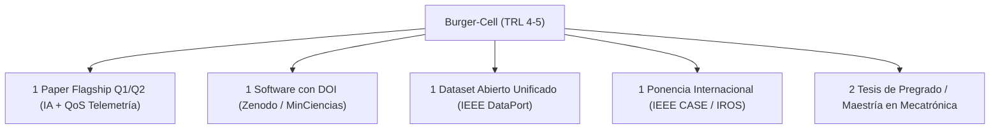

# PROPUESTA DE VINCULACIÓN Y PLAN DE TRABAJO CIENTÍFICO

**Para revisión y aval de:**  
**Prof. William Gómez**  
Docente Investigador — Grupo de Investigación **VOLTA (A1)**  
Programa de Ingeniería Mecatrónica — Campus Nueva Granada  

**Dirigida a:**  
**Dr. William Arnulfo Aperador Chaparro**  
Líder del Grupo de Investigación **VOLTA (Categoría A1 - MinCiencias)**  
Comité de Investigaciones — Programa de Ingeniería Mecatrónica  
Universidad Militar Nueva Granada (Sede Campus Nueva Granada - Cajicá)  

---

## 1. Título del Proyecto y Producto Tecnológico

> **"Burger-Cell: Framework Abierto y Banco Experimental de Manufactura Flexible Heterogénea en ROS 2 para Manipulación Robótica (Kinova Gen3), Telemetría de Red QoS y Razonamiento Espacial con Inteligencia Artificial"**  
> **DOI Zenodo:** `10.5281/zenodo.16781702` (Software Científico Registrado)  
> **Nivel de Madurez Tecnológica:** TRL 4 - TRL 5 (Validado en entorno de laboratorio real)  

---

## 2. Resumen Ejecutivo y Justificación Estratégica

La presente propuesta tiene como objetivo formalizar la vinculación del suscrito docente/investigador al **Grupo de Investigación VOLTA**, aportando una plataforma experimental operativa (*Living Lab*) que articula de forma sinérgica la **robótica de manipulación industrial**, los **sistemas embebidos distribuidos (micro-ROS)**, la **telemetría ciber-física en tiempo real** y la **Inteligencia Artificial Multimodal (Embodied AI)**.

### ¿Por qué Burger-Cell fortalece los indicadores de VOLTA ante MinCiencias?
1. **Línea de Diseños Mecatrónicos y Manufactura 4.0:** Integra hardware industrial real (brazo robótico de 7-DOF Kinova Gen3, gripper adaptativo y cámaras RGB-D) controlado mediante MoveIt 2 y C++ de baja latencia.
2. **Línea de Sistemas Embebidos y Telecomunicaciones:** Integra microcontroladores ESP32 con micro-ROS comunicándose por DDS en redes inalámbricas WiFi 6, monitoreados por una herramienta propia de telemetría de sockets a nivel de kernel (`monitor_red`).
3. **Línea de Inteligencia Artificial Física (Embodied AI):** Incorpora el modelo de frontera **Gemini Robotics (`gemini-robotics-er-1.6-preview`)** para razonamiento espacial 3D *zero-shot* y estimación de affordances físicas de agarre sin requerir re-entrenamiento de visión clásica.
4. **Metodología Experimental Unificada (Paper Flagship de Alto Impacto):** En lugar de dispersar esfuerzos, el proyecto fusiona en **un único estudio integral** el impacto del retardo y degradación de red (QoS/Jitter) sobre la inferencia de modelos VLM y la precisión de manipulación cinemática del robot en entornos industriales.

---

## 3. Alineación con las Líneas de Investigación de VOLTA

| Línea de Investigación de VOLTA | Contribución Directa de Burger-Cell |
|---|---|
| **1. Diseños Mecatrónicos y Aplicaciones Industriales** | Celda colaborativa de pick & place de alta precisión con cinemática inversa optimizada, servoing visual mediante AprilTags 3D y trayectorias suaves (*jerk reduction*). |
| **2. Sistemas Embebidos y Telemetría Ciber-Física** | Medición continua de latencia RTT, Jitter de retardo ($J$) y pérdida de paquetes ($L\%$) en buses DDS/RTPS, garantizando determinismo temporal en fábricas inteligentes. |
| **3. Inteligencia Artificial Aplicada a Mecatrónica** | Razonamiento espacial 3D y grasping *zero-shot* con **Gemini Robotics VLM**, evaluando su resiliencia temporal frente a fluctuaciones de canal inalámbrico. |

---

## 4. Compromisos de Producción Científica para el GrupLAC (2026 - 2027)

Como integrante de VOLTA, concentraré el esfuerzo investigativo en **un artículo insignia (Flagship Paper) de alta categoría (Q1/Q2)** que fusiona la IA Multimodal con la Telemetría de Red:

### Detalle de Productos:

#### 1. Artículo Principal en Revista Indexada Q1 / Q2 (MinCiencias Tipo A1):
* **Título Propuesto:**  
  > *"VLM-Guided 3D Spatial Reasoning Under Network QoS Uncertainty: A Real-Time Telemetry and Manipulation Benchmark in Heterogeneous ROS 2 Robotic Cells"*
* **Pregunta Científica Central:** ¿Cómo afecta la degradación de calidad de servicio (Jitter, latencia DDS y pérdida de paquetes) a la inferencia espacial de Modelos de Visión-Lenguaje (Gemini Robotics) y al éxito cinemático de agarre 6-DoF en manipuladores industriales?
* **Revistas Objetivo (Target Journals):**  
  * *IEEE Transactions on Automation Science and Engineering (T-ASE)*
  * *IEEE Robotics and Automation Letters (RA-L)*
  * *Sensors (MDPI - Q1/Q2)*
  * *Mechatronics (Elsevier)*

#### 2. Producto Tecnológico - Software Científico Registrado:
* Registro formal ante MinCiencias del repositorio [Burger-Cell](file:///home/roncanciovl/ros2_ws/src/burger_delivery) con DOI `10.5281/zenodo.16781702`.

#### 3. Dataset de Acceso Abierto Unificado:
* Publicación en **Zenodo / IEEE DataPort** del dataset integrado que correlaciona: métricas de tráfico DDS a $1\text{ Hz}$, latencias de inferencia VLM (ms), coordenadas de grasping 3D y error cuadrático medio de seguimiento articular (RMSE).

#### 4. Formación de Talento Humano en Campus Cajicá:
* Vinculación de estudiantes del semillero de robótica mediante las guías de laboratorio [education/](file:///home/roncanciovl/ros2_ws/src/burger_delivery/education).
* Dirección de 1 a 2 trabajos de grado para la **Maestría en Ingeniería Mecatrónica** de la Sede Campus.

---

## 5. Demostración Tecnológica (MVP en Campus Cajicá)

Para respaldar esta postulación, ofrezco realizar una **sesión de demostración en vivo (10 minutos)** en los laboratorios de Mecatrónica del Campus Nueva Granada:

* **Demostrador 1 (Pipeline Unificado IA + Cinemática):** Captura de imagen multi-vista, consulta en vivo al VLM **Gemini Robotics**, extracción de affordance de agarre 3D y ejecución del movimiento con el Kinova Gen3 vía MoveIt 2.
* **Demostrador 2 (Telemetría de Red y Benchmark en Vivo):** Monitoreo en tiempo real (`http://localhost:8080`) de la ráfaga de paquetes DDS durante la inferencia y movimiento, exportando el dataset en `.csv`.
* **Demostrador 3 (Análisis Estadístico Automatizado):** Ejecución del script [analyze_telemetry_benchmark.py](file:///home/roncanciovl/ros2_ws/src/burger_delivery/scripts/analyze_telemetry_benchmark.py) generando las figuras vectoriales publicables del paper.

## 6. Recursos Solicitados y Apoyo del Grupo VOLTA / VRI

Para garantizar la ejecución en los tiempos comprometidos, se solicita el respaldo y aval de VOLTA para gestionar ante la Vicerrectoría de Investigaciones (VRI):

1. **Hardware Embebido y Sensores (Fase Inmediata):**
   * **Tarjetas de Desarrollo ESP32 / ESP32-S3 (x3 unidades):** Para montaje de nodos embebidos distribuidos con micro-ROS (control de gripper, nodos sensores y plataformas móviles AGV).
   * **Cámara de Profundidad RGB-D:** Cámara industrial tipo *Intel RealSense D435i / D455* para montaje *eye-in-hand* en el manipulador Kinova Gen3.
2. **Fondo de Publicación (APC Open Access):**
   * Cobertura de cargos de procesamiento para el **Flagship Paper Q1** al momento de su aceptación en revistas indexadas (IEEE / MDPI Sensors / Elsevier).
3. **Créditos de Cómputo e Inferencia IA:**
   * Fondo de tokens API para inferencia en la nube con **Gemini Robotics VLM** durante la toma masiva de datos experimentales.
4. **Vinculación Contractual de Investigación (Modalidad Docente de Cátedra):**
   * Gestión y aval institucional ante la Decanatura y la Vicerrectoría de Investigaciones (VRI) para la formalización de un **contrato de investigación adicional / remuneración por horas de proyecto** (4 a 6 horas semanales dedicadas a investigación) o vinculación contractual como coinvestigador financiado con cargo al proyecto / fondos de fortalecimiento del grupo VOLTA.
5. **Vinculación de Talento Joven:**
   * Asignación de 1 estudiante auxiliar de investigación (pregrado o maestría) para soporte en calibración de hardware y pruebas de laboratorio en Campus Cajicá.

---

| **Docente Proponente** | **Aval y Visto Bueno (Grupo VOLTA)** |
|:---:|:---:|
|   ___________________________________ **Docente de Cátedra / Investigador** Programa de Ingeniería Mecatrónica Campus Nueva Granada — UMNG |   ___________________________________ **Prof. William Gómez** Docente Investigador — Grupo VOLTA (A1) Campus Nueva Granada — UMNG |

