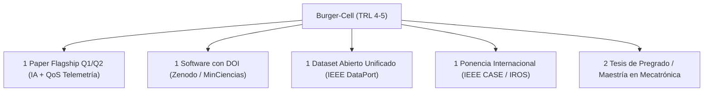

# PROPUESTA DE VINCULACIÓN Y PLAN DE TRABAJO CIENTÍFICO

**Para consideración previa de:**  
**Dr. William Gómez Rivera, Ph.D.** (`william.gomezr@unimilitar.edu.co`)  
Docente Investigador — Grupo de Investigación **VOLTA (Categoría A1 - MinCiencias)**  
Programa de Ingeniería Mecatrónica — Campus Nueva Granada  

**Dirigida a:**  
**Dr. William Arnulfo Aperador Chaparro**  
Líder del Grupo de Investigación **VOLTA (Categoría A1 - MinCiencias)**  
Comité de Investigaciones — Facultad de Ingeniería  
Universidad Militar Nueva Granada  

---

## 1. Título del Proyecto y Producto Tecnológico

> **"Burger-Cell: Framework Abierto y Banco Experimental de Manufactura Flexible Heterogénea en ROS 2 para Manipulación Robótica (Kinova Gen3), Telemetría de Red QoS y Razonamiento Espacial con Inteligencia Artificial"**  
> **Repositorio GitHub:** [https://github.com/roncanciovl/burger_delivery](https://github.com/roncanciovl/burger_delivery) *(Proyecto activo, documentado y en fase de pruebas experimentales en laboratorio)*  
> **DOI Persistente Zenodo:** [`10.5281/zenodo.21809949`](https://doi.org/10.5281/zenodo.21809949) *(Concepto) / [`10.5281/zenodo.21809950`](https://doi.org/10.5281/zenodo.21809950) (v1.0.0 — Software Científico Registrado)*  
> **Nivel de Madurez Tecnológica:** TRL 4 - TRL 5 (Validado en entorno de celda robótica real)  

---

## 2. Resumen Ejecutivo y Justificación Estratégica

La presente propuesta formaliza la postulación del suscrito **Docente e Investigador** para vincularse al **Grupo de Investigación VOLTA (Categoría A1 - MinCiencias)**, aportando una plataforma de investigación aplicada que **ya cuenta con un proyecto de software funcional y abierto en GitHub ([github.com/roncanciovl/burger_delivery](https://github.com/roncanciovl/burger_delivery))**, validado experimentalmente en laboratorio y registrado formalmente en **DataCite / Zenodo con DOI persistente ([10.5281/zenodo.21809949](https://doi.org/10.5281/zenodo.21809949))**.

La plataforma articula de forma sinérgica la **robótica de manipulación industrial (Kinova Gen3 7-DOF)**, los **sistemas embebidos distribuidos (micro-ROS en ESP32)**, la **telemetría ciber-física en tiempo real** y la **Inteligencia Artificial Multimodal (Embodied AI con Gemini Robotics)**. Al tratarse de una celda con protocolos de medición terminados y toma de datos activa, ofrece a VOLTA un retorno científico inmediato sin tiempos muertos de desarrollo inicial.

---

## 3. Articulación Estratégica con las Líneas de Investigación de VOLTA

Las líneas oficiales de investigación del Grupo VOLTA son:
1. **Energías Renovables**
2. **Diseños Mecatrónicos**
3. **Materiales y Procesos de Manufactura**

El proyecto **Burger-Cell** se articula de forma directa en el núcleo de la **Línea 2 (Diseños Mecatrónicos)** y le aporta **dos extensiones de frontera tecnológica** que actualmente no están cubiertas en el GrupLAC del grupo:

| Líneas Oficiales de VOLTA | Estado Actual en VOLTA | Aporte y Extensión con Burger-Cell |
|---|---|---|
| **1. Energías Renovables** | Consolidada (Generación y optimización energética). | — |
| **2. Diseños Mecatrónicos** | **Núcleo de la Propuesta:** Robótica y automatización. | **Aporte Directo:** Celda colaborativa de pick & place de alta precisión con manipulador Kinova Gen3 (7-DOF), cinemática inversa optimizada en MoveIt 2, servoing visual 3D (AprilTags) y control de trayectoria suave (*jerk reduction*). |
| *Extensión 2.A (Nueva Capacidad)* | *No presente en GrupLAC* | **Telemetría Ciber-Física y QoS en Tiempo Real:** Caracterización y registro a $1\text{ Hz}$ de latencia RTT, Jitter ($J$) y pérdida de paquetes ($L\%$) en buses DDS/RTPS de ROS 2 y micro-ROS (ESP32) sobre WiFi 6. |
| *Extensión 2.B (Nueva Capacidad)* | *No presente en GrupLAC* | **Inteligencia Artificial Física (Embodied AI):** Razonamiento espacial 3D *zero-shot* con Modelos de Visión-Lenguaje (**Gemini Robotics `gemini-robotics-er-1.6-preview`**) para grasping semántico multi-vista y estimación de affordances. |
| **3. Materiales y Procesos de Manufactura** | Consolidada (Tribología, corrosión y caracterización). | Potencial sinergia futura para pruebas de desgaste y agarre sobre superficies manufacturadas. |

> **Valor Estratégico:** La incorporación de telemetría DDS y modelos VLM expande el alcance de VOLTA hacia la **Robótica Cognitiva y los Sistemas Ciber-Físicos Conectados**, habilitando la publicación en revistas de robótica avanzada de primer nivel.

---

## 4. Compromisos de Producción Científica para el GrupLAC (2026 - 2027)

Como integrante de VOLTA, concentraré el esfuerzo investigativo en **un artículo insignia (Flagship Paper) de alta categoría (Q1/Q2)** sustentado en la fusión de la IA Multimodal con la Telemetría de Red:

### Detalle de Productos:

#### 1. Artículo Principal en Revista Indexada Q1 / Q2 (MinCiencias Tipo A1):
* **Título Propuesto:**  
  > *"VLM-Guided 3D Spatial Reasoning Under Network QoS Uncertainty: A Real-Time Telemetry and Manipulation Benchmark in Heterogeneous ROS 2 Robotic Cells"*
* **Pregunta Científica Central:** ¿Cómo afecta la degradación de calidad de servicio (Jitter, latencia DDS y pérdida de paquetes) a la inferencia espacial de Modelos de Visión-Lenguaje (Gemini Robotics) y al éxito cinemático de agarre 6-DoF en manipuladores industriales?
* **Revistas Objetivo (Target Journals):**  
  * *IEEE Transactions on Automation Science and Engineering (T-ASE)*
  * *IEEE Robotics and Automation Letters (RA-L)*
  * *Sensors (MDPI - Q1/Q2)*
  * *Mechatronics (Elsevier)*

#### 2. Producto Tecnológico - Software Científico Registrado:
* Registro formal ante MinCiencias del repositorio [Burger-Cell en GitHub](https://github.com/roncanciovl/burger_delivery) con DOI persistente [`10.5281/zenodo.21809949`](https://doi.org/10.5281/zenodo.21809949).

#### 3. Dataset de Acceso Abierto Unificado:
* Publicación en **Zenodo / IEEE DataPort** del dataset integrado que correlaciona: métricas de tráfico DDS a $1\text{ Hz}$, latencias de inferencia VLM (ms), coordenadas de grasping 3D y error cuadrático medio de seguimiento articular (RMSE).

#### 4. Formación de Talento Humano:
* Vinculación de estudiantes del semillero de robótica mediante las guías de laboratorio [education/](file:///home/roncanciovl/ros2_ws/src/burger_delivery/education).
* Dirección de 1 a 2 trabajos de grado para la **Maestría en Ingeniería Mecatrónica** (Sede Campus Nueva Granada).

---

## 5. Demostración Tecnológica en Laboratorio (MVP)

Se ofrece una **sesión de demostración funcional (10 minutos)** en las instalaciones de laboratorio de la Facultad de Ingeniería (Campus Nueva Granada):

* **Demostrador 1 (Pipeline Unificado IA + Cinemática):** Captura multi-vista, inferencia espacial con Gemini Robotics, cálculo de affordance de agarre 3D y ejecución de trayectoria MoveIt 2 con el Kinova Gen3.
* **Demostrador 2 (Telemetría de Red y Benchmark en Vivo):** Monitoreo en tiempo real (`http://localhost:8080`) de ráfagas DDS durante la inferencia y movimiento, exportando el dataset en `.csv`.
* **Demostrador 3 (Análisis Estadístico Automatizado):** Ejecución del script [analyze_telemetry_benchmark.py](file:///home/roncanciovl/ros2_ws/src/burger_delivery/scripts/analyze_telemetry_benchmark.py) generando las figuras vectoriales para publicación.

---

## 6. Recursos y Apoyo Solicitado al Grupo VOLTA / VRI

Para consolidar la infraestructura experimental y asegurar la celeridad en la publicación, se solicita el respaldo del grupo para gestionar ante la Vicerrectoría de Investigaciones (VRI):

1. **Equipamiento Embebido y Sensores (Fase Inmediata):**
   * **Tarjetas de Desarrollo ESP32 / ESP32-S3 (x3 unidades):** Para nodos embebidos distribuidos con micro-ROS (control de gripper, nodos sensores y plataformas móviles AGV).
   * **Cámara de Profundidad RGB-D:** Cámara tipo *Intel RealSense D435i / D455* para montaje en efector final del Kinova Gen3.
2. **Fondo de Publicación (APC Open Access):**
   * Respaldo para la cobertura de cargos de procesamiento para el **Flagship Paper Q1** al momento de su aceptación en revista indexada.
3. **Créditos de Cómputo e Inferencia IA:**
   * Soporte de tokens de API para inferencia en la nube con **Gemini Robotics VLM** durante las campañas de experimentación masiva.
4. **Articulación de Estudiantes:**
   * Asignación de 1 estudiante auxiliar de investigación (pregrado o maestría) para apoyo en protocolos de calibración y pruebas experimentales en laboratorio.

---

 

**Postula:**

  
___________________________________________  
**Prof. Henry Antonio Roncancio Velandia**  
Docente e Investigador — Programa de Ingeniería Mecatrónica  
Facultad de Ingeniería  
Universidad Militar Nueva Granada  
ORCID: [0009-0009-9954-9813](https://orcid.org/0009-0009-9954-9813)  
Correo: `henry.roncancio@unimilitar.edu.co`  

 

---

**Visto Bueno / Aval de Postulación (Grupo VOLTA):**

  
___________________________________________  
**Dr. William Gómez Rivera, Ph.D.**  
Docente Investigador — Grupo de Investigación VOLTA (A1)  
Universidad Militar Nueva Granada  
