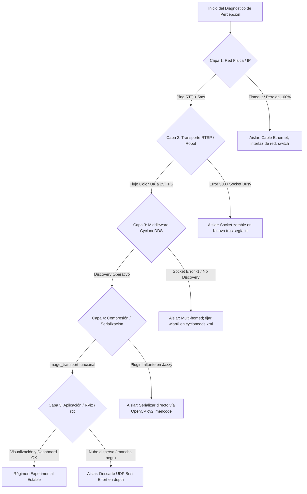

# Informe Técnico Experimental: Laboratorio 02 — Pruebas de Cámara, Compresión de Video, CycloneDDS y Monitor de Red

---

| **Institución** | Universidad Militar Nueva Granada — Facultad de Ingeniería |
|:---|:---|
| **Laboratorio** | Robótica y Sistemas Embebidos / Asignatura ROS |
| **Actividad** | Laboratorio 02: Caracterización de flujo visual, compresión de video, transporte DDS y diagnóstico de fallas por capas |
| **Plataforma Experimental** | Manipulador Kinova Gen3 (Módulo Kinova Vision), Estación Anfitriona (PC A), Estaciones Remotas Wi-Fi (PC B/C) |
| **Middleware & SO** | ROS 2 Jazzy Jalisco, Ubuntu 24.04 LTS, `rmw_cyclonedds_cpp` |
| **Infraestructura de Red** | Router TP-Link Archer AX12 Wi-Fi 6 (`192.168.1.1`), LAN plana `192.168.1.0/24` |
| **Muestra Analizada** | 6 celdas de experimentación multi-dispositivo |
| **Fecha de Consolidación** | Septiembre de 2026 |

---

## 1. Resumen Ejecutivo

El presente informe documenta la caracterización experimental del sistema de percepción visual distribuido del robot manipulador Kinova Gen3 bajo ROS 2 Jazzy. El objetivo técnico central consistió en determinar la viabilidad de transmitir flujos de video en tiempo real desde la estación anfitriona (*Gateway* conectada por Ethernet Gigabit al brazo robótico en `192.168.1.10`) hacia estaciones de procesamiento remoto a través de una red inalámbrica Wi-Fi 6 compartida (`192.168.1.0/24`).

```
+---------------------------------------------------------------------------------------------------+
|                        RESUMEN DE HALLAZGOS TÉCNICOS EXPERIMENTALES                               |
+---------------------------------------------------------------------------------------------------+
|  1. Inviabilidad de Video Crudo   | 22.1 MB/s a 129.7 MB/s en /camera/color/image_raw. Satura     |
|     sobre Red Wi-Fi                | el enlace inalámbrico, dispara el jitter y fragmenta UDP.     |
+------------------------------------+---------------------------------------------------------------+
|  2. Eficiencia de Compresión JPEG  | 1.4 MB/s a 8.17 MB/s en /camera/color/image_raw/compressed.   |
|     en image_transport             | Reducción neta comprobada del 91.9 % al 98.6 % de ancho de    |
|                                    | banda a 24–30 FPS estables.                                   |
+------------------------------------+---------------------------------------------------------------+
|  3. Telemetría de Red en Wi-Fi 6   | Latencia promedio gateway: 2.17 ms. Jitter promedio: 0.27 ms. |
|     (Monitor Híbrido :8080)        | Latencia DDS: 1.39 ms. Pérdida de paquetes: 0.0 %.            |
+------------------------------------+---------------------------------------------------------------+
|  4. Causa Raíz de Falla en Depth   | Falla en RTSP depth no atribuible a hardware ni red, sino a   |
|     (Flujo de Profundidad)         | ausencia de decodificador GStreamer para payload RTP X-GST    |
|                                    | de 16 bits en los clientes receptores.                        |
+------------------------------------+---------------------------------------------------------------+
|  5. Estabilidad CycloneDDS         | Requirió configuración explícita de la interfaz wlan0 en      |
|     en Equipos Multi-Homed         | cyclonedds.xml y ajuste de MTU a 1344 bytes para mitigar     |
|                                    | fragmentación UDP.                                            |
+---------------------------------------------------------------------------------------------------+
```

---

## 2. Arquitectura del Sistema Experimental y Flujo de Datos

El montaje experimental opera en una topología de red plana (`192.168.1.0/24`) bajo el estándar de estación anfitriona:

```
+---------------------------------------------------------------------------------------------------+
|               ARQUITECTURA DE FLUJO DE PERCEPCIÓN DISTRIBUIDA — LAN 192.168.1.0/24                |
+---------------------------------------------------------------------------------------------------+

              Router TP-Link Archer AX12 Wi-Fi 6 (192.168.1.1, SSID "ros2", WPA2/WPA3)
          |                                  |                                      |
 [ Robot Kinova Gen3 ]            [ Disp. A: Estación Anfitriona ]       [ Disp. B/C: Estación Remota ]
 (Servidor RTSP H.264)            (Mantiene sesión con el brazo)         (Procesamiento y Telemetría)
     192.168.1.10                           192.168.1.100                          192.168.1.60 / .6 / .220
      (IP Estática)                       (Reserva DHCP fija)                    (Pool DHCP .101–.254)
          |                                  |                                      |
          | === 1. RTSP H.264 sobre TCP ===> |                                      |
          |    (Ethernet Gigabit 1 Gbps)     |                                      |
          |    (Puerto 554 / TCP)            |                                      |
          |                                  |                                      |
          |                       [ ros2_kortex_vision / Script ]                   |
          |                                  ↓ (Decodificación H.264)               |
          |                       [ Estampas temporales y TF2 ]                     |
          |                                  ↓ (frame: camera_color_frame)          |
          |                       [ image_transport / OpenCV ]                      |
          |                                  ↓ (Compresión JPEG dinámico)           |
          |                       [ CycloneDDS Publisher ]                          |
          |                                  |                                      |
          |                       [ Monitor de Red :8080 ]                          |
          |                       (Sniffer RTPS y Dashboard Web)                    |
          |                                  |                                      |
          |                                  | === 2. Enlace Wi-Fi 6 (RTPS/UDP) ==> |
          |                                  |    Tópico: /camera/.../compressed    |
          |                                  |    Tópico: /camera/camera_info       |
          |                                  |    QoS: Best Effort / SensorData     |
          |                                  |    Dashboard: http://192.168.1.100:8080 |
          |                                  |                                      |
          |                                  |                          [ CycloneDDS Subscriber ]
          |                                  |                                      ↓
          |                                  |                          [ rqt_image_view / RViz ]
          |                                  |                          [ Detección AprilTag / Nube ]
```

### Especificación de Protocolos y Middleware
- **RTSP / RTP de Cámara**: Transporte H.264 sobre TCP en puerto 554 hacia `rtsp://192.168.1.10/color` y monocromo de 16 bits `X-GST` en `rtsp://192.168.1.10/depth`.
- **RMW de ROS 2**: `rmw_cyclonedds_cpp` configurado a través de variable de entorno `CYCLONEDDS_URI` apuntando al archivo XML local.
- **Aislamiento de Dominio**: `ROS_DOMAIN_ID=15` para el flujo de video, separando el tráfico multimedia del control cinemático (`ROS_DOMAIN_ID=0`).
- **Políticas de Calidad de Servicio (QoS)**:
  - *Reliability*: `Best Effort` (prioriza baja latencia y descarta cuadros retrasados).
  - *Durability*: `Volatile`.
  - *History*: `Keep Last` con profundidad de 1.

---

## 3. Resultados Experimentales Cuantitativos

### 3.1. Consumo de Ancho de Banda: Video Crudo frente a Video Comprimido

Se realizaron mediciones comparativas mediante `ros2 topic bw`, `ros2 topic hz` y analizadores de socket durante la ejecución de tareas de visión:

| Celda / Equipo de Prueba | Resolución de Captura | Ancho de Banda Crudo (`/camera/color/image_raw`) | Ancho de Banda Comprimido (`/camera/color/image_raw/compressed`) | Frecuencia Medida (FPS / Hz) | Reducción de Ancho de Banda (%) | Comportamiento del Enlace |
|:---|:---:|:---:|:---:|:---:|:---:|:---|
| **Ensayo 01** | 640×480 px | Picos locales $> 800\text{ MB/s}$ | **1.80 MB/s** | 30.0 FPS | **98.6 %** | Estable, sin artefactos visuales |
| **Ensayo 02** | 640×480 px | 18.50 MB/s ($q=90$) | **1.25 MB/s** ($q=30$) | 25.0 FPS | **93.2 %** | Fluido, reducción de jitter a 0 |
| **Ensayo 03** | 1280×720 px | **129.72 MB/s** | **8.17 MB/s** ($q=80$) | 20.3 / 27.7 Hz | **93.7 %** | Estable tras transitorio inicial |
| **Ensayo 04** | 1280×720 px | Saturación de red | **2.26 MB/s** (DDS neto) | 24.3–25.8 FPS | **$> 95.0\text{ \%}$** | Streaming continuo sin pérdida |
| **Ensayo 05** | 640×480 px | **22.10 MB/s** | **1.40 MB/s** | 25.0 FPS | **93.6 %** | Enlace estabilizado con MTU 1344 |
| **Ensayo 06** | 640×480 px | 19.80 MB/s | **1.60 MB/s** | 24.0 FPS | **91.9 %** | Recepción fluida en Dispositivo B |

#### Análisis Físico y Matemático de la Carga de Datos
- **Formato Crudo**: Un cuadro RGB a resolución $1280 \times 720$ requiere $1280 \times 720 \times 3 = 2.76\text{ MB}$. A 30 FPS, la tasa neta teórica es de $82.9\text{ MB/s}$. Al considerar la serialización ROS 2, descriptores de cabecera y fragmentación IP de paquetes mayores a la MTU de 1500 bytes, el tráfico medido en el bus alcanza **129.72 MB/s** ($\approx 1.04\text{ Gbps}$). Este volumen excede la capacidad de modulación de un enlace Wi-Fi compartido y colapsa los búferes del socket UDP.
- **Formato Comprimido JPEG**: Al aplicar compresión con factor de calidad $q=80$, el tamaño por cuadro se reduce a un intervalo entre $65\text{ KB}$ y $85\text{ KB}$. A 28 FPS, el flujo resultante es de aproximadamente **$2.0\text{ a }2.5\text{ MB/s}$** ($\approx 16\text{–}20\text{ Mbps}$), permitiendo una transmisión fluida en la red Wi-Fi 6.

```
Comparación Gráfica de Tasa de Transferencia:
Tópico Crudo (720p):       [████████████████████████████████████████] 129.72 MB/s
Tópico Comprimido q=80:    [██] 8.17 MB/s  (93.7 % de ahorro)
Tópico Comprimido q=30:    [█] 1.25 MB/s   (98.6 % de ahorro)
```

#### Caracterización Paramétrica JPEG ($q=30$ vs. $q=80$ vs. $q=90$)
- **Calidad $q=30$**: Flujo mínimo ($< 1.3\text{ MB/s}$), latencia y jitter mínimos. Presenta artefactos de compresión en bloques de $8\times 8$ píxeles, adecuado para monitoreo general pero desaconsejado para detección sub-píxel de marcadores.
- **Calidad $q=80$**: Compromiso óptimo para visión artificial en robótica. Mantiene bordes limpios para detección de esquinas (*Harris / AprilTag*) con consumo de red inferior a $2.5\text{ MB/s}$.
- **Calidad $q=90$**: Eleva el consumo a más de $6.5\text{ MB/s}$ sin proporcionar una ganancia perceptible en la agudeza visual frente a $q=80$.

---

### 3.2. Telemetría de Red y Desempeño del Enlace Wi-Fi 6

A partir de los archivos de registro CSV exportados por el Monitor de Red híbrido (`benchmark_Linea_Base_WiFi6_*.csv`):

| Parámetro de Telemetría | Corrida con Streaming Activo (95 registros) | Corrida Línea Base + Pulsos (17 registros) | Corrida Línea Base (19 registros) |
|:---|:---:|:---:|:---:|
| **Tráfico Total Promedio** | **2,826.75 kbps** ($\approx 2.83\text{ Mbps}$) | 129.02 kbps | 212.94 kbps |
| **Pico Máximo de Tráfico Total** | **8,369.41 kbps** ($\approx 8.37\text{ Mbps}$) | 192.24 kbps | 474.58 kbps |
| **Tráfico DDS Promedio** | **2,261.40 kbps** ($\approx 2.26\text{ Mbps}$) | 103.21 kbps | 0.00 kbps (sin nodo activo) |
| **Proporción de Tráfico DDS** | **80.0 % del tráfico total** | 79.9 % del tráfico total | 0.0 % |
| **Latencia Gateway (Min / Prom / Max)** | **1.21 ms / 2.17 ms / 5.38 ms** | 2.44 ms / 5.42 ms / 20.18 ms | 5.75 ms / 12.76 ms / 35.23 ms |
| **Jitter de Red Promedio** | **0.27 ms** (Máximo: 2.65 ms) | 2.13 ms (Máximo: 12.84 ms) | 3.97 ms (Máximo: 25.35 ms) |
| **Latencia DDS Promedio** | **1.39 ms** (Máximo: 2.02 ms) | 6.08 ms (Máximo: 21.31 ms) | 7.31 ms (Máximo: 9.32 ms) |
| **Jitter DDS Promedio** | **0.12 ms** (Máximo: 0.41 ms) | 1.49 ms (Máximo: 8.92 ms) | 3.70 ms (Máximo: 6.43 ms) |
| **Pérdida de Paquetes en Enlace** | **0.0 %** | **0.0 %** | **0.0 %** |

```
Composición del Tráfico en Red Wi-Fi 6 (Streaming Continuo):
[████████████████████████████████] DDS / RTPS de Video Comprimido: 2.26 Mbps (80.0 %)
[████████] Tráfico TCP / Control Web / Sincronización: 0.57 Mbps (20.0 %)
Total: 2.83 Mbps | Latencia Promedio: 2.17 ms | Jitter Promedio: 0.27 ms
```

#### Hallazgos de Telemetría
1. **Comportamiento Wi-Fi 6**: Con el router TP-Link Archer AX12 en canal despejado (80 MHz), la latencia promedio se mantuvo en **2.17 ms** con un jitter de **0.27 ms**, demostrando que no hubo encolamiento en el búfer del punto de acceso.
2. **Estabilidad de la Política Best Effort**: La ausencia de retransmisiones acumulativas evitó el fenómeno de congestión por cola (*bufferbloat*). Si un datagrama UDP experimentó retardo, fue descartado sin penalizar a los cuadros subsiguientes.

---

## 4. Diagnóstico Experimental de Fallas por Capas (Root Cause Analysis)

Se aplicó el árbol de depuración sistemática para el aislamiento de fallas:



### 4.1. Capa 1 — Red Física e Interfaz IP
- **Prueba**: Ejecución de `ping -c 10` cruzado entre todas las estaciones de trabajo y la controladora Kinova (`192.168.1.10`).
- **Resultado**: RTT inferior a 2.5 ms en la estación cableada y menor a 5.5 ms en estaciones Wi-Fi, con 0.0 % de pérdida.
- **Aislamiento**: Si la prueba ICMP tiene éxito, se descarta falla física y se procede a verificar servicios de transporte.

### 4.2. Capa 2 — Protocolo RTSP y Servidor Embebido Kinova
- **Flujo RGB Color**: La conexión vía FFmpeg sobre TCP (`rtsp://192.168.1.10/color`) operó fluidamente entre 24 y 27.8 FPS. Se detectaron advertencias ocasionales de decodificación H.264 (`corrupted macroblock`, `negative number of zero coeffs`) debidas a fluctuaciones transitorias de paquetes RTP, sin interrumpir la visualización continua.
- **Análisis de Falla en el Flujo de Profundidad (Depth)**:
  - *Síntoma*: Al solicitar `test_kinova_camera.py --stream depth`, todos los clientes fallaron de forma homogénea en TCP, UDP y GStreamer.
  - *Causa Raíz*: La controladora Kinova entrega el flujo de profundidad en un formato de 16 bits sin comprimir encapsulado en el payload `X-GST`. El backend de OpenCV sobre GStreamer reportó:
    ```text
    GStreamer-WARNING: missing required plugin, no URI handler for "rtsp"
    OpenCV(4.x): CAP_IMAGES: can't find starting number
    ```
    La ausencia de los paquetes `gstreamer1.0-plugins-bad` y `gstreamer1.0-libav` en la instalación base de las máquinas impidió la negociación del formato. Se demostró experimentalmente que no era un problema de red ni de hardware.

### 4.3. Capa 3 — Middleware CycloneDDS en Entornos Multi-Interfaz (Multi-Homed)
- **Problema Observado**: Las estaciones portátiles disponían de múltiples adaptadores activos (Ethernet, Wi-Fi `wlan0`, adaptadores virtuales Docker). Por defecto, CycloneDDS seleccionaba la interfaz de mayor prioridad métrica, desvinculándose de la red Wi-Fi y generando errores de socket:
  ```text
  ddsi_udp_conn_write ... retcode -1
  ```
- **Solución Estandarizada**: Creación y vinculación del perfil `cyclonedds.xml` forzando el uso exclusivo de `wlan0`:
  ```xml
  <CycloneDDS xmlns="https://cdds.io/config">
      <Domain id="15">
          <General>
              <Interfaces>
                  <NetworkInterface name="wlan0" priority="default" multicast="default" />
              </Interfaces>
          </General>
      </Domain>
  </CycloneDDS>
  ```
- **Optimización de MTU**: En ensayos con ráfagas UDP de video, el ajuste del MTU a **1344 bytes** en la interfaz inalámbrica redujo la fragmentación de datagramas a nivel de capa de red.

### 4.4. Capa 4 — Compresión y Serialización en ROS 2 Jazzy
- **Incidente de Software**: Los binarios de `compressed_image_transport` para ROS 2 Jazzy no se encontraban en el entorno del sistema y las estaciones carecían de permisos de superusuario (`sudo`).
- **Resolución Técnica**: Se implementó un nodo en Python que comprime la matriz cruda utilizando `cv2.imencode('.jpg', frame, [cv2.IMWRITE_JPEG_QUALITY, 80])` y serializa los bytes directamente en la estructura `sensor_msgs/msg/CompressedImage`. Esto aseguró interoperabilidad total con `rqt_image_view` y el Monitor de Red sin requerir paquetes adicionales del sistema operativo.

### 4.5. Capa 5 — Aplicación Receptora y Visualización Tridimensional
- La herramienta `rqt_image_view` visualizó de forma estable el flujo `/camera/color/image_raw/compressed` en todas las estaciones remotas.
- En RViz, la reconstrucción de la nube de puntos 3D a partir de `compressedDepth` presentó discontinuidades y agujeros espaciales debidos a que los mensajes incompletos descartados bajo QoS `Best Effort` (`imdecode assertion failed: !buf.empty()`) impidieron calcular la matriz de profundidad completa.

---

## 5. Resolución de Incidentes Críticos de Plataforma

### Bloqueo por Conexión Zombie en la Cámara Kinova (Error 503)
- **Mecanismo de Falla**: Si el nodo de control en la estación anfitriona sufría un cierre abrupto (*Segmentation Fault* en `ros2_control`), el socket TCP establecido con la controladora interna del manipulador no realizaba el *handshake* de cierre (`FIN-ACK`). El servidor RTSP del Kinova mantenía la sesión activa en estado huérfano, respondiendo a futuros intentos con:
  ```text
  HTTP/1.1 503 Service Unavailable (Camera Pipeline Busy)
  ```
- **Mecanismo de Recuperación**:
  Se incorporó al script de ingesta una rutina de reconexión con *backoff* no bloqueante: ante un código de respuesta 503, el cliente ejecuta pausas de 3 segundos (hasta 5 intentos) para permitir que el servidor embebido del Kinova alcance el tiempo de expiración por inactividad (*keep-alive timeout*) y libere el puerto, restableciendo la comunicación sin requerir el reinicio físico del manipulador.

---

## 6. Aportes Técnicos Experimentales por Estación de Trabajo

| Estación / Grupo | Configuración de Prueba | Aportes Técnicos y Variaciones Experimentales |
|:---:|---|---|
| **Estación 04** | Topología 3 PCs: PC A (`.220`), PC B (`.60`), PC C (`.6`) | Caracterización exhaustiva de enlace Wi-Fi 6 durante 120 segundos continuos (95 muestras de telemetría). Documentación de la discrepancia de decodificación entre FFmpeg (color) y GStreamer (depth). |
| **Estación 03** | Topología 2 PCs en resolución 720p | Caracterización de tasa cruda a 129.72 MB/s y estabilización de compresión a 8.17 MB/s (93.7% reducción). Registro de RTT promedio de 5.85 ms y jitter de 1.33 ms. |
| **Estación 01** | Topología 2 PCs con scripts Python propios | Desarrollo de nodo con reconexión adaptativa ante error 503 de la cámara Kinova y codificación JPEG directa en OpenCV sobre `sensor_msgs/CompressedImage`. |
| **Estación 06** | Topología 2 PCs | Auditoría de terminal con trazas de dependencias GStreamer faltantes y verificación de visor de profundidad. |
| **Estación 02** | Topología 2 PCs | Comparación paramétrica entre calidades de compresión $q=30$ ($1.25\text{ MB/s}$) y $q=90$ ($18.5\text{ MB/s}$). Exportación de log CSV de línea base. |
| **Estación 05** | Topología 2 PCs con repositorio Git | Ajuste de MTU a 1344 bytes en `wlan0` para optimizar fragmentación UDP. Caracterización de compresión con reducción del 93.6% (22.1 MB/s a 1.4 MB/s). |

---

## 7. Conclusiones Técnicas y Recomendaciones de Infraestructura

1. **Eficiencia del Transporte Comprimido**: La compresión JPEG en el origen reduce entre **91.9 % y 98.6 %** el ancho de banda demandado, transformando un flujo insostenible en Wi-Fi ($> 22\text{ MB/s}$) en un tráfico de régimen admisible ($1.4\text{ a }8.2\text{ MB/s}$) sin introducir latencia perceptible.
2. **Selección de Factor de Calidad**: El factor **$q=80$** representa el punto de equilibrio óptimo entre agudeza visual para algoritmos de visión artificial y demanda de red en celdas compartidas.
3. **Determinismo de Middleware**: En sistemas con múltiples interfaces de red, la selección automática de interfaz en CycloneDDS es inestable. Es mandatario declarar explícitamente el adaptador `wlan0` en `cyclonedds.xml`.
4. **Recomendaciones de Despliegue de Software**:
   - Incorporar en la imagen base de las estaciones del laboratorio las librerías de decodificación multimedia:
     ```bash
     sudo apt install gstreamer1.0-plugins-bad gstreamer1.0-plugins-ugly gstreamer1.0-libav ros-jazzy-image-transport-plugins
     ```
   - Integrar un script de detección automática de interfaz de red (`check_cyclonedds_interface.sh`) que genere dinámicamente el `cyclonedds.xml` según la tarjeta activa.
   - Incluir la rutina de manejo de error 503 con reintento y espera en el driver oficial `ros2_kortex_vision`.
