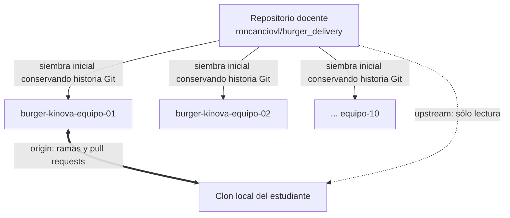

# Configuración de repositorios por equipo (`origin` / `upstream`)

> **Asignatura:** ROBOT OPERATING SYSTEM - ROS<br>
> **Periodo:** 2026-2<br>
> **Organización:** [`umng-mecatronica-ros`](https://github.com/umng-mecatronica-ros)<br>
> **Repositorio docente:** [`roncanciovl/burger_delivery`](https://github.com/roncanciovl/burger_delivery)<br>
> **Módulo interactivo:** [`git-fundamentals/equipos_organizaciones_abet.html`](../../git-fundamentals/equipos_organizaciones_abet.html)

## 1. Arquitectura adoptada

La asignatura utiliza repositorios privados propiedad de la organización docente. Cada equipo trabaja en un repositorio independiente y el repositorio `roncanciovl/burger_delivery` conserva la base oficial del curso.



Los repositorios de equipo **no se crean con `Use this template`** cuando se requiere sincronización posterior. Una plantilla copia los archivos, pero crea una historia Git independiente. Los repositorios se crean vacíos y reciben la rama `main` del repositorio docente, de modo que todos comparten ancestros.

### Repositorios preaprovisionados

| Equipo | Repositorio privado |
|---:|---|
| 01 | [`burger-kinova-equipo-01`](https://github.com/umng-mecatronica-ros/burger-kinova-equipo-01) |
| 02 | [`burger-kinova-equipo-02`](https://github.com/umng-mecatronica-ros/burger-kinova-equipo-02) |
| 03 | [`burger-kinova-equipo-03`](https://github.com/umng-mecatronica-ros/burger-kinova-equipo-03) |
| 04 | [`burger-kinova-equipo-04`](https://github.com/umng-mecatronica-ros/burger-kinova-equipo-04) |
| 05 | [`burger-kinova-equipo-05`](https://github.com/umng-mecatronica-ros/burger-kinova-equipo-05) |
| 06 | [`burger-kinova-equipo-06`](https://github.com/umng-mecatronica-ros/burger-kinova-equipo-06) |
| 07 | [`burger-kinova-equipo-07`](https://github.com/umng-mecatronica-ros/burger-kinova-equipo-07) |
| 08 | [`burger-kinova-equipo-08`](https://github.com/umng-mecatronica-ros/burger-kinova-equipo-08) |
| 09 | [`burger-kinova-equipo-09`](https://github.com/umng-mecatronica-ros/burger-kinova-equipo-09) |
| 10 | [`burger-kinova-equipo-10`](https://github.com/umng-mecatronica-ros/burger-kinova-equipo-10) |

## 2. Acceso e identidad del estudiante

Cada estudiante debe utilizar una cuenta individual de GitHub. No se permiten cuentas ni credenciales compartidas. El correo institucional debe estar agregado y verificado en la cuenta de GitHub cuando la política institucional lo permita.

```bash
cd ~/ros2_ws/src
git clone git@github.com:umng-mecatronica-ros/burger-kinova-equipo-01.git burger_delivery
cd burger_delivery

# Configuración local para este repositorio, no global para todo el computador.
git config user.name "Nombres y Apellidos"
git config user.email "codigo.estudiante@unimilitar.edu.co"
```

La identidad escrita en un commit puede configurarse manualmente; por sí sola no demuestra autoría. Para la trazabilidad se consideran en conjunto la cuenta de GitHub, commits, pull requests, revisiones, bitácoras técnicas y sustentación individual.

## 3. Configuración de remotos

El repositorio del equipo es `origin`. El repositorio docente se agrega como `upstream` y se deshabilita explícitamente como destino de escritura.

```bash
git remote add upstream git@github.com:roncanciovl/burger_delivery.git
git remote set-url --push upstream DISABLED
git remote -v
```

Salida esperada para el equipo 01:

```text
origin    git@github.com:umng-mecatronica-ros/burger-kinova-equipo-01.git (fetch)
origin    git@github.com:umng-mecatronica-ros/burger-kinova-equipo-01.git (push)
upstream  git@github.com:roncanciovl/burger_delivery.git (fetch)
upstream  DISABLED (push)
```

## 4. Trabajo colaborativo

### 4.1. Rama individual

```bash
git switch main
git pull --ff-only origin main
git switch -c feat/apellido-kinova-monitor

# Desarrollar y probar.
git add <archivos>
git commit -m "feat(monitor): implement joint state diagnostics"
git push -u origin feat/apellido-kinova-monitor
```

No se realiza `push` directo a `main`. Cada cambio llega mediante un pull request que incluya:

1. propósito del cambio;
2. pruebas ejecutadas y resultados;
3. interfaces o parámetros modificados;
4. revisión de por lo menos otro integrante.

## 5. Actualizaciones publicadas por el docente

El curso no integra continuamente cualquier estado de `upstream/main`. El docente publica bases identificadas por periodo y corte, por ejemplo:

```text
base-2026-2-corte1
```

El integrante responsable incorpora una base mediante una rama de sincronización y un pull request:

```bash
git fetch upstream --tags
git switch -c sync/base-2026-2-corte1 origin/main
git merge --no-ff refs/tags/base-2026-2-corte1
git push -u origin sync/base-2026-2-corte1
```

Después se abre un PR `sync/base-2026-2-corte1 -> main`, se revisan los conflictos y se ejecutan las pruebas. Este procedimiento conserva la prohibición de escribir directamente sobre `main`.

Las correcciones urgentes posteriores se publican con un identificador nuevo y una nota de cambios. No se reutiliza ni mueve una base ya publicada.

## 6. Entrega y congelamiento

Una vez integrado y probado el trabajo:

```bash
git switch main
git pull --ff-only origin main
git tag -a entrega-2026-2-corte1 -m "Entrega oficial 2026-2 - corte 1"
git push origin entrega-2026-2-corte1
git rev-parse HEAD
```

El equipo registra en la plataforma:

- URL del repositorio oficial;
- nombre exacto del tag;
- SHA completo del commit;
- URL del pull request de cierre, cuando corresponda.

El SHA es la referencia definitiva de evaluación. Un tag sólo se considera protegido cuando exista una regla que impida borrarlo o moverlo. El docente verifica el SHA al cierre y puede crear una referencia adicional bajo control docente.

## 7. Gestión mediante GitHub Teams

La hoja privada `Equipos` del panel docente es la fuente única de conformación.
Para la matrícula inicial de 19 estudiantes se usan nueve equipos —ocho parejas
y un trío— y `equipo-10` queda como reserva. No se mantienen listas manuales
independientes en Classroom, GitHub ni dentro de este repositorio público.

Los permisos se asignan mediante equipos de la organización, no mediante una lista dispersa de colaboradores directos:

- `docentes`: permiso `maintain` o `admin`;
- `equipo-01` a `equipo-10`: permiso `push` únicamente en su repositorio.

Ejemplo administrativo:

```bash
# Crear el equipo una sola vez.
gh api -X POST orgs/umng-mecatronica-ros/teams \
  -f name=equipo-01 -f privacy=closed

# Dar acceso de escritura al repositorio asignado.
gh api -X PUT \
  orgs/umng-mecatronica-ros/teams/equipo-01/repos/umng-mecatronica-ros/burger-kinova-equipo-01 \
  -f permission=push

# Incorporar un estudiante.
gh api -X PUT \
  orgs/umng-mecatronica-ros/teams/equipo-01/memberships/USUARIO_GITHUB \
  -f role=member
```

Los estudiantes no reciben permisos `maintain` ni `admin`.

La réplica idempotente del CSV privado se ejecuta con
[`education/administracion/github/sincronizar_equipos.py`](../administracion/github/sincronizar_equipos.py).
Su modo predeterminado es `VISTA_PREVIA`; `APLICAR` requiere confirmación
explícita, agrega las membresías previstas y no elimina accesos automáticamente.

## 8. Protección requerida

Antes de incorporar estudiantes, la organización debe disponer de un plan que permita Rulesets o protección de ramas en repositorios privados. La rama `main` debe exigir:

- pull request antes de integrar;
- al menos una aprobación;
- invalidación de aprobaciones cuando cambie el código;
- resolución de conversaciones;
- bloqueo de force-push y eliminación;
- ausencia de bypass para estudiantes.

También debe protegerse el patrón de tags `entrega-*`. En agosto de 2026 la organización se encontraba en GitHub Free, que no habilita estas protecciones para repositorios privados. Se debe activar el beneficio educativo o un plan GitHub Team antes de depender técnicamente de estas reglas.

Mientras se completa esa activación, las reglas anteriores son política académica verificable, pero no están forzadas por GitHub.

## 9. Evidencia y evaluación

GitHub proporciona evidencia complementaria para documentar el proceso del equipo; no reemplaza el instrumento de evaluación ni constituye por sí solo medición de un Student Outcome.

| Aspecto observado | Evidencia complementaria |
|---|---|
| Colaboración y responsabilidad individual | Ramas, commits, PR, revisiones, bitácora y sustentación |
| Diseño e integración | Arquitectura del package, cambios revisados y pruebas de aceptación |
| Experimentación y análisis | Informe reproducible, resultados, incidencias y decisiones técnicas |
| Versión evaluada | Repositorio, tag de entrega y SHA verificado al cierre |

La calificación académica y el nivel de logro ABET se determinan exclusivamente mediante el instrumento aprobado para la actividad.

## 10. Seguridad, automatización y cierre del periodo

- No versionar credenciales, direcciones sensibles, `build/`, `install/`, `log/`, rosbag pesados ni datos personales innecesarios.
- Habilitar detección de secretos y protección de push cuando estén disponibles.
- Ejecutar compilación y pruebas automáticas en cada PR cuando las dependencias lo permitan.
- Mantener las pruebas con el Kinova real bajo supervisión y fuera de la automatización remota.
- Al finalizar el semestre, verificar los SHA entregados, retirar escritura a estudiantes y archivar los repositorios conforme a la política institucional de retención.

## 11. Verificación administrativa

```bash
gh auth status
gh repo list umng-mecatronica-ros --limit 100
gh api orgs/umng-mecatronica-ros/teams
gh api repos/umng-mecatronica-ros/burger-kinova-equipo-01/rulesets
```

El docente debe repetir la última verificación en los diez repositorios y conservar un registro de la configuración vigente al inicio y cierre del periodo.
