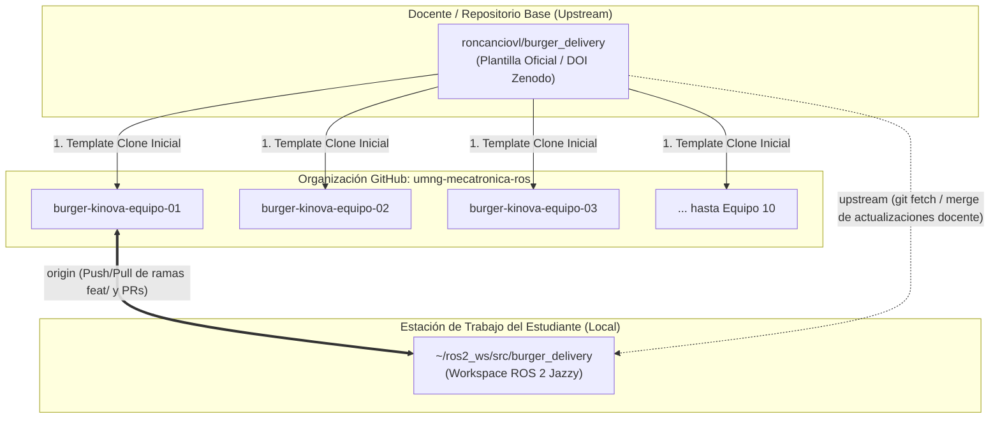

# Guía de Configuración de Repositorios por Equipo y Arquitectura Multi-Remoto (`origin` / `upstream`)

> **Organización Oficial:** [`umng-mecatronica-ros`](https://github.com/umng-mecatronica-ros)  
> **Repositorio Base Docente (Upstream):** [`roncanciovl/burger_delivery`](https://github.com/roncanciovl/burger_delivery)  
> **Fecha de Configuración:** Agosto 2026  
> **Estándar:** Acreditación ABET (SO1, SO2, SO5, SO6) — UMNG  
> **Método de Aprovisionamiento:** GitHub REST API v3 / GitHub CLI (`gh`)  
> **Módulo Interactivo:** [⭐ `git-fundamentals/equipos_organizaciones_abet.html`](../../git-fundamentals/equipos_organizaciones_abet.html)

---

## 1. Resumen Ejecutivo y Arquitectura

Para garantizar la máxima integridad académica, gobernanza institucional y trazabilidad exigidas por **ABET**, la asignatura **ROBOT OPERATING SYSTEM - ROS** implementa un esquema **Nativo de GitHub basado en Organizaciones y Arquitectura Multi-Remoto**:



---

## 2. Repositorios Pre-Aprovisionados en la Organización

Se encuentran creados y configurados los 10 repositorios privados en la organización **`umng-mecatronica-ros`**:

| N° | Repositorio Oficial | URL de Clonación (`origin`) |
| :---: | :--- | :--- |
| **01** | [`burger-kinova-equipo-01`](https://github.com/umng-mecatronica-ros/burger-kinova-equipo-01) | `https://github.com/umng-mecatronica-ros/burger-kinova-equipo-01.git` |
| **02** | [`burger-kinova-equipo-02`](https://github.com/umng-mecatronica-ros/burger-kinova-equipo-02) | `https://github.com/umng-mecatronica-ros/burger-kinova-equipo-02.git` |
| **03** | [`burger-kinova-equipo-03`](https://github.com/umng-mecatronica-ros/burger-kinova-equipo-03) | `https://github.com/umng-mecatronica-ros/burger-kinova-equipo-03.git` |
| **04** | [`burger-kinova-equipo-04`](https://github.com/umng-mecatronica-ros/burger-kinova-equipo-04) | `https://github.com/umng-mecatronica-ros/burger-kinova-equipo-04.git` |
| **05** | [`burger-kinova-equipo-05`](https://github.com/umng-mecatronica-ros/burger-kinova-equipo-05) | `https://github.com/umng-mecatronica-ros/burger-kinova-equipo-05.git` |
| **06** | [`burger-kinova-equipo-06`](https://github.com/umng-mecatronica-ros/burger-kinova-equipo-06) | `https://github.com/umng-mecatronica-ros/burger-kinova-equipo-06.git` |
| **07** | [`burger-kinova-equipo-07`](https://github.com/umng-mecatronica-ros/burger-kinova-equipo-07) | `https://github.com/umng-mecatronica-ros/burger-kinova-equipo-07.git` |
| **08** | [`burger-kinova-equipo-08`](https://github.com/umng-mecatronica-ros/burger-kinova-equipo-08) | `https://github.com/umng-mecatronica-ros/burger-kinova-equipo-08.git` |
| **09** | [`burger-kinova-equipo-09`](https://github.com/umng-mecatronica-ros/burger-kinova-equipo-09) | `https://github.com/umng-mecatronica-ros/burger-kinova-equipo-09.git` |
| **10** | [`burger-kinova-equipo-10`](https://github.com/umng-mecatronica-ros/burger-kinova-equipo-10) | `https://github.com/umng-mecatronica-ros/burger-kinova-equipo-10.git` |

---

## 3. Protocolo de Inicio para Estudiantes

### 3.1. Configuración de Identidad y Clonación
```bash
# 1. Posicionarse en el workspace de ROS 2
cd ~/ros2_ws/src

# 2. Clonar el repositorio asignado a su equipo (ejemplo Equipo 01)
git clone https://github.com/umng-mecatronica-ros/burger-kinova-equipo-01.git burger_delivery
cd burger_delivery

# 3. Configurar identidad formal (Obligatorio para auditoría ABET)
git config --global user.name "Nombres y Apellidos"
git config --global user.email "codigo.estudiante@unimilitar.edu.co"
```

### 3.2. Configuración Obligatoria del Remoto Upstream
```bash
# Configurar el repositorio del docente como upstream
git remote add upstream https://github.com/roncanciovl/burger_delivery.git

# Verificar remotos configurados
git remote -v
```
Salida esperada:
```text
origin    https://github.com/umng-mecatronica-ros/burger-kinova-equipo-01.git (fetch)
origin    https://github.com/umng-mecatronica-ros/burger-kinova-equipo-01.git (push)
upstream  https://github.com/roncanciovl/burger_delivery.git (fetch)
upstream  https://github.com/roncanciovl/burger_delivery.git (push)
```

---

## 4. 🔄 Flujo de Sincronización Continua con el Docente (`upstream`)

Durante el semestre, el docente actualizará el repositorio base con nuevas guías, correcciones de paquetes o ajustes en los drivers.

Para incorporar estas actualizaciones al repositorio de equipo sin sobreescribir el trabajo propio:

```bash
# 1. Cambiarse a la rama principal
git checkout main

# 2. Descargar las actualizaciones del docente
git fetch upstream

# 3. Integrar los cambios en la rama main local
git merge upstream/main --no-edit

# 4. Publicar la versión actualizada en el repositorio del equipo en GitHub
git push origin main
```

---

## 5. Flujo de Trabajo en Equipo y Calidad (ABET SO5)

1. **Ramas de Funcionalidad (`feature branches`):**
   ```bash
   git checkout -b feat/apellido-kinova-monitor
   # Desarrollar código, probar en ROS 2 Jazzy y compilar
   git add .
   git commit -m "feat(monitor): implement joint state subscriber and diagnostics"
   git push -u origin feat/apellido-kinova-monitor
   ```
2. **Pull Request (PR) y Revisión Cruzada:**
   - Se abre un PR hacia `main`.
   - Un compañero de equipo actúa como revisor (*Reviewer*) y debe aprobar el PR con comentarios técnicos constructivos.
   - El *merge* solo procede tras la aprobación por pares.

---

## 6. Procedimiento de Entrega y Congelamiento

En la fecha límite de entrega de cada corte evaluable:

```bash
# 1. Situarse en main y asegurar que todo esté integrado
git checkout main
git pull origin main

# 2. Crear Tag inmutable de entrega
git tag -a v1.0.0-corte1 -m "Entrega Oficial Primer Corte - Conexion Kinova"
git push origin v1.0.0-corte1

# 3. Obtener el Commit SHA inmutable para el informe
git rev-parse HEAD
```

---

## 7. Gestión Docente: Asignación Masiva de Estudiantes vía API

Cuando los estudiantes se registren con sus nombres de usuario de GitHub (`@usuario`), el docente puede agregarlos como colaboradores a sus repositorios respectivos con un solo comando:

```powershell
# Ejemplo: Agregar a los estudiantes user1 y user2 al Equipo 01
gh api -X PUT repos/umng-mecatronica-ros/burger-kinova-equipo-01/collaborators/usuario1 -f permission=push
gh api -X PUT repos/umng-mecatronica-ros/burger-kinova-equipo-01/collaborators/usuario2 -f permission=push
```

---

## 8. Matriz de Trazabilidad ABET

| Criterio ABET | Evidencia en GitHub |
| :--- | :--- |
| **SO5: Trabajo en Equipo** | - Historial de Pull Requests con revisiones y aprobaciones mutuas.<br>- Commits con autoría clara (`user.email` institucional). |
| **SO1 & SO2: Diseño e Integración** | - Estructura modular del package `burger_kinova_connection`.<br>- Cumplimiento de las 10 Pruebas de Aceptación (PA-01 a PA-10). |
| **SO6: Experimentación y Análisis** | - Informe técnico reproducible `docs/VALIDACION_CORTE_1.md`.<br>- Commit SHA inmutable registrado en el cierre. |
