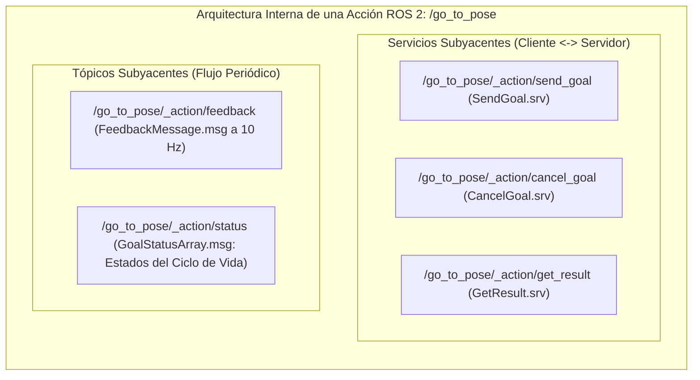
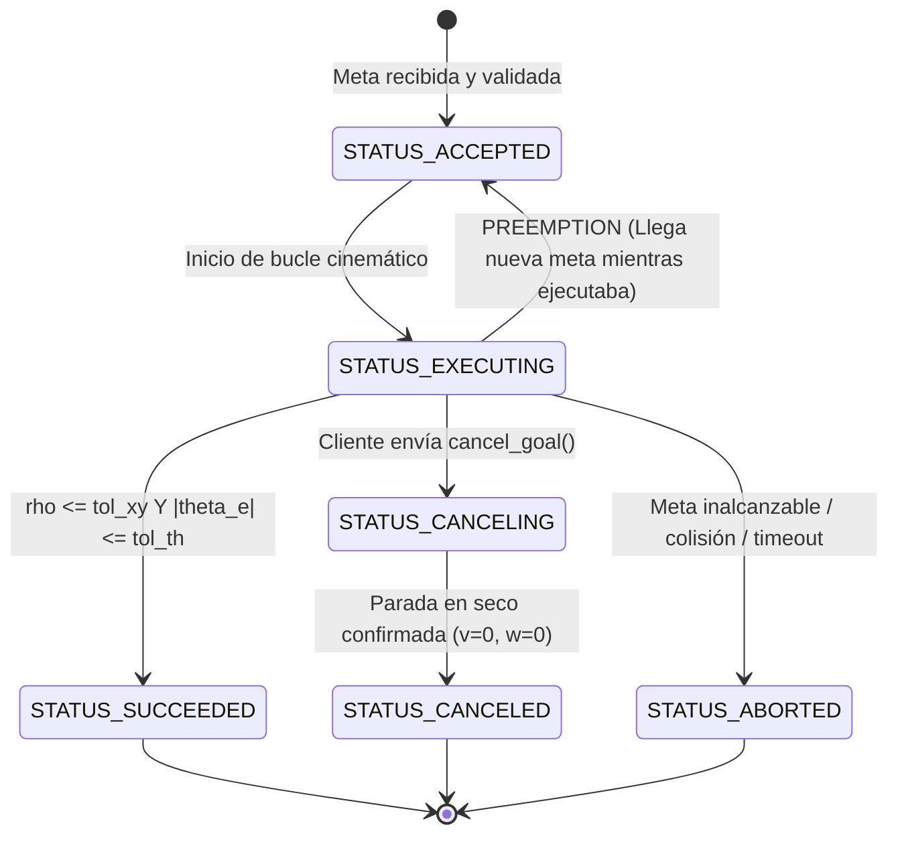

# Proyecto Integrador del Segundo Corte — Control de Posición en Lazo Cerrado con ROS 2 Actions (Turtlesim / micro-ROS)

> **Documento Oficial de Guía Técnica y Evaluación Sumativa — Corte 2 (30% de la Nota del Corte).**  
> **Asignatura:** ROBOT OPERATING SYSTEM - ROS (Periodo 2026-2)  
> **Código de Actividad:** `E_C2` | **Componente Univex:** Entrega Final del Segundo Corte (30%)  
> **Modalidad:** Equipo colaborativo (asignado al entregante designado) con Anexo A de comprobación individual obligatorio.  
> **Puntuación Oficial:** 500 puntos Zubatronic / SGDE ($N_2 = \text{Score} / 100 \in [0.0, 5.0]$).  
> **Instrumento Asociado:** [`education/evidencias_abet/INSTRUMENTO_ABET_PROYECTO_CORTE_2_CONTROL_POSICION.docx`](../evidencias_abet/INSTRUMENTO_ABET_PROYECTO_CORTE_2_CONTROL_POSICION.docx).

---

## 1. Contexto, Justificación y el Valor Fundamental de las Acciones en ROS 2

En sistemas robóticos profesionales, un error conceptual común de ingenieros principiantes es intentar coordinar tareas de navegación, agarre o trayectorias mediante **Tópicos** o **Servicios tradicionales**. Esta práctica genera fallas críticas en entornos industriales:
- **Con Tópicos simples:** No existe retroalimentación garantizada de si el robot aceptó la meta, en qué estado de ejecución se encuentra, cuándo terminó con éxito o si se desvió y falló.
- **Con Servicios simples:** La llamada es síncrona y bloqueante; el cliente se congela durante los 10 o 30 segundos que tarda el robot en desplazarse, sin poder monitorear el progreso ni enviar una orden de cancelación inmediata si se cruza una persona o un obstáculo.

Los **ROS 2 Actions** resuelven esto implementando el patrón cliente-servidor asíncrono de alto nivel más sofisticado del ecosistema robótico. Son la columna vertebral obligatoria sobre la que operan pilas estándar de la industria como **Nav2** (con acciones como `NavigateToPose` y `NavigateThroughPoses`) y **MoveIt 2** (con `MoveGroupAction` y `FollowJointTrajectory`).



### Anatomía Interna: ¿Qué ocurre bajo el capó de una Acción en DDS?
A diferencia de un tópico simple, cada servidor de acción instanciado en ROS 2 levanta automáticamente **tres servicios y dos tópicos** coordinados bajo el protocolo DDS:
1. `_action/send_goal`: Servicio síncrono rápido para validar y aceptar o rechazar la meta (`GoalResponse.ACCEPT` vs `REJECT`).
2. `_action/cancel_goal`: Servicio para solicitar la interrupción en caliente (`CancelResponse.ACCEPT`).
3. `_action/get_result`: Servicio que mantiene en espera la respuesta final sin bloquear el hilo de ejecución principal.
4. `_action/feedback`: Tópico unidireccional de alta frecuencia donde el servidor transmite el avance del robot.
5. `_action/status`: Tópico donde se publica periódicamente el array con los estados formales de todos los `GoalHandle` activos.

---

## 2. Máquina de Estados Formal y Política de Preempción (Preemption)

El valor esencial de una acción radica en su **máquina de estados finita** regulada por el estándar `action_msgs/msg/GoalStatus`:



### Política de Reemplazo de Meta (Goal Preemption):
¿Qué ocurre si el robot está navegando hacia el punto $A$ y el operador o el supervisor decide enviarlo al punto $B$?
En un servidor básico no profesional, la nueva meta se ignora o crashea el nodo. En este proyecto se exige implementar **Preempción Elegante (Goal Replacement)**:
1. El servidor detecta que ya tiene una meta activa en estado `STATUS_EXECUTING`.
2. Ante la llegada de la nueva meta en `goal_callback`, la valida y la acepta.
3. En el hilo de ejecución, marca la meta previa como abortada o cancelada (`previous_goal_handle.abort()` o `canceled()`), emite un mensaje de advertencia en el log, actualiza las referencias cartesianas a la nueva meta y continúa la navegación de forma fluida hacia el nuevo destino sin resetear el nodo.

---

## 3. Especificación del Contrato de Interfaz: `GoToPose.action`

En el paquete de interfaces del workspace (ej. `burger_interfaces/action/GoToPose.action`), se define el contrato formal:

```text
# ==============================================================================
# Contrato de Interfaz de Acción: GoToPose.action
# Control de Navegación en Lazo Cerrado, Monitoreo y Preempción
# ==============================================================================

# 1. GOAL (Solicitud del Cliente)
float32 target_x             # Coordenada X objetivo en marco global [m]
float32 target_y             # Coordenada Y objetivo en marco global [m]
float32 target_theta         # Orientación angular final deseada [rad]
float32 tolerance_xy         # Tolerancia radial de llegada admisible [m]
float32 tolerance_theta      # Tolerancia angular final admisible [rad]
float32 max_linear_speed     # Velocidad lineal máxima permitida [m/s]
float32 max_angular_speed    # Velocidad angular máxima permitida [rad/s]
bool allow_preemption        # Habilita si una nueva meta puede interrumpir a esta

---
# 2. RESULT (Respuesta Final al Concluir o Interrumpir la Tarea)
bool success                 # True si alcanzó la meta dentro de las tolerancias
float32 final_distance_error # Distancia radial euclidiana residual [m]
float32 final_angle_error    # Error angular residual al finalizar [rad]
float32 elapsed_time_sec     # Duración total de la maniobra [s]
int8 final_state             # Estado final de la máquina (SUCCEEDED=4, CANCELED=5, ABORTED=6)
string message               # Resumen textual del desenlace

---
# 3. FEEDBACK (Flujo Periódico emitido a 10 Hz durante la maniobra)
float32 current_x            # Posición actual X [m]
float32 current_y            # Posición actual Y [m]
float32 current_theta        # Orientación actual [rad]
float32 distance_remaining   # Distancia euclidiana faltante hacia la meta [m]
float32 angle_error          # Error de rumbo instantáneo hacia el objetivo [rad]
float32 cmd_linear           # Velocidad lineal comandada en esta iteración [m/s]
float32 cmd_angular          # Velocidad angular comandada en esta iteración [rad/s]
int8 current_phase           # Fase de control: 1=Aproximación lineal/rumbo, 2=Giro en el sitio
```

---

## 4. Fundamentación Matemática del Control Cinemático Uniciclo

Para dar sustento a la acción, el servidor calcula en cada ciclo del timer ($f = 10\text{ Hz}$) la cinemática de error con respecto al `Goal` actual:

1. **Error Cartesiano:** $\Delta x = x_d - x$, $\Delta y = y_d - y$.
2. **Distancia Euclidiana:** $\rho = \sqrt{\Delta x^2 + \Delta y^2}$.
3. **Ángulo de Rumbo hacia la Meta:** $\alpha = \text{wrap\_to\_pi}\left(\text{atan2}(\Delta y, \Delta x) - \theta\right)$.
4. **Error Angular Final:** $\theta_e = \text{wrap\_to\_pi}\left(\theta_d - \theta\right)$.

### Función Obligatoria de Normalización Angular:
```python
import math

def wrap_to_pi(angle: float) -> float:
    """Normaliza estrictamente el ángulo al intervalo [-pi, pi) radianes."""
    while angle > math.pi:
        angle -= 2.0 * math.pi
    while angle < -math.pi:
        angle += 2.0 * math.pi
    return angle
```

### Ley de Control Conmutada en Dos Fases:
- **Fase 1 (Navegación y Rumbo hacia el Punto):** Mientras $\rho > \text{tolerance\_xy}$:
  $$v = \text{clip}\left(K_\rho \cdot \rho \cdot \cos(\alpha), \, 0, \, v_{\max}\right)$$
  $$\omega = \text{clip}\left(K_\alpha \cdot \alpha, \, -\omega_{\max}, \, \omega_{\max}\right)$$
  *(Nótese el factor $\cos(\alpha)$: si el robot no está apuntando al objetivo ($|\alpha| > 90^\circ$), no avanza hasta corregir el rumbo).*
- **Fase 2 (Orientación Final en el Sitio):** Cuando $\rho \le \text{tolerance\_xy}$:
  $$v = 0$$
  $$\omega = \text{clip}\left(K_\theta \cdot \theta_e, \, -\omega_{\max}, \, \omega_{\max}\right)$$
  El objetivo se declara exitoso (`goal_handle.succeed()`) cuando $\rho \le \text{tolerance\_xy}$ y $|\theta_e| \le \text{tolerance\_theta}$.

---

## 5. Requisitos de Implementación de los Nodos

El desarrollo se realiza en un paquete ROS 2 en Python (`turtle_action_controller`):

### 5.1. Nodo Servidor: `turtle_position_action_server.py`
1. **Instanciación del Action Server con Callbacks Especializados:**
   ```python
   self._action_server = ActionServer(
       self,
       GoToPose,
       'go_to_pose',
       execute_callback=self.execute_callback,
       goal_callback=self.goal_callback,
       cancel_callback=self.cancel_callback,
       handle_accepted_callback=self.handle_accepted_callback,
       callback_group=ReentrantCallbackGroup()
   )
   ```
2. **Validación de Límites en `goal_callback`:**
   - Rechaza metas que caigan fuera del área segura del lienzo de `turtlesim`: $x \in [0.5, 10.5]$, $y \in [0.5, 10.5]$.
   - Rechaza metas con parámetros físicamente imposibles ($v_{\max} \le 0$ o $\text{tol}_{xy} < 0.01$).
3. **Gestión de Cancelación en `cancel_callback`:**
   - Registra en el log la solicitud de cancelación.
   - Retorna `CancelResponse.ACCEPT`.
4. **Bucle de Ejecución Asíncrono en `execute_callback`:**
   - Se suscribe a `/turtle1/pose` y publica comandos en `/turtle1/cmd_vel`.
   - Emite `Feedback` a **10 Hz** exactos con métricas dinámicas completas.
   - Evalúa en cada iteración `if goal_handle.is_cancel_requested:` $\rightarrow$ publica `Twist` de ceros, llama `goal_handle.canceled()` y retorna el resultado.
   - Implementa soporte de preempción si entra una nueva meta antes de culminar la actual.

### 5.2. Nodo Cliente Interactivo y Misión de Patrullaje: `turtle_action_client.py`
El cliente debe ofrecer dos modos de operación:
1. **Modo Meta Simple por Línea de Comandos:**
   ```bash
   ros2 run turtle_action_controller turtle_action_client --ros-args -p x:=8.0 -p y:=8.0 -p theta:=1.57
   ```
2. **Modo Patrullaje Secuencial Multi-Meta (Waypoints):**
   - El cliente lee una lista de 4 puntos clave (un polígono o ruta de patrulla):
     $W_1(2, 2, 0) \to W_2(8, 2, \frac{\pi}{2}) \to W_3(8, 8, \pi) \to W_4(2, 8, -\frac{\pi}{2})$.
   - Envía cada meta de forma asíncrona mediante `send_goal_async()`.
   - Monitorea el feedback continuo en pantalla mostrando una barra de progreso o porcentaje de distancia recorrida.
   - Espera el `Result` de cada waypoint antes de despachar el siguiente.
3. **Modo Demostración de Cancelación / Preempción:**
   - Envía una meta distante y a los 3 segundos dispara automáticamente una cancelación o envía una nueva meta para demostrar la preempción fluida en caliente.

---

## 6. Introspección Profunda de Acciones por CLI (Línea de Comandos)

Los estudiantes deben realizar y documentar la introspección técnica de los contratos de acción utilizando las herramientas estándar de ROS 2:

```bash
# 1. Listar acciones activas en el grafo
ros2 action list

# 2. Obtener tipo de interfaz, clientes y servidores conectados
ros2 action info /go_to_pose -t

# 3. Enviar una meta manual con feedback en vivo desde la terminal
ros2 action send_goal /go_to_pose burger_interfaces/action/GoToPose \
  "{target_x: 7.0, target_y: 7.0, target_theta: 0.0, tolerance_xy: 0.1, tolerance_theta: 0.05, max_linear_speed: 1.5, max_angular_speed: 1.0, allow_preemption: true}" \
  --feedback

# 4. Inspeccionar los tópicos internos generados por el middleware DDS
ros2 topic list | grep go_to_pose
# Debe mostrar:
# /go_to_pose/_action/feedback
# /go_to_pose/_action/status

# 5. Inspeccionar los servicios internos generados por la acción
ros2 service list | grep go_to_pose
# Debe mostrar:
# /go_to_pose/_action/cancel_goal
# /go_to_pose/_action/get_result
# /go_to_pose/_action/send_goal
```

---

## 7. Protocolo Experimental y Registro con Rosbag MCAP

Cada equipo debe ejecutar y registrar en un rosbag MCAP cuatro pruebas obligatorias:

| Escenario | Entrada / Configuración | Comportamiento Esperado de la Acción | Métrica a Reportar |
|---|---|---|---|
| **E1: Desplazamiento Rectilíneo** | De $(5.54, 5.54, 0)$ a $(9.50, 5.54, 0)$ | Aceptación rápida, feedback decreciente monótono, frenado suave en tolerancia ($<0.05\text{ m}$). | Tiempo de establecimiento y error final $\rho_f$. |
| **E2: Rotación Pura en el Sitio** | De $(5.54, 5.54, 0)$ a $(5.54, 5.54, 3.14)$ | Conmutación instantánea a Fase 2, $\omega$ regulada con `wrap_to_pi`, parada exacta en ángulo final. | Error angular final $|\theta_{e,f}|$. |
| **E3: Misión Multi-Waypoint (Patrulla)** | Ruta circular o cuadrada de 4 waypoints | Encadenamiento asíncrono de metas: cada meta reporta `SUCCEEDED` antes de despachar la siguiente. | Tiempo total de misión y trayectoria 2D completa. |
| **E4: Cancelación e Interrupción en Caliente** | Meta lejana con orden `cancel_goal()` a mitad de ruta | Transición inmediata a `STATUS_CANCELING` $\to$ `STATUS_CANCELED`, parada en seco instantánea ($v=0, \omega=0$). | Tiempo de respuesta de frenado tras solicitud de cancelación. |

### Grabación Oficial de la Sesión:
```bash
ros2 bag record -s mcap -o dataset_proyecto_corte2_G<equipo> \
  /turtle1/pose \
  /turtle1/cmd_vel \
  /go_to_pose/_action/feedback \
  /go_to_pose/_action/status
```

---

## 8. Reto Sim-to-Real: Portabilidad hacia micro-ROS en ESP32 (Bono +50 Pts)

Dado que la salida del servidor de acción es un flujo estándar de velocidades `geometry_msgs/msg/Twist`, la arquitectura es **100% agnóstica de la plataforma**.
- **Prueba Física:**
  1. Mantener el nodo servidor de acción corriendo en la PC.
  2. Remapear la salida de velocidad en el launch file:
     ```python
     remappings=[('/turtle1/cmd_vel', '/burger_car_NN/cmd_vel')]
     ```
  3. Ejecutar la acción enviando una meta desde el cliente: el ESP32 recibe los paquetes por Wi-Fi UDP a través del agente micro-ROS, hace girar los motores con las velocidades calculadas y enciende su LED al confirmar la llegada a la meta.

---

## 9. Rúbrica Analítica de Evaluación ABET (500 Puntos Zubatronic)

La evaluación otorga **el mayor protagonismo y ponderación a la arquitectura, robustez y ciclo de vida de las Acciones**:

```text
Nota Académica sobre 5,0 = Nota Consolidada sobre 500 ÷ 100
Aporte a la Nota del Corte 2: E₂ = Nota Académica × 0,30 (30% de C2)
```

| Criterio | Peso | SO Principal | Indicador Syllabus | Nivel N3 (Umbral de Logro: 300–399 pts) | Nivel N5 (Excelente: 475–500 pts) |
|---|:---:|:---:|---|---|---|
| **C1. Arquitectura y Contrato de Acción ROS 2** | 30% | **SO2** | **2.1 / 2.3** | Interfaz `GoToPose.action` compilada con tipos correctos; servidor y cliente se conectan y ejecutan una meta simple. | Implementación completa de los 5 canales de la acción (DDS), validación de precondiciones en `goal_callback` (límites del lienzo) e introspección exhaustiva por CLI. |
| **C2. Ciclo de Vida, Máquina de Estados y Preempción** | 25% | **SO6** | **6.4** | El servidor emite feedback periódico y frena al alcanzar la meta. | Gestión impecable de la máquina de estados formal del `GoalHandle`, soporte de cancelación asíncrona con parada inmediata y política de reemplazo de meta en caliente (*Preemption*). |
| **C3. Modelado Cinemático en Lazo Cerrado** | 20% | **SO1** | **1.1 / 1.2** | Ley de control proporcional básica que llega a la meta, con sobrepaso moderado. | Formulación en dos fases desacopladas (aproximación y orientación en el sitio), normalización estricta con `wrap_to_pi`, atenuación angular suave y sin singularidades en $\rho \to 0$. |
| **C4. Misión Multi-Waypoint y Rosbag MCAP** | 15% | **SO6** | **6.1 / 6.2** | Registra rosbag de las pruebas y presenta gráficas de posición. | Ejecución exitosa de los 4 escenarios (incluyendo patrulla multi-waypoint), dataset MCAP íntegro y gráficas de convergencia y perfiles de velocidad. |
| **C5. Trazabilidad Técnica y Trabajo en Equipo** | 10% | **SO3 / SO5** | **3.1–3.3 / 5.1** | Documento oficial diligenciado, Anexo A individual completo y sustentación básica. | Repositorio Git profesional con commits de todos los integrantes, sustentación individual sobresaliente y ejecución del reto Sim-to-Real con micro-ROS en ESP32. |
| **TOTAL** | **100%** | | | | **500 Puntos Máximos** |
