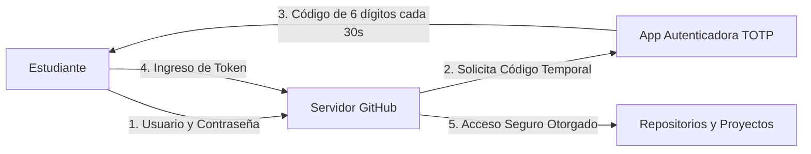
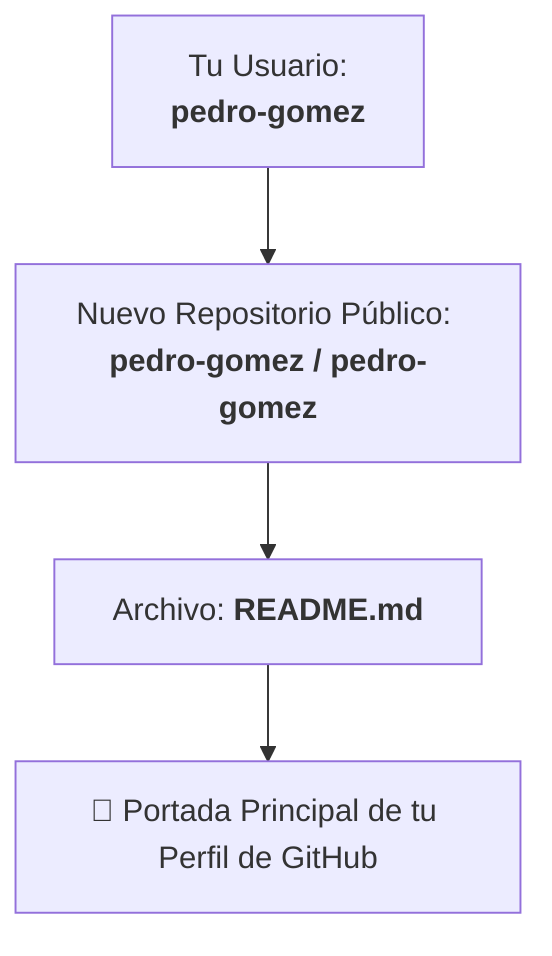

# 🎓 Guía Paso a Paso: Fundamentos de GitHub — Cuenta, Perfil Profesional y Exploración de Repositorios

¡Bienvenido! En este taller práctico darás tus primeros pasos en **GitHub**, la plataforma líder a nivel mundial para el desarrollo colaborativo de software, robótica e ingeniería.

Aprenderás a crear y blindar tu cuenta, estructurar un **perfil profesional de ingeniería**, y dominar las herramientas para **explorar, auditar y navegar repositorios** de otras organizaciones y desarrolladores dentro del ecosistema de **ROS 2**.

---

## 🎯 Resultado de Aprendizaje Evaluable (RAE)

**RAE 1 (Primer Corte):** *Comprender la arquitectura distribuida, redes, comunicación técnica y experimentación en el ecosistema ROS 2.*

### Indicadores ABET asociados:
* **Indicador 3.1 (SO3 - Comunicación efectiva):** Estructura perfiles y documentación técnica con estándares claros de presentación, redacción e identidad profesional.
* **Indicador 4.1 (SO4 - Responsabilidad ética y profesional):** Aplica buenas prácticas de seguridad de credenciales (2FA), gestión de identidad digital y respeto por licencias de software y autoría.
* **Indicador 5.3 (SO5 - Trabajo en equipo):** Configura herramientas de control de versiones y plataformas colaborativas para asegurar trazabilidad en proyectos grupales.

---

## 🧠 Contexto: ¿Por qué GitHub es tu carta de presentación en ingeniería?

En la industria tecnológica y la robótica moderna, **tu perfil de GitHub es tu currículum técnico en vivo**. Los evaluadores, directores de laboratorio y reclutadores no solo leen lo que dices saber; entran a tu GitHub para verificar:
1. **Calidad de tu código y documentación:** Si usas Markdown claro, diagramas, commits descriptivos y licencias adecuadas.
2. **Constancia y colaboración:** Tu historial de contribuciones, pull requests y participación en equipos.
3. **Capacidad de investigación:** Tu habilidad para encontrar librerías abiertas, entender la arquitectura de repositorios existentes y reutilizar paquetes de forma ética y profesional.

---

## 📋 Estructura de Trabajo del Taller

Cada sección combina:
1. **El Concepto:** Por qué es importante cada elemento.
2. **La Acción:** Pasos guiados en la interfaz web de GitHub y terminal.
3. **Mini-Reto:** Validación práctica obligatoria para tu bitácora técnica.

---

## 1. Fase 1: Creación de Cuenta y Seguridad Blindada (2FA)

### 🧠 El Concepto
Tu cuenta de GitHub alojará tus proyectos académicos, tus contribuciones al manipulador Kinova y a los robots móviles de la universidad, y más adelante tu portafolio profesional. Proteger esta identidad es una responsabilidad crítica de ingeniería.

### 🛠️ Ejercicio 1.1: Registro y Nombre de Usuario Profesional
1. Ingresa a [https://github.com](https://github.com) y haz clic en **Sign up**.
2. **Correo Electrónico:** Regístrate con tu correo institucional (ej. `u1234567@unimilitar.edu.co`) o tu correo personal principal. *(Nota: Más adelante puedes vincular ambos correos a la misma cuenta).*
3. **Username (Nombre de Usuario):** Elige un nombre profesional, legible y formal.
   * ✅ **Recomendado:** `hector-parra`, `roncancio-dev`, `alejandro-morales-robotics`, `carlos-gomez-umng`.
   * ❌ **Evitar:** `gamer_pro_99`, `dark_destroyer_2026`, `anonimo1234`.
4. Completa la verificación anti-bot y valida el código que llegará a tu correo.

---

### 🛠️ Ejercicio 1.2: Activación Obligatoria de 2FA (Autenticación en Dos Pasos)
GitHub exige autenticación en dos pasos (2FA) para todos los desarrolladores activos.



1. En GitHub, haz clic en tu foto de perfil (esquina superior derecha) $\to$ **Settings**.
2. En la barra lateral izquierda, selecciona **Password and authentication**.
3. En la sección **Two-factor authentication**, haz clic en **Enable two-factor authentication**.
4. Descarga en tu celular una app autenticadora (como **Google Authenticator**, **Microsoft Authenticator** o **GitHub Mobile**).
5. Escanea el código QR en pantalla e ingresa el código de 6 dígitos que genera la app.
6. ⚠️ **MUY IMPORTANTE:** Descarga o guarda tus **Recovery Codes (Códigos de Recuperación)** en un lugar seguro (por ejemplo en tu gestor de contraseñas). Si pierdes tu celular, estos códigos son la **única** forma de recuperar tu cuenta.

---

### 🛠️ Ejercicio 1.3: Vincular el Correo Institucional y Solicitar el Student Pack
1. Ve a **Settings $\to$ Emails**.
2. Añade tu correo institucional `@unimilitar.edu.co` y haz clic en **Verify**.
3. Accede a [https://education.github.com/pack](https://education.github.com/pack) y solicita el **GitHub Student Developer Pack**. Este beneficio gratuito para estudiantes de la UMNG incluye:
   * GitHub Pro gratis mientras seas estudiante.
   * Acceso gratuito a GitHub Copilot.
   * Créditos en la nube (AWS, Azure, DigitalOcean) y licencias de software profesional (JetBrains, Termius, etc.).

---

## 2. Fase 2: Configuración del Perfil Profesional y README Especial

### 🧠 El Concepto
Un perfil incompleto transmite informalidad. Un perfil configurado con foto, biografía y un **Profile README** convierte tu cuenta en un portafolio interactivo.

### 🛠️ Ejercicio 2.1: Información Básica del Perfil
1. Ve a **Settings $\to$ Public profile**.
2. Completa los siguientes campos:
   * **Name:** Tu nombre y apellidos reales completos (ej. `Pedro Nel Gómez`).
   * **Public email:** Selecciona tu correo verificado para que tus contribuciones se vinculen a tu perfil.
   * **Bio:** Una descripción concisa y profesional (máximo 160 caracteres).
     > *Ejemplo:* "Estudiante de Ingeniería Mecatrónica en la UMNG. Apasionado por la robótica móvil, visión artificial y sistemas distribuidos en ROS 2."
   * **Company / Organization:** `@unimilitar` o `Universidad Militar Nueva Granada`.
   * **Location:** `Bogotá / Cajicá, Colombia`.
   * **Social accounts:** Añade tu perfil de LinkedIn si lo tienes.
3. **Foto de Perfil:** Sube una foto clara, formal y de buena calidad donde se identifique tu rostro.

---

### 🛠️ Ejercicio 2.2: Creación del Repositorio Especial `username/username`
GitHub tiene una función secreta: si creas un repositorio público con **el mismo nombre exacto que tu nombre de usuario**, su archivo `README.md` se mostrará automáticamente en la portada principal de tu perfil.



1. Haz clic en el botón **`+`** (esquina superior derecha) $\to$ **New repository**.
2. En **Repository name**, escribe **exactamente tu nombre de usuario** (verás aparecer un mensaje especial con confeti 🌟 indicando que has descubierto el repositorio secreto).
3. Asegúrate de marcarlo como **Public** y activar la casilla **Add a README file**.
4. Haz clic en **Create repository**.
5. Abre el archivo `README.md` creado, haz clic en el icono del lápiz ✏️ para editarlo y utiliza una plantilla atractiva con Markdown y badges.

#### 📝 Plantilla Sugerida para Estudiantes de Robótica / ROS:

```markdown
# ¡Hola, soy [Tu Nombre y Apellidos]! 👋

🎓 **Estudiante de Ingeniería Mecatrónica** en la [Universidad Militar Nueva Granada](https://www.unimilitar.edu.co).  
🤖 Interesado en robótica colaborativa, percepción visual, cinemática y arquitecturas en **ROS 2**.

---

### 🛠️ Tecnologías y Herramientas en Aprendizaje


---

### 🚀 Proyectos en Desarrollo
- 🦾 **Burger Delivery (ROS 2 & Kinova Gen3):** Celda robótica colaborativa con manipulación industrial y plataformas móviles diferenciales.
- 📡 **Telemetría y micro-ROS:** Nodos embebidos distribuidos sobre ESP32 y Wi-Fi 6.

---

### 📬 Conéctate Conmigo
- 🌐 [LinkedIn](https://linkedin.com/in/tu-usuario)
- ✉️ Correo: `tu.correo@unimilitar.edu.co`
```

6. Haz clic en **Commit changes...** para guardar los cambios y regresa a tu perfil (`https://github.com/tu-usuario`) para admirar tu nueva portada.

---

## 3. Fase 3: Exploración y Navegación de Repositorios en Otras Cuentas

### 🧠 El Concepto
En ingeniería, el 80% del tiempo no escribes código desde cero: **lees, analizas, auditas y reutilizas repositorios existentes**. Conocer la anatomía de un repositorio te permite entender rápidamente cómo está construido cualquier proyecto.

---

### 🛠️ Ejercicio 3.1: Anatomía de un Repositorio en GitHub
Visita el repositorio base del docente de la asignatura:  
👉 [`https://github.com/roncanciovl/burger_delivery`](https://github.com/roncanciovl/burger_delivery)

Explora sus pestañas y elementos principales:

```text
┌──────────────────────────────────────────────────────────────────────────┐
│ roncanciovl / burger_delivery                                            │
├──────────────────────────────────────────────────────────────────────────┤
│ [< > Code]  [⊙ Issues]  [⑂ Pull requests]  [▶ Actions]  [📊 Insights]   │
└──────────────────────────────────────────────────────────────────────────┘
```

* **`< > Code`:** El árbol de archivos del proyecto. Contiene la rama activa (`main`), el botón verde `Code` (para clonar vía HTTPS o SSH) y el historial de commits.
* **`README.md`:** Documento principal que explica qué hace el proyecto, cómo instalarlo y cómo usarlo.
* **`LICENSE`:** Define legalmente qué se puede y qué no se puede hacer con el código (ej. Apache 2.0, MIT, GPL).
* **`CITATION.cff` / `.zenodo.json`:** Archivos que permiten citar formalmente el proyecto en tesis, artículos científicos y publicaciones indexadas.
* **`Releases` (Barra lateral derecha):** Versiones estables publicadas y empaquetadas (ej. `v1.0.0`, `v1.1.0`).

---

### 🛠️ Ejercicio 3.2: Atajos Secretos de Teclado en GitHub
En la página del repositorio `roncanciovl/burger_delivery`, prueba estos atajos interactivos en tu navegador:

1. **Buscador Rápido de Archivos (File Finder):**  
   Presiona la tecla <kbd>t</kbd>.  
   *Escribe `Syllabus` o `diagnostico` y verás cómo encuentras el archivo en milisegundos sin hacer clic en cada carpeta.*
2. **Editor Web VS Code en la Nube:**  
   Presiona la tecla <kbd>.</kbd> (punto) en tu teclado.  
   *El navegador abrirá una versión completa de Visual Studio Code (`github.dev`) cargando todo el repositorio para lectura cómoda.*
3. **Inspección de Autoría (Git Blame):**  
   Abre cualquier archivo (ej. `README.md`) y haz clic en el botón **Blame** (arriba a la derecha del visor de código).  
   *Podrás ver exactamente qué persona modificó cada línea y con qué commit.*

---

### 🛠️ Ejercicio 3.3: Interacciones Esenciales (Star, Watch y Exploración de Organización)
1. **Dar Star ⭐:** En la esquina superior derecha del repositorio `roncanciovl/burger_delivery`, haz clic en **Star**.  
   *Esto guarda el repositorio en tus favoritos y apoya la visibilidad del proyecto.*
2. **Configurar Watch 👀:** Haz clic en **Watch** $\to$ **Participating and @mentions** o **All Activity** si deseas recibir notificaciones de cambios.
3. **Explorar la Organización Oficial de la Asignatura:**  
   Visita la organización institucional:  
   👉 [`https://github.com/umng-mecatronica-ros`](https://github.com/umng-mecatronica-ros)  
   *Aquí residen los repositorios privados preaprovisionados de cada equipo de trabajo (`burger-kinova-equipo-01`, etc.).*

---

### 🛠️ Ejercicio 3.4: Búsqueda Avanzada de Proyectos en GitHub
En la barra de búsqueda superior de GitHub (`/`), prueba realizar estas consultas con filtros:

* Buscar proyectos en ROS 2 Jazzy con más de 10 estrellas:
  ```text
  topic:ros2-jazzy stars:>10
  ```
* Buscar repositorios en lenguaje Python sobre manipuladores Kinova:
  ```text
  kinova language:python
  ```
* Buscar paquetes sobre micro-ROS:
  ```text
  micro-ros in:name,description
  ```

---

## 4. Fase 4: Configuración de la Identidad Local de Git

### 🧠 El Concepto
Para que los commits que hagas desde tu terminal de Ubuntu (`~/ros2_ws/src/burger_delivery`) aparezcan con tu foto y se sumen a tu historial de contribuciones en GitHub, tu configuración local de Git debe coincidir **exactamente** con tu correo registrado en GitHub.

### 🛠️ Ejercicio: Configurar Git en tu Terminal

Abre tu terminal en Ubuntu y ejecuta:

```bash
# 1. Configurar tu nombre completo (como aparece en tu perfil)
git config --global user.name "Tu Nombre y Apellidos"

# 2. Configurar tu correo electrónico registrado y verificado en GitHub
git config --global user.email "tu.correo@unimilitar.edu.co"

# 3. Configurar la rama principal por defecto como main
git config --global init.defaultBranch main

# 4. Verificar la configuración
git config --global --list
```

---

## 📦 Entregables del Taller para la Bitácora ABET

Cada estudiante debe incluir en su informe individual / bitácora de evidencias:

1. **Captura 1 (Seguridad y Cuenta):** Captura de pantalla de la sección *Password and authentication* donde se aprecie el indicador **Two-factor authentication: Enabled**.
2. **Captura 2 (Perfil y README):** Enlace web a tu perfil público (`https://github.com/tu-usuario`) y captura de pantalla de tu portada con el README especial personalizado.
3. **Captura 3 (Exploración del Repositorio Base):** Captura de pantalla del repositorio [`roncanciovl/burger_delivery`](https://github.com/roncanciovl/burger_delivery) mostrando tu estrella ⭐ otorgada y un archivo inspeccionado mediante el atajo <kbd>t</kbd> o <kbd>.</kbd>.
4. **Verificación de Identidad Local:** Salida del comando `git config --global --list` ejecutado en tu terminal de Linux.
