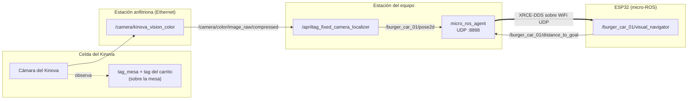

# 🎓 Guía Paso a Paso: Localización Visual 2D con la Cámara del Kinova y Lazo de Pose con micro-ROS

> [!IMPORTANT]
> **Actualización del Repositorio Privado del Equipo:**
> Antes de iniciar o continuar con este taller, asegúrese de haber sincronizado su repositorio privado de equipo con los últimos cambios de la base del curso. Consulte la [Guía Oficial de Sincronización y Actualizaciones](../proyectos_evaluables/ACTUALIZACIONES_BASE_CORTE_1.md) para realizar este proceso correctamente.

Este taller construye un lazo distribuido entre la celda del Kinova y un robot móvil: un nodo de
localización detecta los **AprilTags reales de la mesa** en la imagen de la **cámara del Kinova**,
calcula la pose 2D de un carrito (`geometry_msgs/msg/Pose2D`) y un ESP32 con micro-ROS la consume,
calcula su distancia a una meta y publica ese error de vuelta al grafo ROS 2.

Se trabaja en dos modos que comparten el mismo nodo y el mismo firmware:

| Modo | Fuente de la pose | Driver del robot | Para qué sirve |
|---|---|---|---|
| **A · Simulado** | Trayectoria sintética (círculo de 0.35 m) | No | Validar la cadena PC → agente → ESP32 sin ocupar la celda |
| **B · Real con el Kinova** | AprilTags de la mesa vistos por la cámara del Kinova | **Sí**: la estación anfitriona publica la imagen comprimida | Localizar el carrito real sobre la mesa |

Trabaja con los conceptos de ROS 2 del **Primer Corte** (nodos, tópicos, publicadores,
suscriptores y micro-ROS) **sin árboles TF2**, que se abordan en el Segundo Corte.

---

## 🎯 Resultado de Aprendizaje Evaluable (RAE)

**RAE 1 (Primer Corte):** *Comprender la arquitectura distribuida, redes, comunicación técnica y experimentación en el ecosistema ROS 2.*

### Indicadores ABET asociados:
* **Indicador 1.1 (SO1 - Resolución de problemas):** Formula y conecta el flujo de datos entre la cámara del Kinova, un nodo de localización en la PC y un nodo de control embebido en el microcontrolador.
* **Indicador 2.2 (SO2 - Diseño de ingeniería):** Selecciona interfaces y mensajes compactos (imagen comprimida, `geometry_msgs/msg/Pose2D`) respetando las restricciones de ancho de banda y memoria del ESP32, y justifica sus limitaciones (Fase 3).
* **Indicador 6.1 (SO6 - Experimentación y análisis):** Diseña y ejecuta pruebas de lazo cerrado, midiendo la exactitud de la pose, su frecuencia de actualización y la respuesta del nodo embebido.

---

## ✅ Prerrequisitos

**Para ambos modos:**
- Fases 0 a 2 del [taller de micro-ROS en ESP32](TALLER_MICROROS_ESP32_ROBOTICA_MOVIL.md): agente micro-ROS disponible y firmware WiFi con namespace funcionando.
- Entorno del curso en todas las terminales (`source /opt/ros/jazzy/setup.bash`, `ROS_DOMAIN_ID=0`, CycloneDDS) según [`ROS2_NETWORK_CONFIG.md`](../../network_setup/ROS2_NETWORK_CONFIG.md) §3.
- Repositorio en `~/ros2_ws/src/burger_delivery`.

**Para el Modo B (real), además:**
- En la **estación anfitriona**: driver de visión `kinova_vision` y `ros-jazzy-image-transport-plugins` instalados, según la [Guía de Laboratorio 02](../guias_laboratorio/GUIA_LAB_02_PRUEBAS_CAMARA_KINOVA_VISION.md), Fase 3.
- En la **estación del equipo**: OpenCV y NumPy (`python3 -c "import cv2, numpy; print(cv2.__version__)"`). Con el `python3-opencv` de Ubuntu 24.04 (4.6.0) funciona; el nodo usa la API de detección disponible en esa versión y en las posteriores.
- AprilTags de la familia **36h11** impresos: uno fijo en la mesa (`tag_mesa`) y uno en el techo del carrito.

---

## 🗺️ Mapa del Sistema: qué se ejecuta y qué aparece en el grafo

| Estación | Qué se ejecuta | Nodo en el grafo | Publica | Se suscribe | Modo |
|---|---|---|---|---|---|
| **Anfitriona** (Ethernet) | `ros2 launch kinova_vision kinova_vision.launch.py device:=192.168.1.10` | `/camera/kinova_vision_color` | `/camera/color/image_raw/compressed` | — | B |
| Equipo | `python3 scripts/apriltag_fixed_camera_localizer.py …` | `/apriltag_fixed_camera_localizer` | `/burger_car_01/pose2d` | `/camera/color/image_raw/compressed` (sólo B) | A y B |
| Equipo | `ros2 run micro_ros_agent micro_ros_agent udp4 --port 8888` | *no aparece*: puente XRCE-DDS ↔ DDS | — | — | A y B |
| ESP32 | firmware de la Fase 4 | `/burger_car_01/visual_navigator` | `/burger_car_01/distance_to_goal` | `/burger_car_01/pose2d` | A y B |



---

## 🧑‍🤝‍🧑 Roles de las Estaciones y Dominio

> [!IMPORTANT]
> **Modo B: aplica la convención de estación anfitriona** ([`TROUBLESHOOTING.md`](../../TROUBLESHOOTING.md) §2.0).
> - Todas las estaciones en `ROS_DOMAIN_ID=0`.
> - **Una sola** estación, conectada por **Ethernet** al router, ejecuta los drivers del brazo y del
>   módulo de visión (comparten la IP del robot) y publica la imagen comprimida.
> - Las demás estaciones **no** lanzan `kinova_vision` ni `kortex_bringup`: se suscriben a
>   `/camera/color/image_raw/compressed`.
>
> Antes de lanzar cualquier driver, comprueba si ya hay uno:
> ```bash
> timeout 15s ros2 node list | grep -E "controller_manager|kinova_vision"
> ros2 topic echo /burger/kinova/diagnostics --once | grep -A8 "identidad de la estación"
> ```

Además, en el Modo B:
- **Sólo la anfitriona mueve el brazo.** La cámara está en la muñeca: para que vea la mesa, la anfitriona lleva el brazo a una **pose de observación** fija que encuadre el `tag_mesa` y la zona de los carritos, y la mantiene durante la práctica. Si el brazo se mueve, cambia la perspectiva; la homografía se recalcula en cada imagen, pero ambos tags deben seguir visibles.
- **Un solo localizador por carrito.** Dos estaciones publicando `/burger_car_01/pose2d` darían al ESP32 poses alternadas. Cada equipo localiza **su** carrito (`robot_namespace`) con **su** `tag_id`.
- **Cada suscriptor de la imagen es un flujo más desde la anfitriona.** Conviene que sólo se suscriba a la imagen quien la procesa; el ancho de banda se mide en la Fase 2.

**Modo A:** no hay driver, así que la convención de anfitriona **no aplica**. El namespace de cada
carrito (`/burger_car_01`, …) basta para que varios equipos compartan el dominio `0`.

---

## 🧭 Límites del Taller (qué valida y qué no)

| Distinción | En este taller |
|---|---|
| **Modo A vs. Modo B** | El Modo A **no detecta nada**: valida la comunicación, no la cámara, los tags ni la exactitud. Sólo el Modo B valida la localización. |
| **Detector vs. localización** | El detector encuentra las 4 esquinas de cada tag en píxeles. La localización expresa el tag del carrito en metros **en el marco de `tag_mesa`**. El nodo hace ambas cosas, en ese orden. |
| **Marco de `tag_mesa` (este taller) vs. frame `tag_mesa` del URDF** | El origen y los ejes salen del **sticker impreso**: el eje x va de su esquina 0 a su esquina 1. Coincide con el frame `tag_mesa` del URDF sólo si el sticker está pegado como declara `table_to_tag_mesa` ([`TALLER_URDF_TF.md`](TALLER_URDF_TF.md) §5). |
| **Plano de la mesa vs. altura del carrito** | La homografía es exacta para puntos **en el plano de `tag_mesa`**. El tag del carrito está a la altura de su techo: con la cámara inclinada eso introduce un error de paralaje (Fase 6). |
| **Error de distancia vs. navegación** | El ESP32 **no navega**: calcula una distancia y enciende un LED. No hay control de motores. |
| **Pose sin estampa de tiempo** | `Pose2D` no tiene `header`: el receptor no sabe cuándo se tomó la imagen que originó la pose. |

---

## 1. Fase 1: Localizador en Modo Simulado (Modo A)

### 🧠 El Concepto
El nodo publica periódicamente `(x, y, θ)` en `/{robot_namespace}/pose2d`. El **namespace** permite
que varios carritos compartan el dominio: `burger_car_01` publica en `/burger_car_01/pose2d`.

> [!NOTE]
> El código del localizador vive en el paquete `burger_perception`: el nodo en
> `burger_perception/burger_perception/apriltag_localizer.py` y la geometría (homografía, pose)
> en `tag_geometry.py`. `scripts/apriltag_fixed_camera_localizer.py` es un envoltorio que lo
> ejecuta, así que los comandos `python3 scripts/apriltag_fixed_camera_localizer.py ...` de este
> taller siguen funcionando. Compilado el paquete, también sirve
> `ros2 run burger_perception apriltag_localizer`.

### 🔍 Revisión real obligatoria
```bash
cd ~/ros2_ws/src/burger_delivery
rg -n "declare_parameter|topic_name|simulated_mode|radius|sim_time \+=|math.pi" burger_perception/burger_perception/
```

Anota los ocho parámetros con sus valores por defecto, cómo se construye el nombre del tópico y la
trayectoria simulada: radio `0.35` m, `0.05` rad por mensaje, `θ` tangente al círculo.

### 🛠️ Ejercicio
**Terminal 1:**
```bash
python3 scripts/apriltag_fixed_camera_localizer.py --ros-args -p simulated_mode:=true -p robot_namespace:=burger_car_01
```

**Terminal 2:**
```bash
ros2 topic info /burger_car_01/pose2d
ros2 topic echo /burger_car_01/pose2d --once
ros2 topic hz /burger_car_01/pose2d
```

Salida esperada (medida en ROS 2 Jazzy):
```text
Type: geometry_msgs/msg/Pose2D
Publisher count: 1
Subscription count: 0

x: 0.34414395345490373
y: -0.06375687649523813
theta: 1.3876110196152964
---

average rate: 9.998
	min: 0.099s max: 0.101s std dev: 0.00037s
```

Con la pose de ejemplo, `atan2(y, x) = −0.183` rad y `θ = −0.183 + π/2 = 1.388` rad: la orientación
es tangente al círculo.

> [!NOTE]
> Si `echo` o `info` terminan sin imprimir nada aunque el nodo corre, es el **daemon de la CLI**:
> `timeout 5s ros2 daemon stop; ros2 daemon start` ([`TROUBLESHOOTING.md`](../../TROUBLESHOOTING.md) §1).

### ✅ Criterios de éxito
- La persona participante puede ubicar los parámetros del nodo y explicar cómo `robot_namespace` determina el tópico.
- La persona participante puede validar con `ros2 topic info` y `ros2 topic hz` un único publicador a ≈ 10 Hz.
- La persona participante puede explicar qué valida el Modo A y qué no.

---

## 2. Fase 2: Imagen de la Cámara del Kinova y Tags Reales (Modo B)

### 🧠 El Concepto
La anfitriona publica la imagen de la cámara del Kinova **comprimida en JPEG** mediante
`image_transport`. La estación del equipo se suscribe al tópico `/compressed`, decodifica cada
imagen, detecta los tags y publica una pose **por cada imagen** en la que ve los dos tags. Por eso,
en el Modo B, la frecuencia de la pose la fija la cámara, no un temporizador.

### 🔍 Revisión real obligatoria
```bash
rg -n "image_topic|qos_profile_sensor_data|imdecode|make_detector|ArucoDetector|DetectorParameters_create|Tags visibles|no visible" burger_perception/burger_perception/
```

Identifica: la suscripción a `CompressedImage` con perfil de datos de sensor, la decodificación con
`cv2.imdecode`, la selección de API de OpenCV (4.6 frente a 4.7+) y los dos casos en que el nodo
**decide no publicar**.

### 🛠️ Ejercicio 2.1: Verificar la imagen que publica la anfitriona
Desde la estación del equipo (sin lanzar ningún driver):
```bash
ros2 node list | grep kinova_vision
# /camera/kinova_vision_color

ros2 topic info /camera/color/image_raw/compressed
# Type: sensor_msgs/msg/CompressedImage
# Publisher count: 1

ros2 topic hz /camera/color/image_raw/compressed
ros2 topic bw /camera/color/image_raw/compressed
```

Anota la frecuencia y el ancho de banda: son la frecuencia máxima que tendrá la pose y el costo de
red de cada suscriptor. Si el tópico no existe, el problema está en la anfitriona (driver o plugins
de `image_transport`), no en la estación del equipo.

> [!NOTE]
> **Referencia medida en el laboratorio (2026-09-15).** Desde una estación WiFi (`192.168.1.185`) el
> robot respondió a `ping` con 0 % de pérdida y RTT medio de 7.6 ms, y el RTSP de color
> (`rtsp://192.168.1.10/color`) entregó **1920 × 1080 a ≈ 29 FPS** tanto por TCP como por UDP. Ese es
> el techo de frecuencia de la cámara; la del tópico comprimido depende además de
> `max_color_pub_rate` en la anfitriona y del enlace.

### 🛠️ Ejercicio 2.2: Identificar los tags y medir su tamaño
1. Lanza el localizador en Modo B **sin referencia** sólo para ver qué IDs detecta:
   ```bash
   python3 scripts/apriltag_fixed_camera_localizer.py --ros-args -p robot_namespace:=burger_car_01 -p tag_id:=0
   ```
   Cada 5 s el nodo registra los tags visibles:
   ```text
   [INFO] [...] [apriltag_fixed_camera_localizer]: Tags visibles: [1, 5]
   ```
   Tapa uno de los tags con la mano para saber qué ID corresponde a `tag_mesa` y cuál al carrito.
2. Mide con regla o calibrador el **lado del cuadro negro** del `tag_mesa` (sin el margen blanco), en metros: es `tag_size_m`.
3. Identifica la **esquina 0** del `tag_mesa` (la superior izquierda del tag en su orientación impresa) y la dirección de la esquina 0 a la 1: ese es el eje x del marco de medición.

### 🛠️ Ejercicio 2.3: Localizar el carrito
Con los valores medidos (el ejemplo usa `tag_mesa` = 1, carrito = 5, lado de 0.10 m):
```bash
python3 scripts/apriltag_fixed_camera_localizer.py --ros-args \
  -p robot_namespace:=burger_car_01 -p tag_id:=5 -p reference_tag_id:=1 -p tag_size_m:=0.10
```

Al arrancar, el nodo confirma su configuración:
```text
   Tag del carrito: 5
   Publicando en: /burger_car_01/pose2d
   Fuente: imagen /camera/color/image_raw/compressed; referencia: tag_mesa ID 1 (0.1 m)
   Modo Simulación: False
```

En otra terminal:
```bash
ros2 topic echo /burger_car_01/pose2d
ros2 topic hz /burger_car_01/pose2d
```

La tasa de la pose debe ser igual a la de la imagen (Ejercicio 2.1) mientras ambos tags estén
visibles. Si falta uno, el nodo **deja de publicar** y lo avisa:
```text
Tag del carrito 5 no visible: no se publica pose
Tag de referencia 1 no visible: no se publica pose
```

> [!NOTE]
> **Validación sin robot.** El nodo se probó con una escena sintética (tag 1 de 0.10 m en el origen,
> tag 5 de 0.06 m en `(0.30, 0.15)` m y 30°) vista con una cámara **inclinada** y publicada como JPEG
> a 15 Hz. Resultado: `x = 0.3030`, `y = 0.1510`, `θ = 29.45°`, a 14.99 Hz. Es el orden de exactitud
> esperable con tags coplanares y bien enfocados; con la cámara real habrá además ruido y paralaje.

### ✅ Criterios de éxito
- La persona participante puede validar desde su estación que la anfitriona publica la imagen comprimida, y medir su frecuencia y ancho de banda.
- La persona participante puede identificar los IDs de los tags reales, medir `tag_size_m` y ubicar los ejes del `tag_mesa`.
- La persona participante puede explicar por qué el nodo no publica cuando falta un tag, en lugar de publicar una pose aproximada.

---

## 3. Fase 3: Modelo de Medición en el Plano de la Mesa

### 🧠 El Concepto
Las 4 esquinas del `tag_mesa` se conocen en **dos** sistemas: en píxeles (las da el detector) y en
metros (el tag es un cuadrado de lado $s$ centrado en su origen):

$$\text{esquina } 0 \to (-\tfrac{s}{2}, +\tfrac{s}{2}),\quad 1 \to (+\tfrac{s}{2}, +\tfrac{s}{2}),\quad 2 \to (+\tfrac{s}{2}, -\tfrac{s}{2}),\quad 3 \to (-\tfrac{s}{2}, -\tfrac{s}{2})$$

Cuatro correspondencias de puntos definen una **homografía** $H$ (matriz $3 \times 3$) que lleva
cualquier píxel del **plano de la mesa** a metros en el marco del `tag_mesa`, aunque la cámara esté
inclinada:

$$\begin{bmatrix} x' \\ y' \\ w \end{bmatrix} = H \begin{bmatrix} u \\ v \\ 1 \end{bmatrix}, \qquad (x, y) = \left(\frac{x'}{w}, \frac{y'}{w}\right)$$

El nodo aplica $H$ a las 4 esquinas del tag del carrito. La **posición** es el centro de esas
esquinas, y la **orientación** $\theta$ es el ángulo del vector que va del centro al punto medio del
borde derecho del tag (esquinas 1 y 2), es decir, su eje x.

**Caso particular: cámara perpendicular.** $H$ se reduce a una rotación más una escala
$k = \text{lado del tag\_mesa en píxeles} / s$. Es el caso que se calcula a mano.

**Sobre `Pose2D`.** Es compacto (tres `float64`), cómodo para un ESP32, pero en Jazzy está
**marcado como obsoleto** (`# Deprecated as of Foxy ... Please use the full 3D pose.`) y **no tiene
`header`**. Usarlo es una decisión de diseño con costos, no una buena práctica por defecto.

### 🔍 Revisión real obligatoria
```bash
rg -n "_to_reference_plane|reference_m|getPerspectiveTransform|perspectiveTransform|forward|_to_image_center" burger_perception/burger_perception/
ros2 interface show geometry_msgs/msg/Pose2D
```

Relaciona cada línea con la teoría: el arreglo `reference_m` son las esquinas en metros,
`getPerspectiveTransform` calcula $H$, `perspectiveTransform` la aplica y `forward` define $\theta$.
`_to_image_center` es el modelo simple sin referencia (origen en el centro de la imagen y escala fija
`pixels_per_meter`), que no se usa cuando `reference_tag_id ≥ 0`. En la definición del mensaje, ubica
el aviso de obsolescencia y comprueba que no hay `header`.

### 🛠️ Ejercicio 3.1: Cálculo a mano (cámara perpendicular)
El `tag_mesa` ($s = 0.10$ m) aparece alineado con la imagen, centrado en $(u, v) = (500, 400)$ y con
un lado de 80 píxeles. El centro del tag del carrito está en $(740, 280)$.

1. Calcula la escala $k$ en píxeles por metro. *Esperado: 800 px/m.*
2. Calcula $(x, y)$ del carrito en el marco del `tag_mesa`, teniendo en cuenta que $v$ crece hacia abajo. *Esperado: $x = 0.30$ m, $y = 0.15$ m.*
3. Si el sticker del `tag_mesa` se pegara girado 90° a la izquierda, ¿qué valores publicaría el nodo para el mismo carrito?

### 🛠️ Ejercicio 3.2: Exactitud con el carrito real
1. Con cinta métrica, marca sobre la mesa 3 posiciones conocidas del centro del tag del carrito respecto al centro del `tag_mesa`, siguiendo sus ejes.
2. En cada una, registra 20 poses (`ros2 topic echo /burger_car_01/pose2d`) y calcula media y desviación de `x`, `y` y `θ`.
3. Repite **una** posición con el tag del carrito sobre la mesa y otra con el tag en el techo del carrito. La diferencia es el error de paralaje por la altura del carrito.

### ✅ Criterios de éxito
- La persona participante puede explicar por qué cuatro esquinas de un tag de tamaño conocido bastan para medir en el plano de la mesa con la cámara inclinada.
- La persona participante puede ubicar en el código las esquinas en metros, el cálculo de la homografía y la definición de $\theta$.
- La persona participante puede diagnosticar si un error pertenece a `tag_size_m`, a la colocación del `tag_mesa`, al paralaje por la altura del carrito o al detector.
- La persona participante puede justificar el uso de `Pose2D` y enumerar sus dos limitaciones.

---

## 4. Fase 4: Firmware micro-ROS en ESP32 (Consumidor de Pose)

### 🧠 El Concepto
El ESP32 crea el nodo `visual_navigator` en el namespace `burger_car_01`. Sus nombres **relativos**
`pose2d` y `distance_to_goal` se resuelven a `/burger_car_01/pose2d` y
`/burger_car_01/distance_to_goal`.

Por cada pose recibida calcula $e_d = \sqrt{(x_{\text{meta}} - x)^2 + (y_{\text{meta}} - y)^2}$, lo
publica en `distance_to_goal` (`std_msgs/msg/Float32`) y enciende el LED fijo si $e_d < 0.05$ m (si
no, lo conmuta).

**La meta depende del modo:**
- **Modo A:** `(0.35, 0.00)`, un punto **sobre** la trayectoria simulada, para que el LED llegue a quedar fijo. Con `(0.30, 0.00)` la distancia mínima medida fue `0.0503` m y el LED nunca quedaba fijo.
- **Modo B:** un punto de la mesa medido **en el marco del `tag_mesa`** (Ejercicio 3.2), por ejemplo la zona donde el carrito debe detenerse.

### 🔍 Revisión real obligatoria
En el código siguiente, antes de cargarlo, ubica:
- `ROBOT_NAMESPACE` y el nombre de nodo en `rclc_node_init_default()`.
- Los dos nombres relativos de tópico y cómo quedan resueltos.
- `create_entities()` y `destroy_entities()`: qué se crea al encontrar el agente y qué se libera al perderlo.
- `rmw_uros_set_context_entity_destroy_session_timeout(..., 0)`: evita que la liberación espere a un agente que ya no responde.

### 🛠️ Ejercicio: Cargar el firmware

> [!IMPORTANT]
> **Ajusta `AGENT_IP` antes de cargar.** Es la IP de la estación que ejecuta el agente del equipo
> (`ip -brief addr`). `192.168.1.100` es la IP reservada de la PC principal del laboratorio
> ([`router_tplink_ax12_config.md`](../../network_setup/router_tplink_ax12_config.md)); las demás
> estaciones reciben por DHCP una del rango `192.168.1.101-254`. Si el agente corre en WSL, la red
> debe estar en modo `mirrored`.
>
> **El dominio lo fija el ESP32, no la PC.** `rclc_support_init()` pide el `0`, el del curso. Si la
> PC quedó en otro dominio, no verá los tópicos del ESP32 (ver el
> [taller de micro-ROS](TALLER_MICROROS_ESP32_ROBOTICA_MOVIL.md#0-fase-0-entorno-y-agente-micro-ros)).

```cpp
#include <Arduino.h>
#include <WiFi.h>
#include <micro_ros_arduino.h>

#include <rcl/rcl.h>
#include <rcl/error_handling.h>
#include <rclc/rclc.h>
#include <rclc/executor.h>
#include <rmw_microros/rmw_microros.h>
#include <geometry_msgs/msg/pose2_d.h>
#include <std_msgs/msg/float32.h>
#include <math.h>

// ==========================================
// CONFIGURACIÓN DE RED
// ==========================================
const char* SSID = "ros2";
const char* PASSWORD = "ros12345";
IPAddress AGENT_IP(192, 168, 1, 100);   // ← IP de la estación que ejecuta el agente
const size_t AGENT_PORT = 8888;

#define ROBOT_NAMESPACE "burger_car_01"
#define PIN_STATUS_LED 2

// Meta (m). Modo A: (0.35, 0.00), sobre la trayectoria simulada.
// Modo B: punto medido en el marco del tag_mesa.
const float GOAL_X = 0.35;
const float GOAL_Y = 0.00;
const float GOAL_TOLERANCE_M = 0.05;

// Variables de micro-ROS
rclc_support_t support;
rcl_allocator_t allocator;
rcl_node_t node;
rclc_executor_t executor;
rcl_subscription_t pose_sub;
rcl_publisher_t dist_pub;

geometry_msgs__msg__Pose2D msg_pose;
std_msgs__msg__Float32 msg_dist;

bool is_connected = false;

// Se ejecuta en el executor cada vez que llega una pose nueva
void pose_callback(const void * msgin) {
  const geometry_msgs__msg__Pose2D * pose = (const geometry_msgs__msg__Pose2D *)msgin;

  float dx = GOAL_X - pose->x;
  float dy = GOAL_Y - pose->y;
  float distance = sqrt(dx * dx + dy * dy);

  msg_dist.data = distance;
  rcl_publish(&dist_pub, &msg_dist, NULL);

  if (distance < GOAL_TOLERANCE_M) {
    digitalWrite(PIN_STATUS_LED, HIGH);                          // Dentro de la tolerancia
  } else {
    digitalWrite(PIN_STATUS_LED, !digitalRead(PIN_STATUS_LED)); // Fuera: parpadeo
  }
}

bool create_entities() {
  allocator = rcl_get_default_allocator();
  if (rclc_support_init(&support, 0, NULL, &allocator) != RCL_RET_OK) return false;
  if (rclc_node_init_default(&node, "visual_navigator", ROBOT_NAMESPACE, &support) != RCL_RET_OK) return false;

  // Nombres relativos: se resuelven dentro de /burger_car_01
  rclc_subscription_init_default(
    &pose_sub, &node, ROSIDL_GET_MSG_TYPE_SUPPORT(geometry_msgs, msg, Pose2D), "pose2d");
  rclc_publisher_init_default(
    &dist_pub, &node, ROSIDL_GET_MSG_TYPE_SUPPORT(std_msgs, msg, Float32), "distance_to_goal");

  // Executor con 1 manejador (la suscripción)
  rclc_executor_init(&executor, &support.context, 1, &allocator);
  rclc_executor_add_subscription(&executor, &pose_sub, &msg_pose, &pose_callback, ON_NEW_DATA);
  return true;
}

// Libera las entidades antes de reconectar: sin esto, cada caída del agente
// vuelve a inicializar soporte y nodo sobre los anteriores y agota la memoria.
void destroy_entities() {
  rmw_context_t * rmw_context = rcl_context_get_rmw_context(&support.context);
  (void) rmw_uros_set_context_entity_destroy_session_timeout(rmw_context, 0);

  rcl_publisher_fini(&dist_pub, &node);
  rcl_subscription_fini(&pose_sub, &node);
  rclc_executor_fini(&executor);
  rcl_node_fini(&node);
  rclc_support_fini(&support);
}

void setup() {
  pinMode(PIN_STATUS_LED, OUTPUT);
  digitalWrite(PIN_STATUS_LED, LOW);
  set_microros_wifi_transports((char*)SSID, (char*)PASSWORD, AGENT_IP, AGENT_PORT);
}

void loop() {
  if (!is_connected) {
    if (rmw_uros_ping_agent(500, 2) == RMW_RET_OK && create_entities()) {
      is_connected = true;
    }
  } else {
    if (rmw_uros_ping_agent(200, 1) != RMW_RET_OK) {
      destroy_entities();
      digitalWrite(PIN_STATUS_LED, LOW);
      is_connected = false;
    } else {
      rclc_executor_spin_some(&executor, RCL_MS_TO_NS(50));
    }
  }
}
```

> [!NOTE]
> Este firmware no se compiló en la estación donde se revisó la guía (no hay toolchain de ESP32).
> Si la compilación falla en `rmw_microros/rmw_microros.h` o en
> `rmw_uros_set_context_entity_destroy_session_timeout`, la biblioteca `micro_ros_arduino` no
> corresponde a la distribución del agente (`jazzy`).

### ✅ Criterios de éxito
- La persona participante puede explicar cómo el namespace del nodo y los nombres relativos producen `/burger_car_01/pose2d` y `/burger_car_01/distance_to_goal`.
- La persona participante puede ubicar en el firmware qué se crea al encontrar el agente y qué se libera al perderlo.
- La persona participante puede justificar la meta elegida en cada modo y en qué marco está expresada.

---

## 5. Fase 5: Integración del Lazo con el Agente

### 🧠 El Concepto
El agente traduce XRCE-DDS (ESP32) a DDS. Desde el grafo, el ESP32 aparece como un nodo más, pero
la ruta real es `cámara → anfitriona → localizador → DDS → agente → WiFi UDP → ESP32`, y de vuelta.
`rqt_graph` muestra los nodos unidos por tópicos **sin** mostrar el agente: que no aparezca no
significa que no esté en la ruta.

### 🛠️ Ejercicio: Puesta en marcha

1. **Terminal 1:** agente (`-v6` muestra la creación de cliente y sesión):
   ```bash
   ros2 run micro_ros_agent micro_ros_agent udp4 --port 8888 -v6
   ```
2. **Terminal 2:** localizador en el modo elegido:
   ```bash
   # Modo A
   python3 scripts/apriltag_fixed_camera_localizer.py --ros-args -p simulated_mode:=true -p robot_namespace:=burger_car_01
   # Modo B (valores de la Fase 2)
   python3 scripts/apriltag_fixed_camera_localizer.py --ros-args \
     -p robot_namespace:=burger_car_01 -p tag_id:=5 -p reference_tag_id:=1 -p tag_size_m:=0.10
   ```
3. **Enciende o reinicia el ESP32.** En la Terminal 1 aparecen líneas de creación de cliente y de
   sesión, y después de participante, tópicos, publicador y suscriptor (la redacción exacta depende
   de la versión del agente). Si no aparece nada, el ESP32 no alcanza la estación: revisa `AGENT_IP`,
   la red WiFi y el modo de red de WSL.
4. **Terminal 3:** verificación en el grafo:
   ```bash
   ros2 node list
   # /apriltag_fixed_camera_localizer
   # /burger_car_01/visual_navigator
   # (Modo B: también /camera/kinova_vision_color, en la anfitriona)

   ros2 topic info /burger_car_01/pose2d
   # Publisher count: 1
   # Subscription count: 1      ← el ESP32, a través del agente

   ros2 topic echo /burger_car_01/distance_to_goal
   ```
5. **Resultado esperado:**
   - **Modo A:** `distance_to_goal` oscila entre ≈ 0.00 y 0.70 m con período ≈ 12.6 s (una vuelta, $2\pi / 0.05 \cdot 0.1$ s). El LED parpadea y queda **fijo ≈ 0.5 s por vuelta** (medido: rachas de 5–6 poses bajo 5 cm).
   - **Modo B:** mueve el carrito a mano hacia la meta: `distance_to_goal` baja y el LED queda fijo a menos de 5 cm. Retíralo: vuelve a parpadear.
6. **Grafo:** `rqt_graph`, vista *Nodes/Topics (all)*.

### ✅ Criterios de éxito
- La persona participante puede validar el lazo con `ros2 node list`, `ros2 topic info` (`Subscription count: 1`) y `ros2 topic echo`.
- La persona participante puede explicar por qué el agente no aparece en `rqt_graph` aunque todo el tráfico pasa por él.
- La persona participante puede relacionar lo que hace el LED con la pose publicada en cada modo.

---

## 6. Fase 6: Pruebas Experimentales y Robustez

### 🧠 El Concepto
Un lazo distribuido falla de formas que el código no muestra: la fuente de pose deja de publicar
(una oclusión del tag), el enlace se corta o los datos llegan tarde. Una prueba experimental provoca
esos fallos a propósito y mide la respuesta.

### 🛠️ Ejercicio 6.1: Tasas de publicación
```bash
ros2 topic hz /camera/color/image_raw/compressed   # sólo Modo B
ros2 topic hz /burger_car_01/pose2d
ros2 topic hz /burger_car_01/distance_to_goal
```
En el Modo A la pose va a ≈ 10 Hz; en el Modo B, a la tasa de la imagen mientras ambos tags son
visibles. `distance_to_goal` debe seguir a `pose2d`: si queda por debajo, el ESP32 o el enlace WiFi
pierden o retrasan mensajes.

### 🛠️ Ejercicio 6.2: Oclusión
- **Modo B (real):** con el lazo funcionando, tapa el tag del carrito durante 10 s; después, el `tag_mesa`. El localizador avisa `… no visible: no se publica pose` y `ros2 topic hz /burger_car_01/pose2d` deja de recibir mensajes.
- **Modo A (emulada):** detén el localizador (`Ctrl+C`) durante 10 s y relánzalo.

Resultado esperado en ambos: `distance_to_goal` **deja de publicarse** y el LED **se congela** en su
último estado. El firmware no distingue "el carrito está quieto en la meta" de "no sé dónde está el
carrito": no tiene un tiempo máximo de validez para la pose.

**Mini-reto:** añade al firmware un *timeout* de pose con `millis()`: si pasan más de 500 ms sin
pose nueva, apaga el LED (en un robot real: detén los motores). Mide el tiempo de reacción.

### 🛠️ Ejercicio 6.3: Desconexión del agente
1. Detén el agente (`Ctrl+C` en la Terminal 1): el LED se apaga cuando el ESP32 detecta que no responde.
2. Espera 10 s y relánzalo.
3. Mide el tiempo hasta que `ros2 node list` vuelve a mostrar `/burger_car_01/visual_navigator`, **sin** pulsar el reset del ESP32.

### 🛠️ Ejercicio 6.4: Registro temporal del lazo
Como `Pose2D` no tiene `header`, la comparación temporal usa la marca de **recepción** que guarda
`rosbag2`:

```bash
ros2 bag record -s mcap -o dataset_lazo_burger_car_01 \
  --topics /burger_car_01/pose2d /burger_car_01/distance_to_goal
# Deja correr al menos 30 s (Modo B: moviendo el carrito) y detén con Ctrl+C
ros2 bag info dataset_lazo_burger_car_01
```

No grabes la imagen: son varios megabytes y no hace falta para este análisis. La extracción con
`rosbag2_py` está en el [taller de rosbag2](TALLER_ROSBAG_LOGGING_DEBUGGING.md), Fase 5.

### ✅ Criterios de éxito
- La persona participante puede validar con `ros2 topic hz` que la pose sigue a la imagen (Modo B) y que el ESP32 responde a la misma tasa que la pose.
- La persona participante puede explicar por qué un LED congelado no indica que el carrito esté en la meta, y proponer un mecanismo de validez temporal.
- La persona participante puede medir el tiempo de reconexión tras reiniciar el agente.
- La persona participante puede justificar por qué la comparación temporal usa la marca de recepción del bag.

---

## ⚠️ Fallos Frecuentes y su Capa

| Síntoma | Capa probable | Verificación / Solución |
|---|---|---|
| `/camera/color/image_raw/compressed` no existe | Anfitriona (driver o plugins) | En la anfitriona: `kinova_vision` lanzado y `ros2 run image_transport list_transports` lista `compressed` |
| Dos publicadores en `/camera/color/image_raw/compressed` o dos `controller_manager` | Convención de anfitriona | Otra estación lanzó un driver: sólo la anfitriona lo ejecuta ([`TROUBLESHOOTING.md`](../../TROUBLESHOOTING.md) §2.0) |
| `Tags visibles: []` con los tags en la escena | Detector | Familia 36h11, iluminación, enfoque, tag demasiado pequeño en la imagen o reflejos |
| `Tag de referencia … no visible` | Encuadre | El `tag_mesa` debe quedar dentro de la imagen junto al carrito |
| `RuntimeError: Con reference_tag_id >= 0 hay que indicar tag_size_m` | Configuración | Pasar `-p tag_size_m:=<lado en m>` |
| La pose es proporcionalmente mayor o menor que lo medido | Escala | `tag_size_m` mal medido (se mide sólo el cuadro negro) |
| La pose está girada respecto a los ejes de la mesa | Marco de referencia | El eje x es el de la esquina 0→1 del `tag_mesa` impreso; revisar cómo está pegado |
| La pose es buena con el tag sobre la mesa pero se desplaza en el techo del carrito | Paralaje | Altura del carrito con cámara inclinada (Ejercicio 3.2) |
| `ros2 topic echo` o `info` terminan sin imprimir nada | CLI (daemon) | [`TROUBLESHOOTING.md`](../../TROUBLESHOOTING.md) §1 |
| El agente no muestra ninguna línea al encender el ESP32 | Red (WiFi / IP / WSL) | `AGENT_IP` correcta, red `ros2`, WSL en modo `mirrored` |
| El agente muestra la sesión, pero `ros2 node list` no ve `/burger_car_01/visual_navigator` | Dominio DDS | La estación debe estar en `ROS_DOMAIN_ID=0`, el que pide el firmware |
| `Publisher count: 2` en `/burger_car_01/pose2d` | Grafo compartido | Otro localizador usa el mismo namespace: un solo localizador por carrito |
| `Subscription count: 0` en `/burger_car_01/pose2d` con el ESP32 conectado | Nombres | `ROBOT_NAMESPACE` del firmware y `robot_namespace` del localizador deben coincidir |
| Modo A: el LED nunca queda fijo | Datos de prueba | La meta debe estar sobre la trayectoria simulada (radio 0.35 m) |

---

## 📦 Entregables del Taller para la Bitácora ABET

Cada equipo incluye en su informe técnico:
1. **Grafo del lazo (`rqt_graph`)** en el Modo B, con `/camera/kinova_vision_color`, `/apriltag_fixed_camera_localizer` y `/burger_car_01/visual_navigator`, y la explicación de por qué el agente no aparece.
2. **Configuración de los tags:** IDs, `tag_size_m` medido y los ejes del `tag_mesa` (Fase 2), y el cálculo a mano del Ejercicio 3.1.
3. **Exactitud de la localización:** tabla del Ejercicio 3.2 (posición real frente a media y desviación medidas, incluido el paralaje) y la justificación de `Pose2D`.
4. **Registro temporal** (`dataset_lazo_burger_car_01`, Ejercicio 6.4) con una gráfica de `x`, `y` y `distance_to_goal` frente al tiempo de recepción.
5. **Desempeño y robustez:** tasas y ancho de banda de la imagen (2.1, 6.1), comportamiento ante oclusión (6.2), tiempo de reconexión (6.3) y, si se hizo, el *timeout* del mini-reto.
