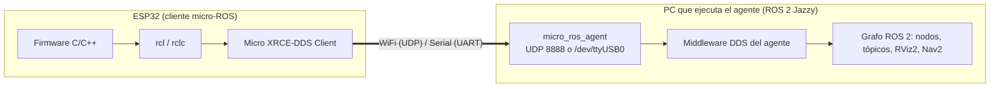
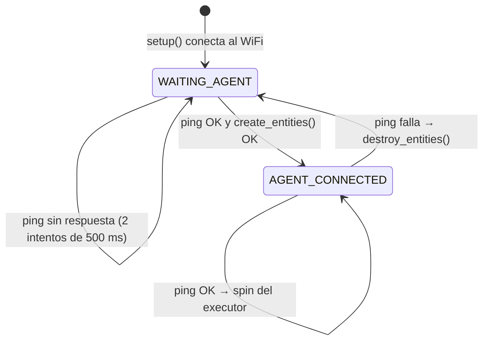

# 🎓 Guía Paso a Paso: Integración de micro-ROS en ESP32 para Plataformas Móviles y Drones

> [!IMPORTANT]
> **Actualización del Repositorio Privado del Equipo:**
> Antes de iniciar o continuar con este taller, asegúrese de haber sincronizado su repositorio privado de equipo con los últimos cambios de la base del curso. Consulte la [Guía Oficial de Sincronización y Actualizaciones](../proyectos_evaluables/ACTUALIZACIONES_BASE_CORTE_1.md) para realizar este proceso correctamente.

Este taller convierte un microcontrolador **ESP32 / ESP32-S3** en un nodo del grafo distribuido de
**ROS 2 Jazzy**. Avanza aislando variables: primero por cable serial, después por WiFi con
namespace y reconexión, luego con control desde la PC y, por último, con mediciones de red.

Está pensado para los equipos de los **robots móviles de reparto (*burger cars*)**, plataformas
diferenciales y drones.

---

## 🎯 Resultado de Aprendizaje Evaluable (RAE)

**RAE 1 (Primer Corte):** *Comprender la arquitectura distribuida, redes, comunicación técnica y experimentación en el ecosistema ROS 2.*

### Indicadores ABET asociados:
* **Indicador 1.1 (SO1 - Resolución de problemas):** Identifica y selecciona los requerimientos para la arquitectura de software distribuido del robot mediante nodos de ROS 2 y micro-ROS.
* **Indicador 2.2 (SO2 - Diseño de ingeniería):** Incorpora restricciones de red, latencia, ancho de banda y seguridad en la integración de hardware heterogéneo (micro-ROS en microcontroladores).
* **Indicador 6.1 (SO6 - Experimentación y análisis):** Diseña y ejecuta pruebas de conectividad, jitter, pérdida de paquetes y latencia en enlaces inalámbricos XRCE-DDS.

---

## 🧠 Contexto: ¿Por qué micro-ROS y no ROS 2 estándar en un microcontrolador?

Un ESP32 tiene **520 KB de SRAM** y corre FreeRTOS o código *bare-metal*. ROS 2 estándar, con un
middleware DDS como Fast DDS o CycloneDDS, necesita varios megabytes de RAM y un sistema operativo
POSIX. **micro-ROS** resuelve esa distancia con **Micro XRCE-DDS** (*eXtremely Resource Constrained
Environments*):



* **Cliente (ESP32):** no descubre nodos ni participa en DDS; habla con **un único agente**.
* **Agente (`micro_ros_agent`):** corre en una PC, recibe las peticiones del cliente y crea en su
  nombre los nodos, publicadores y suscriptores dentro de DDS. El agente **no aparece** como nodo en
  `ros2 node list`; el ESP32 sí.

---

## 🗺️ Mapa del Sistema

| Fase | Transporte | Nodo en el grafo | Publica | Se suscribe |
|---|---|---|---|---|
| 1 | Serial USB | `/esp32_serial_node` | `/esp32/heartbeat` (`Int32`, 2 Hz) | — |
| 2–4 | WiFi UDP 8888 | `/burger_car_01/base_controller` | `/burger_car_01/battery_voltage` (`Float32`) | `/burger_car_01/cmd_vel` (`Twist`) |

## 🧭 Límites del Taller (qué valida y qué no)

| Distinción | En este taller |
|---|---|
| **Datos simulados vs. sensores reales** | `battery_voltage` es un valor **sintético** (12.10–12.29 V); no mide ninguna batería. |
| **Comando recibido vs. motor accionado** | El firmware calcula `vel_izq` y `vel_der`, pero **no acciona motores**: sólo enciende un LED. Conectar el puente H es un mini-reto. |
| **Agente activo vs. ESP32 conectado** | Que el proceso del agente escuche en el puerto 8888 no prueba que haya un ESP32 conectado. La prueba es ver su nodo en `ros2 node list`. |
| **Red hasta el router vs. red hasta el ESP32** | El monitor web mide RTT, jitter y pérdida **hacia el router**. La calidad del enlace **hasta el ESP32** se mide con `ping` a su IP (Fase 4). |

---

## 0. Fase 0: Entorno y Agente micro-ROS

### 🧠 El Concepto
El agente puede ejecutarse como paquete ROS 2 compilado en un workspace propio o como contenedor
Docker. El ESP32 y el agente deben corresponder a la **misma distribución** (`jazzy`).

### 🔍 Revisión real obligatoria
Comprueba qué tiene disponible la estación antes de elegir una opción:

```bash
source /opt/ros/jazzy/setup.bash
ros2 pkg prefix micro_ros_agent      # ruta del paquete, o "Package not found"
docker --version                     # si Docker está instalado
printenv ROS_DOMAIN_ID RMW_IMPLEMENTATION
```

`micro_ros_agent` **no** viene con la instalación base de ROS 2 Jazzy: `Package not found` es el
resultado normal en una estación recién instalada.

### 🛠️ Ejercicio: Lanzar el agente

#### Opción A: Contenedor Docker oficial (no requiere compilar)
```bash
docker run -it --rm --net=host microros/micro-ros-agent:jazzy udp4 --port 8888 -v6
```

#### Opción B: Paquete nativo compilado con `micro_ros_setup`
Procedimiento oficial de micro-ROS (una sola vez por estación; no verificado en la estación donde
se revisó esta guía):

```bash
mkdir -p ~/microros_ws/src && cd ~/microros_ws
git clone -b jazzy https://github.com/micro-ROS/micro_ros_setup.git src/micro_ros_setup
rosdep update && rosdep install --from-paths src --ignore-src -y
colcon build && source install/local_setup.bash
ros2 run micro_ros_setup create_agent_ws.sh
ros2 run micro_ros_setup build_agent.sh
source install/local_setup.bash
```

Después, en cada sesión:
```bash
source ~/microros_ws/install/local_setup.bash
ros2 run micro_ros_agent micro_ros_agent udp4 --port 8888 -v6                  # WiFi
ros2 run micro_ros_agent micro_ros_agent serial --dev /dev/ttyUSB0 -b 115200 -v6 # Serial
```

> [!IMPORTANT]
> **Dominio: se trabaja en el `0` del curso.** Este taller no usa el driver del Kinova, así que la
> convención de estación anfitriona no aplica; y como cada carrito tiene su propio **namespace**
> (`/burger_car_01`, …), varios equipos comparten el dominio sin colisiones
> ([`TROUBLESHOOTING.md`](../../TROUBLESHOOTING.md) §4.1). **El dominio del ESP32 lo fija el firmware,
> no la PC**: el agente crea el nodo en el dominio que pide el cliente, `rclc_support_init()` pide el
> `0`, y exportar `ROS_DOMAIN_ID` en la terminal del agente no lo cambia. Si la PC está en otro
> dominio (por ejemplo, tras un taller simulado), no verá el ESP32. Sólo si el docente asigna otro
> dominio, se fija en el firmware:
>
> ```cpp
> rcl_init_options_t init_options = rcl_get_zero_initialized_init_options();
> rcl_init_options_init(&init_options, allocator);
> rcl_init_options_set_domain_id(&init_options, <dominio asignado>);
> rclc_support_init_with_options(&support, 0, NULL, &init_options, &allocator);
> ```

> [!NOTE]
> **En WSL:** para WiFi, la red debe estar en modo `mirrored`
> ([`router_tplink_ax12_config.md`](../../network_setup/router_tplink_ax12_config.md)); en NAT el ESP32
> no alcanza el puerto UDP 8888. Para serial, el USB se comparte con `usbipd-win` desde PowerShell
> (`usbipd list`, `usbipd bind --busid <id>`, `usbipd attach --wsl --busid <id>`), y **un puerto no
> puede estar a la vez en Windows y en WSL**: carga el firmware primero y después conecta el puerto
> a WSL. Si `ros2 node list` se queda colgado, es el daemon de la CLI:
> [`TROUBLESHOOTING.md`](../../TROUBLESHOOTING.md) §1.

### ✅ Criterios de éxito
- La persona participante puede validar si la estación tiene el agente disponible y elegir entre Docker o compilación nativa.
- La persona participante puede explicar por qué el dominio del ESP32 no depende de `ROS_DOMAIN_ID` en la PC.

---

## 1. Fase 1: Primer Nodo Embebido por Cable Serial (USB-UART)

### 🧠 El Concepto
Antes de introducir la variabilidad del WiFi se **aíslan variables**: por cable se valida la pila
`rclc` (soporte, nodo, publicador, temporizador, executor) sin que la red pueda ser la causa de un
fallo.

### 🛠️ Ejercicio: Firmware base serial (Arduino IDE / PlatformIO)

Instala la biblioteca **`micro_ros_arduino`** en la versión publicada para **Jazzy** y carga este
código:

```cpp
#include <Arduino.h>
#include <micro_ros_arduino.h>

#include <rcl/rcl.h>
#include <rcl/error_handling.h>
#include <rclc/rclc.h>
#include <rclc/executor.h>
#include <std_msgs/msg/int32.h>

rcl_publisher_t publisher;
std_msgs__msg__Int32 msg;
rclc_executor_t executor;
rclc_support_t support;
rcl_allocator_t allocator;
rcl_node_t node;
rcl_timer_t timer;

#define LED_PIN 2
#define HEARTBEAT_PERIOD_MS 500   // 2 Hz (Mini-reto 1: 100 ms = 10 Hz)

#define RCCHECK(fn) { rcl_ret_t temp_rc = fn; if((temp_rc != RCL_RET_OK)){error_loop();}}
#define RCSOFTCHECK(fn) { rcl_ret_t temp_rc = fn; if((temp_rc != RCL_RET_OK)){}}

// Parpadeo rápido: alguna llamada rcl falló (típicamente, no había agente al arrancar)
void error_loop(){
  while(1){
    digitalWrite(LED_PIN, !digitalRead(LED_PIN));
    delay(100);
  }
}

void timer_callback(rcl_timer_t * timer, int64_t last_call_time)
{
  RCLC_UNUSED(last_call_time);
  if (timer != NULL) {
    RCSOFTCHECK(rcl_publish(&publisher, &msg, NULL));
    msg.data++;
  }
}

void setup() {
  pinMode(LED_PIN, OUTPUT);
  digitalWrite(LED_PIN, LOW);

  set_microros_transports(); // Transporte serial USB por defecto
  delay(2000);

  allocator = rcl_get_default_allocator();

  RCCHECK(rclc_support_init(&support, 0, NULL, &allocator));
  RCCHECK(rclc_node_init_default(&node, "esp32_serial_node", "", &support));

  RCCHECK(rclc_publisher_init_default(
    &publisher,
    &node,
    ROSIDL_GET_MSG_TYPE_SUPPORT(std_msgs, msg, Int32),
    "esp32/heartbeat"));

  RCCHECK(rclc_timer_init_default(
    &timer,
    &support,
    RCL_MS_TO_NS(HEARTBEAT_PERIOD_MS),
    timer_callback));

  RCCHECK(rclc_executor_init(&executor, &support.context, 1, &allocator));
  RCCHECK(rclc_executor_add_timer(&executor, &timer));

  msg.data = 0;
  digitalWrite(LED_PIN, HIGH); // LED fijo: todas las entidades creadas
}

void loop() {
  RCSOFTCHECK(rclc_executor_spin_some(&executor, RCL_MS_TO_NS(100)));
}
```

### 🔍 Revisión real obligatoria
En el código, ubica el orden de creación **soporte → nodo → publicador → temporizador → executor**
y relaciónalo con lo que aparece en la PC: el nodo `esp32_serial_node` sin namespace y el tópico
relativo `esp32/heartbeat`, que se resuelve a `/esp32/heartbeat`.

Este firmware **no reconecta**: si el agente no está corriendo durante los 2 s de `delay`, la
primera llamada falla y el ESP32 entra en `error_loop()`.

### 🛠️ Ejercicio: Inspección en la PC
1. Lanza **primero** el agente serial y **después** reinicia el ESP32 (botón `EN`/`RST`):
   ```bash
   ros2 run micro_ros_agent micro_ros_agent serial --dev /dev/ttyUSB0 -b 115200 -v6
   ```
   Si el ESP32-S3 usa su USB nativo, el puerto suele ser `/dev/ttyACM0` (`ls /dev/tty{USB,ACM}*`).
2. En otra terminal:
   ```bash
   ros2 node list
   # /esp32_serial_node

   ros2 topic hz /esp32/heartbeat
   # average rate: ≈ 2.0

   ros2 topic echo /esp32/heartbeat
   # data: 17
   # ---
   # data: 18
   ```

Interpretación del LED: **fijo** = entidades creadas; **parpadeo rápido** = `error_loop()`, el
agente no respondió al arrancar.

### 🛠️ Mini-Reto 1 (Serial)
* Cambia `HEARTBEAT_PERIOD_MS` a **100** (10 Hz), vuelve a cargar y mide con `ros2 topic hz /esp32/heartbeat`.
* Registra en la bitácora la tasa media y la desviación estándar (`std dev`) que reporta `ros2 topic hz`.

### ✅ Criterios de éxito
- La persona participante puede relacionar cada entidad creada en el firmware con lo que muestran `ros2 node list` y `ros2 topic list`.
- La persona participante puede diagnosticar con el LED si el fallo está en la creación de entidades (agente ausente al arrancar) o en otra capa.
- La persona participante puede validar con `ros2 topic hz` que la tasa medida corresponde al período configurado.

---

## 2. Fase 2: Transporte WiFi UDP, Namespaces y Reconexión

### 🧠 El Concepto
En una celda con varios robots móviles, cada vehículo necesita un **namespace** propio
(`/burger_car_01`, `/burger_car_02`) para que sus tópicos `cmd_vel` y `battery_voltage` no
colisionen. El namespace se declara **una vez** al crear el nodo, y los nombres relativos lo heredan.

Además, el WiFi se corta. El firmware implementa una **máquina de estados de reconexión** con
`rmw_uros_ping_agent`: crea las entidades cuando el agente responde y las libera cuando deja de
responder.



### 🛠️ Ejercicio: Firmware WiFi con namespace y suscriptor `cmd_vel`

> [!IMPORTANT]
> **`AGENT_IP` es la IP de la PC que ejecuta el agente.** `192.168.1.100` es la IP reservada de la PC
> principal del laboratorio ([`router_tplink_ax12_config.md`](../../network_setup/router_tplink_ax12_config.md));
> las demás estaciones reciben por DHCP una del rango `192.168.1.101-254` (`ip -brief addr`).
> Cambia también `ROBOT_NAMESPACE` al carrito del equipo.

```cpp
#include <Arduino.h>
#include <WiFi.h>
#include <micro_ros_arduino.h>

#include <rcl/rcl.h>
#include <rcl/error_handling.h>
#include <rclc/rclc.h>
#include <rclc/executor.h>
#include <rmw_microros/rmw_microros.h>
#include <geometry_msgs/msg/twist.h>
#include <std_msgs/msg/float32.h>

// ==========================================
// CONFIGURACIÓN DE RED Y EQUIPO
// ==========================================
const char* SSID = "ros2";
const char* PASSWORD = "ros12345";
IPAddress AGENT_IP(192, 168, 1, 100);   // ← IP de la PC que ejecuta el agente
const size_t AGENT_PORT = 8888;

#define ROBOT_NAMESPACE "burger_car_01"  // ← carrito del equipo
#define LED_PIN 2
#define TELEMETRY_PERIOD_MS 1000         // 1 Hz (Fase 4: 200 ms = 5 Hz, 100 ms = 10 Hz)
#define WHEEL_BASE_HALF_M 0.5            // semidistancia entre ruedas del modelo diferencial

// Variables micro-ROS
rclc_support_t support;
rcl_allocator_t allocator;
rcl_node_t node;
rclc_executor_t executor;
rcl_publisher_t battery_pub;
rcl_subscription_t cmd_vel_sub;
rcl_timer_t timer;

geometry_msgs__msg__Twist msg_cmd_vel;
std_msgs__msg__Float32 msg_battery;

enum AgentStatus {
  WAITING_AGENT,
  AGENT_CONNECTED
} agent_state;

void cmd_vel_callback(const void * msgin) {
  const geometry_msgs__msg__Twist * msg = (const geometry_msgs__msg__Twist *)msgin;

  float linear_x = msg->linear.x;
  float angular_z = msg->angular.z;

  // Cinemática diferencial: velocidad de cada rueda.
  // NO se aplica a motores en este taller (Mini-reto 3): sólo se calcula.
  float vel_izq = linear_x - angular_z * WHEEL_BASE_HALF_M;
  float vel_der = linear_x + angular_z * WHEEL_BASE_HALF_M;
  (void) vel_izq;
  (void) vel_der;

  // LED encendido mientras el comando pide movimiento
  if (fabs(linear_x) > 0.01 || fabs(angular_z) > 0.01) {
    digitalWrite(LED_PIN, HIGH);
  } else {
    digitalWrite(LED_PIN, LOW);
  }
}

void timer_callback(rcl_timer_t * timer, int64_t last_call_time) {
  RCLC_UNUSED(last_call_time);
  if (timer != NULL) {
    // Valor SINTÉTICO de batería: 12.10 V a 12.29 V. No mide ningún sensor.
    msg_battery.data = 12.2 + (random(-10, 10) / 100.0);
    rcl_publish(&battery_pub, &msg_battery, NULL);
  }
}

bool create_entities() {
  allocator = rcl_get_default_allocator();
  if (rclc_support_init(&support, 0, NULL, &allocator) != RCL_RET_OK) return false;

  // Namespace declarado una sola vez: los nombres relativos lo heredan
  if (rclc_node_init_default(&node, "base_controller", ROBOT_NAMESPACE, &support) != RCL_RET_OK) return false;

  rclc_publisher_init_default(
    &battery_pub, &node, ROSIDL_GET_MSG_TYPE_SUPPORT(std_msgs, msg, Float32), "battery_voltage");
  rclc_subscription_init_default(
    &cmd_vel_sub, &node, ROSIDL_GET_MSG_TYPE_SUPPORT(geometry_msgs, msg, Twist), "cmd_vel");

  rclc_timer_init_default(&timer, &support, RCL_MS_TO_NS(TELEMETRY_PERIOD_MS), timer_callback);

  // Executor con 2 manejadores: suscripción + temporizador
  rclc_executor_init(&executor, &support.context, 2, &allocator);
  rclc_executor_add_subscription(&executor, &cmd_vel_sub, &msg_cmd_vel, &cmd_vel_callback, ON_NEW_DATA);
  rclc_executor_add_timer(&executor, &timer);
  return true;
}

void destroy_entities() {
  // No esperar a un agente que ya no responde al liberar las entidades
  rmw_context_t * rmw_context = rcl_context_get_rmw_context(&support.context);
  (void) rmw_uros_set_context_entity_destroy_session_timeout(rmw_context, 0);

  rcl_publisher_fini(&battery_pub, &node);
  rcl_subscription_fini(&cmd_vel_sub, &node);
  rcl_timer_fini(&timer);
  rclc_executor_fini(&executor);
  rcl_node_fini(&node);
  rclc_support_fini(&support);
}

void setup() {
  pinMode(LED_PIN, OUTPUT);
  Serial.begin(115200);
  agent_state = WAITING_AGENT;

  // Conecta al WiFi y configura el transporte UDP hacia el agente
  set_microros_wifi_transports((char*)SSID, (char*)PASSWORD, AGENT_IP, AGENT_PORT);

  // IP del ESP32: se necesita para las mediciones de la Fase 4
  Serial.print("IP del ESP32: ");
  Serial.println(WiFi.localIP());
}

void loop() {
  switch (agent_state) {
    case WAITING_AGENT:
      if (rmw_uros_ping_agent(500, 2) == RMW_RET_OK && create_entities()) {
        agent_state = AGENT_CONNECTED;
      }
      break;

    case AGENT_CONNECTED:
      if (rmw_uros_ping_agent(200, 1) != RMW_RET_OK) {
        destroy_entities();
        digitalWrite(LED_PIN, LOW);
        agent_state = WAITING_AGENT;
      } else {
        rclc_executor_spin_some(&executor, RCL_MS_TO_NS(100));
      }
      break;
  }
}
```

> [!NOTE]
> Este firmware no se compiló en la estación donde se revisó la guía (no hay toolchain de ESP32). Si
> la compilación falla en `rmw_microros/rmw_microros.h` o en
> `rmw_uros_set_context_entity_destroy_session_timeout`, la biblioteca `micro_ros_arduino` no
> corresponde a la distribución del agente (`jazzy`).

### 🔍 Revisión real obligatoria
Antes de cargar, ubica en el código:
- Dónde se declara el namespace y qué nombres de tópico son relativos.
- Qué entidades crea `create_entities()` y cuáles libera `destroy_entities()` (deben ser las mismas).
- Por qué el executor se inicializa con **2** manejadores.
- Qué hace `(void) vel_izq;` y por qué se deja explícito que no hay motores.

Carga el firmware, abre el **Monitor Serie** a 115200 baudios y anota la línea `IP del ESP32: …`.

### ✅ Criterios de éxito
- La persona participante puede predecir los nombres completos del nodo y los tópicos a partir de `ROBOT_NAMESPACE` y los nombres relativos.
- La persona participante puede explicar la máquina de estados de reconexión y verificar que `create_entities()` y `destroy_entities()` son simétricas.
- La persona participante puede distinguir en el firmware qué datos son sintéticos y qué acciones no llegan al hardware.

---

## 3. Fase 3: Control en Tiempo Real desde la PC

### 🧠 El Concepto
Un `geometry_msgs/msg/Twist` publicado en la PC viaja por DDS hasta el agente y por XRCE-DDS hasta
el ESP32, que lo recibe en su callback. La prueba de extremo a extremo es que un comando cambie un
efecto físico observable: el LED.

### 🛠️ Ejercicio de teleoperación
1. Agente UDP en la PC:
   ```bash
   ros2 run micro_ros_agent micro_ros_agent udp4 --port 8888 -v6
   ```
2. Verifica nodo, tópicos y conexión de la suscripción:
   ```bash
   ros2 node list
   # /burger_car_01/base_controller

   ros2 topic list
   # /burger_car_01/battery_voltage
   # /burger_car_01/cmd_vel

   ros2 topic info /burger_car_01/cmd_vel
   # Type: geometry_msgs/msg/Twist
   # Publisher count: 0
   # Subscription count: 1       ← el ESP32

   ros2 topic echo /burger_car_01/battery_voltage
   # data: 12.19…      (valor sintético entre 12.10 y 12.29; cambia cada período)
   ```
3. Envía una velocidad de prueba:
   ```bash
   ros2 topic pub --once /burger_car_01/cmd_vel geometry_msgs/msg/Twist "{linear: {x: 0.5}, angular: {z: 0.0}}"
   ```
   Resultado esperado: el LED **se enciende**. Con `--once`, el comando **espera** a encontrar un
   suscriptor antes de publicar. Si se queda repitiendo `Waiting for at least 1 matching
   subscription(s)...`, el ESP32 no está conectado o el namespace no coincide: vuelve al paso 2.
   Envía `"{linear: {x: 0.0}, angular: {z: 0.0}}"` y el LED se apaga.
4. Teleoperación con teclado, remapeada al namespace del carrito:
   ```bash
   ros2 run teleop_twist_keyboard teleop_twist_keyboard --ros-args --remap cmd_vel:=/burger_car_01/cmd_vel
   ```
   Con la tecla `i` el LED se enciende; con `k` (parada) se apaga.

### 🛠️ Mini-Reto 3 (opcional): accionar motores
Conecta `vel_izq` y `vel_der` a un puente H mediante PWM (`ledcWrite`) en los pines del carrito.
Documenta la saturación aplicada y qué ocurre con los motores si se pierde el agente (conviene
detenerlos en `destroy_entities()`).

> [!TIP]
> **💊 Píldora Metodológica — Carga Dinámica de Interfaces y Mensajes en Python (`rosidl_runtime_py`):**  
> *En la sesión de micro-ROS se incluirá una píldora metodológica sobre cómo cargar tipos de mensajes de interfaces personalizadas con `rosidl_runtime_py`.*  
>  
> Al interactuar mediante scripts de Python con los tópicos del ESP32 o deserializar telemetría de micro-ROS (ej. grabada en bags MCAP), evite acoplarse rígidamente a imports estáticos que fallan si el entorno no los tiene en el `PYTHONPATH`. La biblioteca `rosidl_runtime_py` permite resolver e instanciar dinámicamente cualquier tipo de mensaje en tiempo de ejecución:
> ```python
> from rosidl_runtime_py.utilities import get_message
>
> # Carga dinámica de tipo estándar:
> TwistMsg = get_message('geometry_msgs/msg/Twist')
> cmd = TwistMsg()
> cmd.linear.x = 0.5
>
> # Carga dinámica de interfaces personalizadas creadas en el workspace:
> # BatteryMsg = get_message('burger_interfaces/msg/BatteryStatus')
> ```

### ✅ Criterios de éxito
- La persona participante puede validar con `ros2 topic info` que el ESP32 está suscrito antes de enviar comandos.
- La persona participante puede interpretar la espera de `ros2 topic pub --once` como un diagnóstico de conexión o de nombres.
- La persona participante puede explicar por qué `teleop_twist_keyboard` necesita el remapeo al namespace del carrito.

---

## 4. Fase 4: Diagnóstico y Medición de Calidad de Red

### 🧠 El Concepto
El desempeño del lazo depende del enlace **PC ↔ router ↔ ESP32**. Cada herramienta mide un tramo
distinto y conviene no confundirlos:

| Herramienta | Qué mide | Qué no mide |
|---|---|---|
| `ping` a la IP del ESP32 | RTT, jitter (`mdev`) y pérdida **hasta el ESP32** | Si micro-ROS funciona |
| `diagnostico_microros.sh` | Agente, puerto, ping a los ESP32 indicados, router, dominio | Calidad temporal del enlace |
| Monitor de red web | RTT, jitter y pérdida **hacia el router**; estado del socket del agente | El enlace hasta el ESP32 |
| `ros2 topic hz` | Tasa y regularidad de los mensajes que llegan al grafo | Dónde se pierde un mensaje |

### 🛠️ Ejercicio 4.1: Script de diagnóstico
```bash
cd ~/ros2_ws/src/burger_delivery/network_setup
ESP32_IPS="<IP del ESP32 anotada en la Fase 2>" ./diagnostico_microros.sh
```
Sin `ESP32_IPS`, el script prueba por defecto `192.168.1.101` y `192.168.1.102`, que pueden no
corresponder a los ESP32 del equipo. `AGENT_IP` se autodetecta y también se puede fijar (`AGENT_IP=... ESP32_IPS=... ./diagnostico_microros.sh`).

### 🛠️ Ejercicio 4.2: RTT, jitter y pérdida hasta el ESP32
```bash
ping -c 100 -i 0.2 <IP del ESP32>
```
Al final, `ping` reporta `packet loss` (pérdida) y `rtt min/avg/max/mdev` (`mdev` es la dispersión:
el jitter). Repite con el carrito cerca y lejos del router.

### 🛠️ Ejercicio 4.3: Estabilidad de la telemetría a 1, 5 y 10 Hz
Para cada valor de `TELEMETRY_PERIOD_MS` (1000, 200 y 100 ms), carga el firmware y mide durante
60 s:
```bash
ros2 topic hz /burger_car_01/battery_voltage -w 50
```
Registra `average rate`, `min`, `max` y `std dev`.

### 🛠️ Ejercicio 4.4: Monitor de red y resiliencia
1. Abre el monitor (`bash network_setup/iniciar_monitor.sh`) y registra el RTT, jitter y pérdida **al
   router**, y el estado del agente micro-ROS. Según la tabla del concepto, esas cifras corresponden
   al tramo PC ↔ router, no al ESP32.
2. Detén el agente, espera 10 s y relánzalo. Mide el tiempo hasta que `/burger_car_01/base_controller`
   reaparece en `ros2 node list` **sin** resetear el ESP32.

### ✅ Criterios de éxito
- La persona participante puede elegir la herramienta adecuada para medir cada tramo del enlace y explicar qué no mide cada una.
- La persona participante puede validar con `ping` el RTT, jitter y pérdida hasta el ESP32, y con `ros2 topic hz` la estabilidad de la telemetría a distintas tasas.
- La persona participante puede medir el tiempo de recuperación autónoma tras reiniciar el agente.

---

## ⚠️ Fallos Frecuentes y su Capa

| Síntoma | Capa probable | Verificación / Solución |
|---|---|---|
| `Package not found` al lanzar `micro_ros_agent` | Instalación | Usar Docker o compilar con `micro_ros_setup` (Fase 0) |
| LED en parpadeo rápido con el firmware serial | Arranque | El agente no corría al arrancar: lanzar el agente y resetear el ESP32 |
| El agente serial no abre `/dev/ttyUSB0` | USB / WSL / permisos | `ls /dev/tty{USB,ACM}*`; en WSL, `usbipd attach`; el puerto no puede estar abierto en Windows |
| El agente WiFi no registra ningún cliente | Red | `AGENT_IP` correcta, red `ros2`, WSL en modo `mirrored`, firewall de la PC |
| El agente registra la sesión pero `ros2 node list` no muestra el nodo | Dominio DDS | La PC debe estar en el dominio que pide el firmware (`0`) |
| `ros2 node list` se queda colgado | CLI (daemon) | [`TROUBLESHOOTING.md`](../../TROUBLESHOOTING.md) §1 |
| `ros2 topic pub --once` espera indefinidamente | Conexión o nombres | `ros2 topic info /burger_car_01/cmd_vel` debe mostrar `Subscription count: 1` |
| La compilación falla en `rmw_microros` | Versión de biblioteca | `micro_ros_arduino` de la misma distribución que el agente (`jazzy`) |
| Tras reiniciar el agente el ESP32 no vuelve | Firmware | `destroy_entities()` debe llamarse al fallar el ping |

---

## 📦 Entregables del Taller para la Bitácora ABET

Cada equipo incluye en su informe técnico / pull request:
1. **Grafo RQt** con `/burger_car_01/base_controller` publicando `battery_voltage` y suscrito a `cmd_vel`, y la explicación de por qué el agente no aparece.
2. **Mini-Reto 1:** tasa y desviación estándar del heartbeat serial a 2 Hz y 10 Hz.
3. **Registro de resiliencia:** tiempo de recuperación autónoma tras reiniciar el agente (Ejercicio 4.4).
4. **Tabla de métricas de red:** RTT, jitter y pérdida hasta el ESP32 (Ejercicio 4.2) y estabilidad de `battery_voltage` a 1, 5 y 10 Hz (Ejercicio 4.3), indicando qué herramienta midió cada valor.
