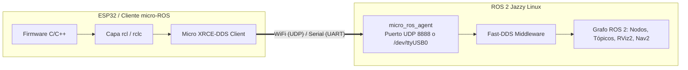
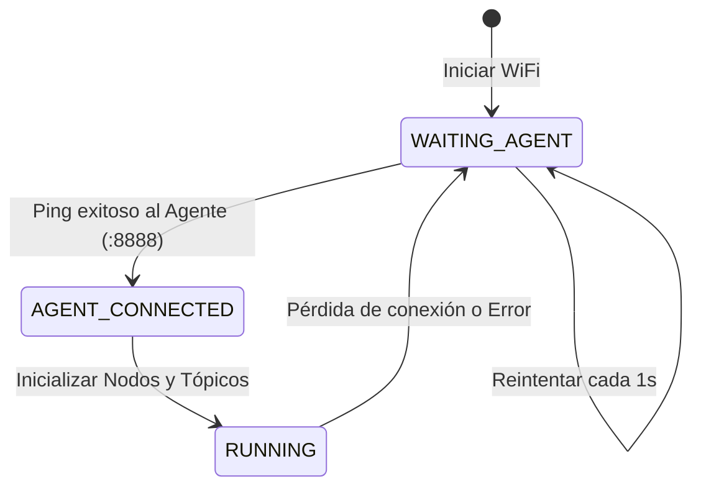

# 🎓 Guía Paso a Paso: Integración de micro-ROS en ESP32 para Plataformas Móviles y Drones

¡Bienvenido! En este taller práctico aprenderás a convertir un microcontrolador de bajo costo (**ESP32 / ESP32-S3**) en un nodo nativo de primer nivel dentro del grafo distribuido de **ROS 2 Jazzy**. 

Este taller está especialmente diseñado para los equipos a cargo de los **robots móviles de reparto (*burger cars*)**, plataformas diferenciales y drones.

---

## 🎯 Resultado de Aprendizaje Evaluable (RAE)

**RAE 1 (Primer Corte):** *Comprender la arquitectura distribuida, redes, comunicación técnica y experimentación en el ecosistema ROS 2.*

### Indicadores ABET asociados:
* **Indicador 1.1 (SO1 - Resolución de problemas):** Identifica y selecciona los requerimientos para la arquitectura de software distribuido del robot mediante nodos de ROS 2 y micro-ROS.
* **Indicador 2.2 (SO2 - Diseño de ingeniería):** Incorpora restricciones de red, latencia, ancho de banda y seguridad en la integración de hardware heterogéneo (micro-ROS en microcontroladores).
* **Indicador 6.1 (SO6 - Experimentación y análisis):** Diseña y ejecuta pruebas de conectividad, jitter, pérdida de paquetes y latencia en enlaces inalámbricos XRCE-DDS.

---

## 🧠 Contexto: ¿Por qué micro-ROS y no ROS 2 estándar en un microcontrolador?

Un microcontrolador típico como el ESP32 cuenta con apenas **520 KB de RAM** y corre un sistema operativo en tiempo real (RTOS) o código *bare-metal*, mientras que ROS 2 estándar (con middleware DDS como Fast-DDS o CycloneDDS) requiere varios megabytes de RAM y un sistema operativo POSIX completo (como Linux).

Para resolver esto, **micro-ROS** implementa el estándar **Micro XRCE-DDS** (*eXtremely Resource Constrained Environments*):



* **El Cliente (ESP32):** Es ultra ligero. No descubre nodos por sí mismo ni gestiona la red DDS compleja; solo se comunica con un único servidor intermedio.
* **El Agente (`micro_ros_agent`):** Corre en la PC principal, recibe las peticiones del microcontrolador y crea los publicadores, suscriptores y servicios correspondientes dentro del mundo DDS de ROS 2.

---

## 📋 Estructura de Trabajo del Taller

Cada sección combina:
1. **El Concepto:** Fundamentos del protocolo y arquitectura.
2. **El Ejercicio:** Comandos y código listos para probar.
3. **Mini-Reto:** Validación obligatoria para la bitácora técnica de tu equipo.

---

## 0. Preparando el Entorno en la PC Host

### 🧠 El Concepto
El agente micro-ROS debe estar disponible en la estación de trabajo. Puede ejecutarse como un paquete nativo de ROS 2 o a través de un contenedor Docker ligero optimizado.

### 🛠️ Ejercicio: Validar o Lanzar el Agente

#### Opción A: Mediante ejecutable nativo ROS 2 (si está instalado en el workspace):
```bash
source /opt/ros/jazzy/setup.bash
# Para transporte inalámbrico UDP:
ros2 run micro_ros_agent micro_ros_agent udp4 --port 8888
```

#### Opción B: Mediante Contenedor Docker Oficial:
```bash
docker run -it --rm --net=host microros/micro-ros-agent:jazzy udp4 --port 8888
```

#### Para pruebas con Cable Serial (USB):
```bash
ros2 run micro_ros_agent micro_ros_agent serial --dev /dev/ttyUSB0 -b 115200
```

---

## 1. Fase 1: Tu Primer Nodo Embebido por Cable Serial (USB-UART)

### 🧠 El Concepto
Antes de introducir la variabilidad del canal Wi-Fi, la regla de oro de la ingeniería es **aislar variables**. Validaremos primero la pila de software `rclc` usando el puerto USB.

### 🛠️ Ejercicio: Firmware Base Serial (Arduino IDE / PlatformIO)

Instala la biblioteca **`micro_ros_arduino`** en tu Arduino IDE (versión compatible con Jazzy/Humble) o PlatformIO.

Carga el siguiente código en tu ESP32:

```cpp
#include <Arduino.h>
#include <micro_ros_arduino.h>

#include <rcl/rcl.h>
#include <rcl/error_handling.h>
#include <rclc/rclc.h>
#include <rclc/executor.h>
#include <std_msgs/msg/int32.h>

rcl_publisher_t publisher;
std_msgs__msg__Int32 msg;
rclc_executor_t executor;
rclc_support_t support;
rcl_allocator_t allocator;
rcl_node_t node;
rcl_timer_t timer;

#define LED_PIN 2

#define RCCHECK(fn) { rcl_ret_t temp_rc = fn; if((temp_rc != RCL_RET_OK)){error_loop();}}
#define RCSOFTCHECK(fn) { rcl_ret_t temp_rc = fn; if((temp_rc != RCL_RET_OK)){}}

void error_loop(){
  while(1){
    digitalWrite(LED_PIN, !digitalRead(LED_PIN));
    delay(100);
  }
}

void timer_callback(rcl_timer_t * timer, int64_t last_call_time)
{  
  RCLC_UNUSED(last_call_time);
  if (timer != NULL) {
    RCSOFTCHECK(rcl_publish(&publisher, &msg, NULL));
    msg.data++;
  }
}

void setup() {
  pinMode(LED_PIN, OUTPUT);
  digitalWrite(LED_PIN, LOW);

  set_microros_transports(); // Transporte Serial USB por defecto
  delay(2000);

  allocator = rcl_get_default_allocator();

  // Crear soporte y nodo
  RCCHECK(rclc_support_init(&support, 0, NULL, &allocator));
  RCCHECK(rclc_node_init_default(&node, "esp32_serial_node", "", &support));

  // Crear publicador de heartbeat / contador
  RCCHECK(rclc_publisher_init_default(
    &publisher,
    &node,
    ROSIDL_GET_MSG_TYPE_SUPPORT(std_msgs, msg, Int32),
    "esp32/heartbeat"));

  // Crear temporizador a 2 Hz (500 ms)
  const unsigned int timer_timeout = 500;
  RCCHECK(rclc_timer_init_default(
    &timer,
    &support,
    RCL_MS_TO_NS(timer_timeout),
    timer_callback));

  // Crear ejecutor
  RCCHECK(rclc_executor_init(&executor, &support.context, 1, &allocator));
  RCCHECK(rclc_executor_add_timer(&executor, &timer));

  msg.data = 0;
  digitalWrite(LED_PIN, HIGH); // LED fijo = Enlazado exitosamente
}

void loop() {
  RCSOFTCHECK(rclc_executor_spin_some(&executor, RCL_MS_TO_NS(100)));
}
```

### 🔍 Inspección en la PC
1. Conecta el ESP32 por USB y lanza el agente:
   ```bash
   ros2 run micro_ros_agent micro_ros_agent serial --dev /dev/ttyUSB0 -b 115200
   ```
2. En otra terminal, comprueba la presencia del nodo y los datos:
   ```bash
   ros2 node list
   # Debe aparecer: /esp32_serial_node

   ros2 topic echo /esp32/heartbeat
   ```

### 🛠️ Mini-Reto 1 (Serial)
* Modifica la frecuencia del temporizador a **10 Hz (100 ms)** y mide la frecuencia real recibida en la PC ejecutando:
  ```bash
  ros2 topic hz /esp32/heartbeat
  ```
* Documenta en tu bitácora la tasa de publicación promedio y la desviación estándar.

---

## 2. Fase 2: Transporte Inalámbrico Wi-Fi UDP y Gestión de Namespaces

### 🧠 El Concepto
En una celda con múltiples robots móviles, cada vehículo debe contar con un **namespace** propio (ej. `/burger_car_01`, `/burger_car_02`) para evitar colisiones de nombres en los tópicos `/cmd_vel` y `/telemetry`.

Además, la red inalámbrica puede sufrir desconexiones temporales, por lo que el firmware debe implementar una **máquina de estados de reconexión autónoma** con `rmw_uros_ping_agent`.



### 🛠️ Ejercicio: Firmware Wi-Fi con Namespace y Suscriptor `/cmd_vel`

Carga el siguiente código configurando el namespace de tu equipo:

```cpp
#include <Arduino.h>
#include <WiFi.h>
#include <micro_ros_arduino.h>

#include <rcl/rcl.h>
#include <rcl/error_handling.h>
#include <rclc/rclc.h>
#include <rclc/executor.h>
#include <geometry_msgs/msg/twist.h>
#include <std_msgs/msg/float32.h>

// ==========================================
// CONFIGURACIÓN DE RED Y EQUIPO
// ==========================================
const char* SSID = "ros2";
const char* PASSWORD = "ros12345";
IPAddress AGENT_IP(192, 168, 1, 100);
const size_t AGENT_PORT = 8888;

#define ROBOT_NAMESPACE "burger_car_01"  // Cambiar según tu equipo
#define LED_PIN 2

// Pines de prueba para control de motor / indicador
#define PIN_MOTOR_IZQ 18
#define PIN_MOTOR_DER 19

// Variables micro-ROS
rclc_support_t support;
rcl_allocator_t allocator;
rcl_node_t node;
rclc_executor_t executor;
rcl_publisher_t battery_pub;
rcl_subscription_t cmd_vel_sub;
rcl_timer_t timer;

geometry_msgs__msg__Twist msg_cmd_vel;
std_msgs__msg__Float32 msg_battery;

enum AgentStatus {
  WAITING_AGENT,
  AGENT_CONNECTED,
  AGENT_DISCONNECTED
} agent_state;

void cmd_vel_callback(const void * msgin) {
  const geometry_msgs__msg__Twist * msg = (const geometry_msgs__msg__Twist *)msgin;
  
  float linear_x = msg->linear.x;
  float angular_z = msg->angular.z;

  // Lógica de accionamiento diferencial simplificada
  float vel_izq = linear_x - angular_z * 0.5;
  float vel_der = linear_x + angular_z * 0.5;

  // Depuración visual con LED según actividad de movimiento
  if (abs(linear_x) > 0.01 || abs(angular_z) > 0.01) {
    digitalWrite(LED_PIN, HIGH);
  } else {
    digitalWrite(LED_PIN, LOW);
  }
}

void timer_callback(rcl_timer_t * timer, int64_t last_call_time) {
  RCLC_UNUSED(last_call_time);
  if (timer != NULL) {
    // Simulación de lectura de batería (11.1V a 12.6V)
    msg_battery.data = 12.2 + (random(-10, 10) / 100.0);
    rcl_publish(&battery_pub, &msg_battery, NULL);
  }
}

bool create_entities() {
  allocator = rcl_get_default_allocator();
  rclc_support_init(&support, 0, NULL, &allocator);

  // Crear nodo con namespace
  rclc_node_init_default(&node, "base_controller", ROBOT_NAMESPACE, &support);

  // Publicador de batería
  rclc_publisher_init_default(
    &battery_pub,
    &node,
    ROSIDL_GET_MSG_TYPE_SUPPORT(std_msgs, msg, Float32),
    "battery_voltage");

  // Suscriptor a cmd_vel
  rclc_subscription_init_default(
    &cmd_vel_sub,
    &node,
    ROSIDL_GET_MSG_TYPE_SUPPORT(geometry_msgs, msg, Twist),
    "cmd_vel");

  // Timer para telemetría a 1 Hz
  rclc_timer_init_default(&timer, &support, RCL_MS_TO_NS(1000), timer_callback);

  // Ejecutor para 2 manejadores (timer + sub)
  rclc_executor_init(&executor, &support.context, 2, &allocator);
  rclc_executor_add_subscription(&executor, &cmd_vel_sub, &msg_cmd_vel, &cmd_vel_callback, ON_NEW_DATA);
  rclc_executor_add_timer(&executor, &timer);

  return true;
}

void destroy_entities() {
  rcl_publisher_fini(&battery_pub, &node);
  rcl_subscription_fini(&cmd_vel_sub, &node);
  rcl_timer_fini(&timer);
  rclc_executor_fini(&executor);
  rcl_node_fini(&node);
  rclc_support_fini(&support);
}

void setup() {
  pinMode(LED_PIN, OUTPUT);
  agent_state = WAITING_AGENT;

  // Inicializar transporte WiFi UDP
  set_microros_wifi_transports((char*)SSID, (char*)PASSWORD, AGENT_IP, AGENT_PORT);
}

void loop() {
  switch (agent_state) {
    case WAITING_AGENT:
      if (rmw_uros_ping_agent(500, 2) == RMW_RET_OK) {
        if (create_entities()) {
          agent_state = AGENT_CONNECTED;
        }
      }
      break;

    case AGENT_CONNECTED:
      if (rmw_uros_ping_agent(200, 1) != RMW_RET_OK) {
        destroy_entities();
        agent_state = WAITING_AGENT;
      } else {
        rclc_executor_spin_some(&executor, RCL_MS_TO_NS(100));
      }
      break;

    default:
      agent_state = WAITING_AGENT;
      break;
  }
}
```

---

## 3. Fase 3: Pruebas de Control en Tiempo Real desde la PC

### 🛠️ Ejercicio de Teleoperación
1. Inicia el agente UDP en la PC principal:
   ```bash
   ros2 run micro_ros_agent micro_ros_agent udp4 --port 8888
   ```
2. Verifica que el nodo y los tópicos contengan el namespace correspondiente:
   ```bash
   ros2 node list
   # Debe mostrar: /burger_car_01/base_controller

   ros2 topic list
   # /burger_car_01/battery_voltage
   # /burger_car_01/cmd_vel
   ```
3. Envía una velocidad de prueba al carrito:
   ```bash
   ros2 topic pub --once /burger_car_01/cmd_vel geometry_msgs/msg/Twist "{linear: {x: 0.5}, angular: {z: 0.0}}"
   ```
4. Lanza teleoperación interactiva con teclado remapeada al namespace de tu equipo:
   ```bash
   ros2 run teleop_twist_keyboard teleop_twist_keyboard --ros-args --remap cmd_vel:=/burger_car_01/cmd_vel
   ```

---

## 4. Fase 4: Diagnóstico y Medición de Calidad de Red (QoS)

### 🛠️ Ejercicio de Diagnóstico
Ejecuta el script de diagnóstico de micro-ROS provisto en el repositorio:
```bash
cd ~/ros2_ws/src/burger_delivery/network_setup
./diagnostico_microros.sh
```

Abre el **Monitor de Red Web** (`network_setup/iniciar_monitor.sh`) y registra:
* **Latencia RTT hacia el ESP32** (ms)
* **Jitter Wi-Fi** (ms)
* **Pérdida de paquetes** (%)

---

## 📦 Entregables del Taller para la Bitácora ABET

Cada equipo debe incluir en su informe técnico / pull request:
1. **Captura del Grafo RQt:** Mostrando el nodo del ESP32 publicando telemetría y recibiendo `/cmd_vel`.
2. **Registro de Resiliencia:** Prueba de desconexión forzada del Wi-Fi o del agente, documentando el tiempo de recuperación autónoma del ESP32.
3. **Tabla de Métricas de Red:** Comparativa de latencia RTT y estabilidad de tópicos a 1 Hz, 5 Hz y 10 Hz.
