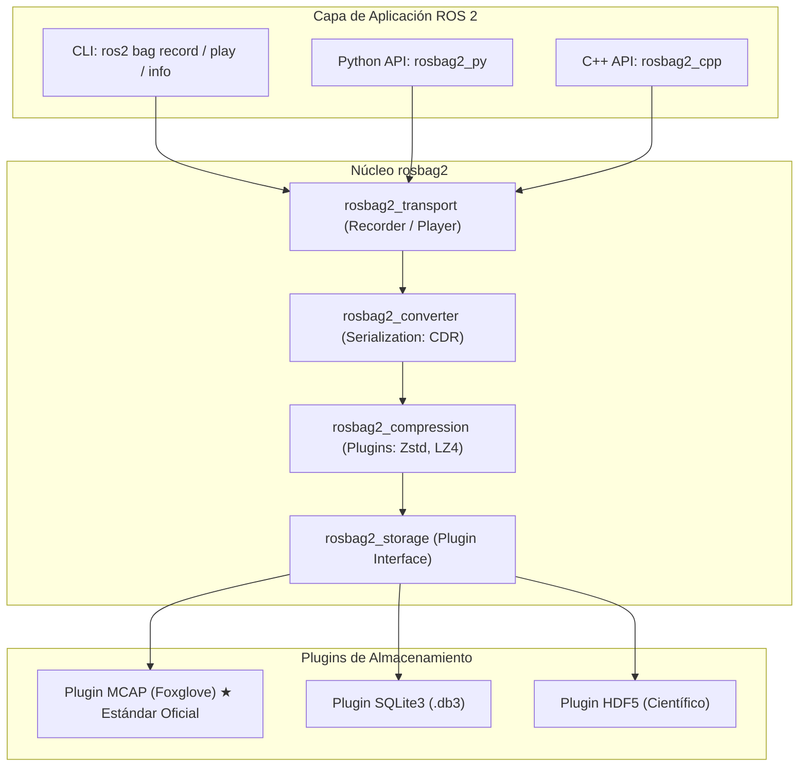
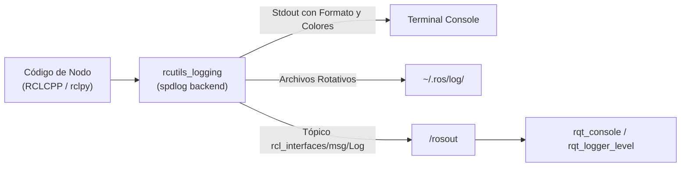
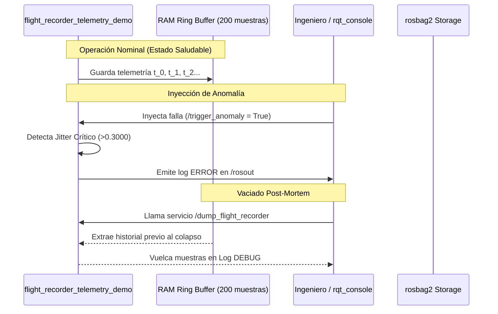

# 🎓 Guía Paso a Paso: Estado del Arte de rosbag2, Sistema de Logging y Depuración Avanzada en ROS 2

> [!IMPORTANT]
> **Actualización del Repositorio Privado del Equipo:**
> Antes de iniciar o continuar con este taller, asegúrese de haber sincronizado su repositorio privado de equipo con los últimos cambios de la base del curso. Consulte la [Guía Oficial de Sincronización y Actualizaciones](../proyectos_evaluables/ACTUALIZACIONES_BASE_CORTE_1.md) para realizar este proceso correctamente.

¡Bienvenido! En este taller práctico explorarás el **estado del arte de las herramientas de registro (logging), grabación (rosbag2) e introspección determinista** en el ecosistema **ROS 2 (Jazzy / Rolling)**.

Aprenderás a depurar robots complejos no mediante ensayo y error a ciegas, sino utilizando técnicas avanzadas de **análisis post-mortem**, **cajas negras de vuelo (Flight Recorders)**, **modificación dinámica de niveles de registro en caliente** y **reproducción paso a paso con el nuevo estándar de almacenamiento MCAP**.

---

## 🎯 Resultados de Aprendizaje Evaluables (RAE) y Criterios ABET

**RAE 1 (Primer Corte):** *Comprender la arquitectura distribuida, redes, comunicación técnica y experimentación en el ecosistema ROS 2.*

### Indicadores de Desempeño ABET Asociados:
* **Indicador 1.1 (ABET SO1 - Resolución de Problemas):** Diagnostica anomalías de sincronización, jittering y fallos lógicos en sistemas robóticos mediante el análisis estructurado de trazas de logging y datos registrados.
* **Indicador 6.1 (ABET SO6 - Experimentación y Análisis de Datos):** Diseña esquemas de grabación selectiva (filtros, compresión y QoS) y ejecuta reproducción determinista para validar hipótesis experimentales sin degradar el rendimiento del robot.
* **Indicador 7.1 (ABET SO7 - Adquisición de Nuevos Conocimientos):** Integra herramientas modernas de la industria (estándar de almacenamiento MCAP, visualizadores Foxglove/PlotJuggler y API programática `rosbag2_py`) para acelerar el ciclo de desarrollo robótico.

---

## 🧠 Estado del Arte: De ROS 1 a ROS 2 Jazzy

### 1. La Revolución de `rosbag2` y el Estándar MCAP

En ROS 1, la herramienta `rosbag` utilizaba un formato binario cerrado (`.bag`) que requería cargar todas las definiciones de mensajes compiladas en el entorno local para poder leerlo. 

En **ROS 2**, `rosbag2` fue completamente rediseñado como una **arquitectura basada en plugins** desacoplada:



#### Comparativa Técnica: SQLite3 vs MCAP (Foxglove)

| Característica | SQLite3 (`.db3`) | MCAP (`.mcap`) ★ Estado del Arte |
| :--- | :--- | :--- |
| **Esquemas Embebidos** | ❌ No (requiere ROS instalado para entender mensajes) | ✅ **Sí** (100% autocontenido con schemas ROS 2 / Protobuf / JSON) |
| **Indexación y Búsqueda** | Basado en índices B-Tree SQL (puede corromperse con cierres abruptos) | ✅ **Índice lineal de chunks sin escaneo completo** (formato de solo-anexar; aun así, un archivo cortado con `SIGKILL` queda sin índice final y `ros2 bag reindex` no lo recupera — medido en Jazzy) |
| **Rendimiento de Escritura** | Limitado por bloqueos de transacciones I/O de base de datos | ✅ **Zero-copy streaming** optimizado para alta tasa de datos (cámaras/LiDAR) |
| **Visualización Web/Externa**| Requiere plugins pesados | ✅ Compatible nativo con **Foxglove Studio, PlotJuggler, Rerun y navegadores** |
| **Compresión por Chunks** | Limitada | ✅ Compresión interna transparente con **Zstandard (Zstd)** |

---

### 2. El Subsistema de Logging en ROS 2

El sistema de logging de ROS 2 no es un simple `print()`. Está estructurado sobre la biblioteca de alto rendimiento `rcutils` y el backend `spdlog`.



#### Niveles de Severidad y Casos de Uso

1. **`DEBUG` (10):** Trazas matemáticas por ciclo (ej. valor de cada matriz jacobiana, timestamps exactos de paquetes de red). *Desactivado en producción para no degradar el determinismo en tiempo real.*
2. **`INFO` (20):** Mensajes informativos de progreso (ej. "Nodo inicializado", "Meta alcanzada").
3. **`WARN` (30):** Condiciones inesperadas pero recuperables (ej. "Tag visual perdido temporalmente", "Jitter de articulación elevado").
4. **`ERROR` (40):** Fallas funcionales de un componente que impiden completar la tarea actual (ej. "Timeout en servicio del Kinova", "Límite de articulación alcanzado").
5. **`FATAL` (50):** Condiciones críticas de hardware o seguridad que exigen la parada de emergencia inmediata (E-Stop).

---

## 🛠️ Heurísticas de la Skill de Robótica (SuperStudent)

> [!IMPORTANT]
> **Reglas de Oro de Registro y Diagnóstico:**
> 1. **Debug por capas:** Nunca culpes al algoritmo de control sin antes verificar la capa de transporte y sincronización con logs estructurados.
> 2. **No contamines la red WiFi:** En un laboratorio multi-robot, **nunca** grabes tópicos de imágenes crudas (`sensor_msgs/msg/Image`). Graba siempre la versión comprimida (`sensor_msgs/msg/CompressedImage`) o la telemetría procesada (`PoseStamped`, `Odometry`).
> 3. **Respeta los perfiles de QoS:** Al grabar o reproducir tópicos con durabilidad `TRANSIENT_LOCAL` (como mapas o parámetros estáticos), la bolsa debe capturar y reproducir con el mismo perfil de QoS para que los nuevos nodos reciban el mensaje histórico.
> 4. **Aplica Throttling a los logs:** Un `get_logger().info()` dentro de un bucle de control a 1000 Hz saturará la CPU y congelará el hilo de ejecución. Usa **logs limitados en frecuencia** (`throttle_duration_sec`).

---

## 📋 Estructura Práctica del Taller

```
Fase 0: Preparación y verificación del entorno
Fase 1: Control dinámico de Logs en tiempo de ejecución (CLI y RQT)
Fase 2: Grabación quirúrgica con rosbag2 (MCAP, Regex, Compresión y QoS)
Fase 3: Reproducción determinista, control interactivo y reloj simulado
Fase 4: Patrón Flight Recorder (Caja Negra) e Inyección de Fallas
Fase 5: Extracción programática de datos en Python con rosbag2_py
```

---

## 0. Preparación del Entorno

> [!WARNING]
> **Este taller no usa el driver del robot, así que no aplica la convención de estación
> anfitriona.** Trabaja con un emulador, y todos los emuladores del aula publican los mismos
> nombres: `/burger/kinova/*` y sus servicios. Si varias estaciones lo ejecutan a la vez en el mismo
> dominio, tus grabaciones mezclarán sus datos y tu `trigger_anomaly` lo atenderán los emuladores de
> tus compañeros. Por eso, **cuando la práctica es simultánea, cada equipo usa un `ROS_DOMAIN_ID`
> distinto** ([`TROUBLESHOOTING.md`](../../TROUBLESHOOTING.md) §2.4 y §4.1). Aísla el **dominio**;
> **no** cambies `ROS_AUTOMATIC_DISCOVERY_RANGE` a `LOCALHOST`. Al terminar, vuelve al dominio `0`
> del curso antes de un taller con el robot.

Carga en **cada terminal** el entorno del curso con el dominio de tu equipo, y reinicia el daemon
de la CLI, que queda atado al dominio con el que arrancó
([`TROUBLESHOOTING.md`](../../TROUBLESHOOTING.md) §1):

```bash
source /opt/ros/jazzy/setup.bash
source ~/ros2_ws/install/setup.bash
export ROS_DOMAIN_ID=<11, 12, ... el de tu equipo>   # práctica simultánea sin robot (§2.4)
export RMW_IMPLEMENTATION=rmw_cyclonedds_cpp
export CYCLONEDDS_URI="file://$HOME/ros2_ws/src/burger_delivery/network_setup/cyclonedds.xml"
cd ~/ros2_ws/src/burger_delivery

timeout 5s ros2 daemon stop; ros2 daemon start
```

Verifica la disponibilidad de los plugins de `rosbag2` y de la API de Python:

```bash
ros2 bag record --help | grep -i "storage"
# Deberías ver disponibles los plugins 'mcap' y 'sqlite3'
# Si faltan: sudo apt install ros-jazzy-rosbag2-storage-mcap ros-jazzy-rosbag2-storage-default-plugins

python3 -c "import rosbag2_py; print('rosbag2_py OK')"
```

Cuando el emulador esté corriendo (Ejercicio 1.1), confirma que **es el único publicador**:

```bash
ros2 topic info /burger/kinova/joint_states    # Publisher count: 1
```

Si ves `Publisher count: 2` o más, estás compartiendo dominio con el emulador de otra estación. Si
aparece `/burger/kinova/diagnostics` en `ros2 topic list`, compartes dominio con una sesión del robot
real (lo publica su `kinova_monitor`). En ambos casos corrige `ROS_DOMAIN_ID` antes de grabar nada.

---

## 1. Fase 1: Control Dinámico de Logs en Caliente

### 🧠 El Concepto
En misiones robóticas reales, **no puedes detener el robot y recompilar el código** sólo para añadir un log de depuración. ROS 2 permite alterar el nivel de verbosidad de un nodo **en tiempo de ejecución** mediante los servicios estándar de logger (si el nodo los habilita) o mediante un parámetro propio (si el nodo lo declara). Ninguno de los dos viene activo por defecto en `rclpy`.

### 🛠️ Ejercicio 1.1: Lanzar el nodo de telemetría con nivel estándar

En la **Terminal 1**, lanza el nodo emulador con nivel `INFO`:

```bash
python3 scripts/flight_recorder_telemetry_demo.py --ros-args --log-level INFO
```

Observa que sólo aparecen los mensajes periódicos de estado cada 2 segundos.

### 🛠️ Ejercicio 1.2: Inspeccionar `/rosout` y cambiar la verbosidad **en caliente**

Abre la **Terminal 2** e inspecciona el tópico agregado de logs de toda la red:

```bash
ros2 topic echo /rosout --once
```

Verás un `rcl_interfaces/msg/Log` con `level: 20` (INFO), `name`, `msg` y —muy útil para depurar— los
campos `file`, `function` y `line` exactos que emitieron el mensaje.

> [!IMPORTANT]
> **`ros2 param set … log_level DEBUG` NO funciona en este nodo.** `log_level` **no es un parámetro
> estándar de ROS 2**: sólo existe si el nodo lo declara y le asocia un callback, como hace
> `kinova_monitor` en `burger_kinova_reference` (ver
> [`TEORIA_LOGGING_ROS2.md`](../../burger_kinova_reference/docs/TEORIA_LOGGING_ROS2.md)). El emulador de
> este taller no lo declara, así que el comando responde:
> `Setting parameter failed: Invalid access to undeclared parameter(s): []`
> y, ojo, **termina con código de salida 0**: un script que compruebe `$?` no detecta el fallo.
> (Comprobado en ROS 2 Jazzy.)

Tienes **dos caminos verificados** para subir la verbosidad:

**Opción A — relanzar el nodo con nivel `DEBUG` sólo para su logger** (es la evidencia que se evalúa
en el nivel N4):

```bash
# En la Terminal 1: detén con Ctrl+C y relanza
python3 scripts/flight_recorder_telemetry_demo.py --ros-args --log-level flight_recorder_telemetry_demo:=debug
```

**Resultado:** aparecen de inmediato las trazas de cálculo cinemático y jittering, una por ciclo a
20 Hz (`🔄 Telemetry cycle: j1=…, j4=…, jitter=…`): **≈ 90 líneas de DEBUG en 5 segundos**.

> [!TIP]
> Evita `--log-level DEBUG` a secas: sube **todos** los loggers del proceso, incluidos `rcl` y
> `rmw_cyclonedds_cpp`. Medido en Jazzy: **≈ 490 líneas en 5 s, de las cuales ≈ 400 son internas
> de la pila** (`Initializing node…`, `Using domain ID…`, la configuración XML de CycloneDDS). Las
> trazas de tu nodo quedan enterradas.

**Opción B — cambiar el nivel sin detener el nodo** (nivel N5; requiere habilitar los servicios de
logger en el código, que `rclpy` crea sólo con `enable_logger_service=True`):

```python
# En el constructor del nodo, dentro de __init__:
super().__init__('flight_recorder_telemetry_demo', enable_logger_service=True)
```

```bash
# DEBUG=10, INFO=20, WARN=30, ERROR=40, FATAL=50
ros2 service call /flight_recorder_telemetry_demo/set_logger_levels \
  rcl_interfaces/srv/SetLoggerLevels \
  "{levels: [{name: 'flight_recorder_telemetry_demo', level: 10}]}"

# Verifica el nivel vigente y vuelve a INFO con level: 20
ros2 service call /flight_recorder_telemetry_demo/get_logger_levels \
  rcl_interfaces/srv/GetLoggerLevels "{names: ['flight_recorder_telemetry_demo']}"
```

**Resultado:** el nodo comienza a emitir sus trazas DEBUG (una por ciclo, del orden de 100 en 5 s)
y, al volver a `level: 20`, deja de emitirlas de inmediato.

> [!NOTE]
> El campo del mensaje se llama **`name`** (no `logger`) y el nivel se expresa numéricamente. Si lo
> escribes mal obtendrás `Failed to populate field: 'LoggerLevel' object has no attribute 'logger'`.

### 🛠️ Ejercicio 1.3: Personalizar el formato de salida en consola

ROS 2 permite personalizar el formato del log mediante la variable de entorno `RCUTILS_CONSOLE_OUTPUT_FORMAT`.

Prueba en una nueva terminal:
```bash
export RCUTILS_COLORIZED_OUTPUT=1
export RCUTILS_CONSOLE_OUTPUT_FORMAT="[{severity}] [{time}] [{name} -> {function_name}:{line_number}]: {message}"

python3 scripts/flight_recorder_telemetry_demo.py
```

> [!TIP]
> Esta variable te permite conocer al instante el archivo y línea exacta de código que emitió la alerta, acelerando el diagnóstico.

---

## 2. Fase 2: Grabación Avanzada con `rosbag2` (MCAP y Filtros)

### 🧠 El Concepto
Grabar "todo" con `ros2 bag record -a` en un robot con cámaras y LiDARs es un error grave que satura el disco y la red DDS. La práctica profesional exige **grabaciones quirúrgicas**:
- Seleccionar tópicos específicos o usar expresiones regulares (Regex).
- Utilizar el plugin de almacenamiento de última generación **MCAP**.
- Aplicar compresión con **Zstandard (zstd)**: `--compression-mode file` comprime cada archivo y produce `*.mcap.zstd`; `--compression-mode message` comprime mensaje por mensaje dentro de un `.mcap` normal. En ambos casos la CLI (`info`, `play`) descomprime sola, pero desde Python hay que leer con `rosbag2_py.SequentialCompressionReader` (Fase 5).
- Fragmentar la bolsa por tiempo o tamaño máximo (Splitting).

### 🛠️ Ejercicio 2.1: Grabación quirúrgica con MCAP y Compresión

En la **Terminal 2**, ejecuta una grabación con almacenamiento MCAP y compresión Zstd:

```bash
# Graba el estado articular, el jittering y la salud del robot en formato MCAP comprimido.
# Usa --topics (la forma posicional está deprecada en Jazzy y emite un WARN).
ros2 bag record -s mcap \
    --compression-mode file \
    --compression-format zstd \
    --max-bag-duration 30 \
    -o dataset_telemetria_kinova \
    --topics /burger/kinova/joint_states \
             /burger/kinova/joint_jitter \
             /burger/kinova/system_health
```

> [!WARNING]
> **El emulador publica sólo tres tópicos de telemetría** (`joint_states`, `joint_jitter`,
> `system_health`). `/burger/kinova/diagnostics`, que aparecía en versiones anteriores de esta guía,
> **no lo publica el emulador**: lo publica el `kinova_monitor` del sistema real, en el dominio `0`
> de las sesiones con robot. Sin robot, si lo pides la grabación **no falla**: lo ignora en silencio y
> el bag queda con menos datos de los esperados. Verifica siempre el resultado con `ros2 bag info`
> (Ejercicio 2.3).

Deja correr la grabación durante 15 segundos y deténla con `Ctrl+C`.

> [!IMPORTANT]
> **Detener la grabación importa.** Al recibir la señal, `rosbag2` cierra el archivo y escribe
> `metadata.yaml`; sin él, `ros2 bag info` y `ros2 bag play` rechazan la carpeta. Con `Ctrl+C` en la
> terminal donde corre no hay problema. **Desde un script** es distinto, y conviene saber por qué:
>
> - Un proceso lanzado con `&` desde una shell **no interactiva** hereda `SIGINT` **ignorado** (regla
>   POSIX para trabajos en segundo plano sin control de trabajos). No es un fallo de `rosbag2`: el
>   `kill -INT` no le llega. El aviso `stdin is not a terminal device. Keyboard handling disabled.`
>   sólo indica que se desactivaron los atajos de teclado.
> - **`SIGTERM` sí lo detiene limpiamente**, con `metadata.yaml` (medido en Jazzy).
> - No uses `pkill -f 'ros2 bag record'` dentro de un script: el patrón también coincide con la
>   línea de comandos de la **propia shell** que lo ejecuta, y la mata.
> - Si terminas con `SIGKILL`, el `.mcap` queda sin cerrar y `ros2 bag reindex` **no** lo recupera
>   (`No storage could be initialized`).
>
> ```bash
> # Grabación no interactiva con parada limpia (verificada)
> ros2 bag record -s mcap --max-bag-duration 30 -o dataset_telemetria_kinova \
>   --topics /burger/kinova/joint_states /burger/kinova/joint_jitter /burger/kinova/system_health \
>   > record.log 2>&1 &
> REC_PID=$!
> # ... experimento ...
> kill -TERM "$REC_PID"; wait "$REC_PID"
> ```

> [!TIP]
> **Compresión medida en este taller (ROS 2 Jazzy, 3 tópicos a 20 Hz, 11.5 s):**
> MCAP+Zstd ≈ **48.5 bytes/mensaje** (33.6 KB) frente a SQLite3 sin compresión ≈ **163.7
> bytes/mensaje** (113.4 KB): **3.4× menos espacio**, sin costo perceptible en el lazo de control.

### 🛠️ Ejercicio 2.2: Grabación mediante expresiones regulares (Regex)

Una expresión regular graba todos los tópicos que coinciden con un patrón, sin escribirlos uno a uno:

```bash
ros2 bag record -s mcap -e "/burger/kinova/.*" -o dataset_flota_completa
```

Si tuvieras varios brazos (`/burger/kinova/...`, `/burger/kinova_2/...`), el patrón anterior **sólo**
captura el primero, porque exige la barra justo después de `kinova`. Para todos: `-e "/burger/kinova[^/]*/.*"`.

> [!NOTE]
> En la captura de referencia, `-e "/burger/kinova/.*"` registró automáticamente los 3 tópicos que
> coinciden con el patrón (`joint_states`, `joint_jitter`, `system_health`).
> La regex es potente pero **poco selectiva**: comprueba con `ros2 bag info` que no hayas capturado
> tópicos pesados que no necesitas (imágenes, nubes de puntos).

### 🛠️ Ejercicio 2.3: Inspección profunda de metadatos con `ros2 bag info`

Inspecciona el archivo generado:

```bash
ros2 bag info dataset_telemetria_kinova
```

Analiza la salida en terminal y responde en tu informe:
- **Plugin de almacenamiento:** debe decir `Storage id: mcap`.
- **Archivos:** `dataset_telemetria_kinova_0.mcap.zstd` (el prefijo es el nombre de la carpeta de `-o`; la extensión `.zstd` confirma la compresión a nivel de archivo).
- **Duración y conteo por tópico:** cada tópico debe tener ≈ `20 × segundos` mensajes.
- **Serialización:** `cdr` en todos los tópicos.

Valores de referencia medidos en el laboratorio (3 tópicos, 20 Hz):

| Grabación | Duración | Mensajes | Tamaño | Bytes/mensaje |
|---|---:|---:|---:|---:|
| MCAP + Zstd | 11.5 s | 692 | 33.6 KB | **48.5** |
| SQLite3 sin compresión | 11.5 s | 693 | 113.4 KB | **163.7** |

> [!TIP]
> Comparar los dos formatos es la forma más rápida de **demostrar** la ventaja de MCAP+Zstd con
> evidencia propia: graba el mismo experimento dos veces (una con `-s mcap --compression-mode file
> --compression-format zstd` y otra con `-s sqlite3`) y contrasta `ros2 bag info`.

---

## 3. Fase 3: Reproducción Determinista e Interactiva

### 🧠 El Concepto
La reproducción determinista permite revivir un experimento exactamente como ocurrió. En ROS 2 Jazzy, el reproductor incorpora **controles interactivos de teclado en tiempo real**, **control de velocidad de reproducción (slow-motion)** y **sincronización de tiempo simulado**.

### 🛠️ Ejercicio 3.1: Reproducción en cámara lenta interactiva

Asegúrate de cerrar el nodo emulador en la Terminal 1 (`Ctrl+C`).

En la **Terminal 1**, lanza la reproducción a mitad de velocidad:

```bash
ros2 bag play dataset_telemetria_kinova --rate 0.5
```

Mientras se reproduce, prueba los **controles interactivos en la terminal** (el player los anuncia
al arrancar con líneas `Press SPACE for Pause/Resume`, `Press CURSOR_RIGHT for Play Next Message`, …):
- Presiona `Espacio` para **pausar / reanudar**.
- Presiona `Flecha Derecha` mientras está pausado para **avanzar mensaje por mensaje (Single Step)**.
- Presiona `Flecha Arriba` o `Flecha Abajo` para **subir o bajar la velocidad un 10 %** al vuelo.

> [!NOTE]
> Versiones anteriores de esta guía indicaban `s`, `+` y `-`: **no hacen nada** en Jazzy.

En la **Terminal 2**, verifica que los datos se están publicando en vivo:
```bash
ros2 topic hz /burger/kinova/joint_jitter
```

> [!NOTE]
> **La reproducción de un bag comprimido funciona igual**: `rosbag2` descomprime al vuelo. En el
> arranque verás `[rosbag2_compression]: Decompressing dataset_telemetria_kinova_0.mcap.zstd`, así que
> puedes usar el mismo dataset de la Fase 2 en esta fase.

> [!CAUTION]
> Reproduce en el dominio de tu equipo. Un `ros2 bag play` en el dominio `0` durante una sesión con
> el robot inyecta telemetría grabada junto a la real; con `/joint_states` es exactamente la
> corrupción que la regla de unicidad del driver busca evitar. Si alguna vez necesitas comparar
> contra datos en vivo, remapea (`--remap /joint_states:=/joint_states_replay`).

### 🛠️ Ejercicio 3.2: Reproducción con reloj de simulación (`/clock`)

Al probar algoritmos de navegación o SLAM con datos grabados, los nodos deben sincronizarse con el tiempo del bag y no con el reloj del sistema operativo.

1. Lanza el bag publicando el reloj simulado:
   ```bash
   ros2 bag play dataset_telemetria_kinova --clock 50
   ```
2. En otra terminal, cualquier nodo que ejecutes con `--ros-args -p use_sim_time:=true` consumirá el tiempo exacto del experimento histórico.

---

## 4. Fase 4: El Patrón Flight Recorder (Caja Negra) e Inyección de Fallas

### 🧠 El Concepto
En robótica industrial y espacial, un robot mantiene continuamente un **búfer circular en memoria RAM (Flight Recorder)**. Cuando ocurre una anomalía crítica (ej. desincronización de un AprilTag o jitter violento de articulación), el sistema activa una alerta y vuelca el búfer de los últimos segundos para su análisis post-mortem.



### 🛠️ Ejercicio 4.1: Inyección de falla y análisis de logs

1. Inicia el nodo de telemetría **ya en nivel DEBUG para su logger** (en el paso 5 verás por qué no
   puede esperar):
   ```bash
   python3 scripts/flight_recorder_telemetry_demo.py --ros-args --log-level flight_recorder_telemetry_demo:=debug
   ```
   En `rqt_console` puedes filtrar la severidad `Debug` para que las trazas por ciclo no tapen los
   `ERROR`.
2. En una segunda terminal, abre la consola gráfica de diagnóstico:
   ```bash
   ros2 run rqt_console rqt_console
   ```
3. En una tercera terminal, inyecta una anomalía de vibración mecánica:
   ```bash
   ros2 service call /burger/kinova/trigger_anomaly std_srvs/srv/SetBool "{data: true}"
   ```
4. Observa cómo aparecen alertas rojas de **ERROR** en `rqt_console` con el mensaje:
   `🚨 [FAULT TRIGGERED] Jitter articular excesivo (0.7920 > 0.3000)! Posible problema con el controlador de trayectoria.`

5. Normaliza el sistema (`"{data: false}"`) y solicita el vaciado de la caja negra **sin detener el
   nodo**:

   ```bash
   ros2 service call /burger/kinova/trigger_anomaly std_srvs/srv/SetBool "{data: false}"
   ros2 service call /burger/kinova/dump_flight_recorder std_srvs/srv/Trigger
   ```

   > [!IMPORTANT]
   > El volcado se emite como líneas `DEBUG`, así que el nodo tiene que estar en ese nivel **desde
   > antes de la falla**. Si lo arrancaste en `INFO`, el servicio responde `success=True, "Buffer
   > volcado exitosamente (200 muestras disponibles en DEBUG log)"` pero **no verás ni una muestra**.
   > Y **no lo arregles relanzando el nodo**: el *ring buffer* vive en RAM y el estado de la anomalía
   > también, así que al relanzar volcarías sólo muestras nominales posteriores al reinicio, y la
   > evidencia de la falla se habría perdido. (`ros2 param set … log_level` tampoco sirve: ver
   > Ejercicio 1.2.) Si te pasó, repite desde el paso 1.

6. En la consola del nodo (nivel DEBUG) localiza el volcado y **analiza una muestra**:
   ```
   📦 [FLIGHT RECORDER DUMP] Vaciando 200 muestras del buffer de memoria...
   [T-200] t=1789416273.20 | j1=0.144, j4=0.436 | jitter=0.7920 | status=CRITICAL_FAULT: HIGH_JITTER_DETECTED
   ```
   Con `T-200` numerado hacia atrás: `T-1` es la muestra más reciente y `T-200` la más antigua
   (≈10 s de historia a 20 Hz; si el nodo lleva menos de 10 s corriendo verás menos de 200). Localiza
   **la última muestra con `status=HEALTH_NOMINAL`** antes de la falla: esa es la evidencia de lo que
   el robot estaba haciendo *justo antes* del incidente.

   > [!NOTE]
   > `status` refleja si la anomalía está **activa**, no si se superó el umbral: verás muestras
   > `CRITICAL_FAULT` con `jitter=0.0429`, por debajo de `0.3`. El `ERROR` en `/rosout`, en cambio,
   > sólo se emite cuando `|jitter| > 0.3`. Distinguir *estado declarado* de *medida* es parte del
   > análisis.

   > [!TIP]
   > Un *flight recorder* de verdad **no debería depender del nivel de log**: en un robot en
   > producción el volcado debe persistirse en archivo (por ejemplo `work/flight_dump.csv`) o
   > publicarse en un tópico para poder analizarlo sin haber previsto la verbosidad. Propón esa mejora
   > en tu informe.

---

## 5. Fase 5: Extracción Programática en Python con `rosbag2_py`

### 🧠 El Concepto
El estado del arte de la ciencia de datos en robótica no depende de reproducir bolsas en tiempo real para capturar CSVs. Mediante la API `rosbag2_py`, puedes abrir directamente un archivo MCAP o SQLite en milisegundos desde un script de Python, deserializar los mensajes y generar métricas estadísticas o gráficas de publicación.

### 🛠️ Ejercicio 5.1: Script lector de telemetría MCAP

El repositorio ya trae el lector completo [`scripts/read_mcap_telemetry.py`](../../scripts/read_mcap_telemetry.py).
Para entender la API, escribe primero esta **versión mínima** en `work/lector_minimo.py` (no
sobrescribas la del repositorio):

```python
#!/usr/bin/env python3
import sys
import rclpy
from rclpy.serialization import deserialize_message
from rosidl_runtime_py.utilities import get_message
import rosbag2_py

def analyze_bag(bag_path: str):
    # Configurar opciones de almacenamiento
    storage_options = rosbag2_py.StorageOptions(uri=bag_path, storage_id='mcap')
    converter_options = rosbag2_py.ConverterOptions(
        input_serialization_format='cdr',
        output_serialization_format='cdr'
    )

    # SequentialCompressionReader descomprime al vuelo (modo 'file' y modo 'message').
    # Para una bolsa grabada SIN compresión usa rosbag2_py.SequentialReader().
    reader = rosbag2_py.SequentialCompressionReader()
    reader.open(storage_options, converter_options)

    # Obtener catálogo de tópicos y tipos
    topics_and_types = reader.get_all_topics_and_types()
    type_map = {topic.name: topic.type for topic in topics_and_types}

    print(f"📖 Analizando bolsa: {bag_path}")
    print(f"📌 Tópicos registrados: {list(type_map.keys())}\n")

    msg_count = 0
    jitter_values = []

    while reader.has_next():
        (topic, data, timestamp_ns) = reader.read_next()
        msg_type = get_message(type_map[topic])
        msg = deserialize_message(data, msg_type)

        if topic == '/burger/kinova/joint_jitter':
            jitter_values.append(msg.data)
        msg_count += 1

    print(f"✅ Total de mensajes leídos: {msg_count}")
    if jitter_values:
        avg_jitter = sum(jitter_values) / len(jitter_values)
        max_jitter = max(jitter_values)
        print(f"📊 Jitter Promedio: {avg_jitter:.5f} | Jitter Máximo: {max_jitter:.5f}")

if __name__ == '__main__':
    if len(sys.argv) < 2:
        print("Uso: python3 work/lector_minimo.py <path_al_bag>")
    else:
        analyze_bag(sys.argv[1])
```

Ejecuta la versión mínima y luego el lector del repositorio sobre el dataset grabado en la Fase 2:
```bash
python3 work/lector_minimo.py dataset_telemetria_kinova
python3 scripts/read_mcap_telemetry.py dataset_telemetria_kinova
```

El lector del repositorio elige solo el lector adecuado (lee `compression_mode` en
`metadata.yaml`) y cambia a `sqlite3` si la carpeta contiene un `.db3`. Salida esperada: la línea
`Plugin de Almacenamiento: MCAP (comprimida, lector SequentialCompressionReader)`, el desglose por
tópico (≈20 mensajes por segundo y tópico), `Total general de mensajes procesados` y las métricas de
jitter (`Promedio`, `Máximo`, `Mínimo`, `Eventos Críticos de Falla Detectados`). Con el dataset
nominal, `Máximo: 0.00200`.

> [!CAUTION]
> **El lector importa, y equivocarse puede fallar en silencio.** Medido en Jazzy:
>
> | Dataset | `SequentialReader` | `SequentialCompressionReader` |
> |---|---|---|
> | Sin compresión | ✅ | ❌ `should not be initialized with NONE compression mode` |
> | `--compression-mode file` (`.mcap.zstd`) | ❌ `invalid magic bytes in Header: 0x28B52FFD…` | ✅ |
> | `--compression-mode message` | ⚠️ **abre, pero entrega los payloads comprimidos** | ✅ |
>
> El tercer caso es el peligroso: la deserialización falla mensaje a mensaje y, si tu script atrapa
> las excepciones con `except: pass` (como hacía una versión anterior de `read_mcap_telemetry.py`),
> **reporta el conteo de mensajes correcto y un jitter de `0.00000`**: un resultado falso con
> apariencia de nominal. Nunca silencies un error de deserialización.
>
> Versiones anteriores de esta guía recomendaban descomprimir a mano el `.mcap.zstd` con el módulo
> `zstandard`. Ya no hace falta, y además esa copia conserva `compression_mode: FILE` en
> `metadata.yaml`, lo que confunde a cualquier lector que se guíe por los metadatos.

Si prefieres un dataset de análisis sin compresión (más grande, pero legible por cualquier
herramienta), grábalo aparte:

```bash
ros2 bag record -s mcap -o dataset_analisis --topics \
  /burger/kinova/joint_states /burger/kinova/joint_jitter /burger/kinova/system_health

python3 scripts/read_mcap_telemetry.py dataset_analisis
```

Ruta recomendada: `dataset_telemetria_kinova` (comprimido) sirve para E3/E4 y también para E9 con
el lector del repositorio; `dataset_analisis` o `dataset_sqlite` son la alternativa sin compresión.

---

## 📏 Datos de referencia medidos (para contrastar tus resultados)

Valores obtenidos al ejecutar este taller completo en ROS 2 Jazzy (RMW CycloneDDS), con el nodo
`flight_recorder_telemetry_demo.py` a 20 Hz. Sirven para saber si tu experimento está bien:

> [!NOTE]
> Estas cifras se midieron cuando el emulador publicaba **7** articulaciones. Desde que publica
> **6**, como el brazo real, cadencia, jitter y conteos no cambian, pero el tamaño por mensaje de
> los bags baja unos bytes. Para reproducir la tabla exacta lanza el nodo con
> `--ros-args -p num_joints:=7`.

| Magnitud | Valor de referencia |
|---|---|
| Cadencia del nodo (`ros2 topic hz`) | 19.997 – 20.005 Hz |
| Intervalo entre mensajes (min / max) | 0.049 s / 0.051 s |
| Desviación estándar del intervalo | ≈ 0.5 ms |
| Tópicos de telemetría publicados | **3** (`joint_states`, `joint_jitter`, `system_health`) |
| Servicios | **2** (`trigger_anomaly`, `dump_flight_recorder`) |
| MCAP + Zstd (3 tópicos, 11.5 s) | 692 mensajes · 33.6 KB · **48.5 B/mensaje** |
| SQLite3 sin compresión (idem) | 693 mensajes · 113.4 KB · **163.7 B/mensaje** |
| Factor de compresión Zstd | **3.4×** (2.84× respecto al MCAP descomprimido) |
| Jitter nominal (máx) | **0.00200** con **0** eventos críticos |
| Jitter con anomalía inyectada (máx) | **0.79200** con **68** eventos críticos |
| Volumen de log con `--log-level flight_recorder_telemetry_demo:=debug` | ≈ 90 líneas en 5 s (una por ciclo de telemetría) |
| Volumen de log con `--log-level DEBUG` global | ≈ 490 líneas en 5 s (≈ 400 de `rcl` / `rmw_cyclonedds_cpp`) |

> [!TIP]
> Si tu jitter máximo nominal sale muy por encima de `0.002`, o tu `joint_states` no trae las 6
> articulaciones simuladas `joint_1..joint_6`, revisa la configuración del nodo y tu `ROS_DOMAIN_ID`
> antes de concluir nada: primero descarta la capa de transporte y de registro.

> [!WARNING]
> **El emulador publica 6 articulaciones, como el robot, pero no la pinza.** El Kinova Gen3 del
> laboratorio es de **6 GDL** y en `/joint_states` publica `joint_1..joint_6` más la articulación de
> la pinza (`robotiq_85_left_knuckle_joint`), que el emulador no simula. El parámetro `num_joints`
> (6 por defecto) existe sólo para reproducir los datos de referencia antiguos. Ver [`TROUBLESHOOTING.md`](../../TROUBLESHOOTING.md) §3.1.

---

## Errores frecuentes y su causa

| Síntoma | Causa real | Solución |
|---|---|---|
| `Setting parameter failed: Invalid access to undeclared parameter(s)` (con código de salida 0) | `log_level` no es un parámetro estándar y este nodo no lo declara | Relanza con `--ros-args --log-level flight_recorder_telemetry_demo:=debug` o habilita el servicio de logger (Ejercicio 1.2, Opción B) |
| `kill -INT` no detiene un `ros2 bag record` lanzado con `&` desde un script | En shells no interactivas los trabajos en segundo plano heredan `SIGINT` ignorado | Detén con `kill -TERM <PID>` (Ejercicio 2.1) |
| El bag existe pero **no tiene `metadata.yaml`** | Se terminó con `SIGKILL`; `ros2 bag reindex` no lo recupera | Repite la grabación y detenla con `Ctrl+C` o `SIGTERM` |
| El script de parada se cierra solo al ejecutar `pkill -f 'ros2 bag record'` | El patrón coincide con la línea de comandos de la propia shell | Guarda el PID (`REC_PID=$!`) y usa `kill -TERM "$REC_PID"` |
| `invalid magic bytes in Header: 0x28B52FFD…` al leer con `rosbag2_py` | Dataset `.mcap.zstd` abierto con `SequentialReader` | Usa `SequentialCompressionReader` o `scripts/read_mcap_telemetry.py` (Fase 5) |
| El análisis da jitter `0.00000` con el conteo de mensajes correcto | Bolsa con `--compression-mode message` leída con `SequentialReader` y errores de deserialización silenciados | Usa `SequentialCompressionReader`; no atrapes excepciones con `pass` |
| La grabación “salió bien” pero faltan tópicos | Un tópico inexistente **no genera error**: se ignora silenciosamente | Verifica el conteo con `ros2 bag info` contra la lista esperada |
| Aparece `/burger/kinova/diagnostics`, o `ros2 topic info` muestra más de un publicador | Compartes dominio con otro emulador o con una sesión del robot real | Usa el `ROS_DOMAIN_ID` de tu equipo y reinicia el daemon (Fase 0) |
| El volcado del flight recorder responde `success=True` pero no muestra muestras | El volcado se emite como `DEBUG` y el nodo está en `INFO` | Arranca el nodo en DEBUG **antes** de inyectar la falla; relanzarlo borra el buffer (Ejercicio 4.1) |
| `s`, `+` o `-` no hacen nada durante `ros2 bag play` | Esas teclas no existen en Jazzy | Espacio, Flecha Derecha, Flecha Arriba/Abajo (Ejercicio 3.1) |
| `ros2 topic list` / `ros2 service list` se quedan colgados o dan `TimeoutError` | Daemon de la CLI bloqueado (frecuente en WSL) | Reinícialo según [`TROUBLESHOOTING.md`](../../TROUBLESHOOTING.md) §1. `--no-daemon` sirve para aislar la falla, no como solución permanente |
| `Failed to populate field: 'LoggerLevel' object has no attribute 'logger'` | El campo del mensaje se llama `name` | Usa `{levels: [{name: '<nodo>', level: 10}]}` |
| `ros2 bag record` avisa “Positional topics argument deprecated” | Sintaxis antigua de posicionar tópicos | Usa `--topics <t1> <t2>` |

---

## 🏆 Mini-Retos Evaluables

### 🛠️ Mini-Reto 1: Captura de Incidente y Reproducción en Remapping
1. Inicia el nodo `flight_recorder_telemetry_demo.py`.
2. Inicia una grabación MCAP comprimida con Zstd en la carpeta `dataset_incidente_mcap`.
3. Inyecta la falla con el servicio `/burger/kinova/trigger_anomaly` durante 5 segundos y luego normaliza el sistema.
4. Detén la grabación.
5. Reproduce el bag **remapeando** el tópico de estado articular hacia un nuevo tópico de prueba:
   ```bash
   ros2 bag play dataset_incidente_mcap --remap /burger/kinova/joint_states:=/burger/kinova/joint_states_replay
   ```
6. Entrega una captura de pantalla donde se observe con `ros2 topic list` y `ros2 topic echo` que `/burger/kinova/joint_states_replay` contiene los datos registrados.

> [!NOTE]
> El bag comprimido `dataset_incidente_mcap` **sí** se reproduce: `rosbag2` lo descomprime al vuelo
> (verás `Decompressing …` en el arranque). Para tener tiempo de inspeccionar, reproduce a la mitad de
> velocidad: `ros2 bag play dataset_incidente_mcap --rate 0.5 --remap /burger/kinova/joint_states:=/burger/kinova/joint_states_replay`.
> Entonces `ros2 topic list` debe mostrar `/burger/kinova/joint_states_replay` y `ros2 topic echo`
> un `JointState` con `frame_id: base_link` y las 6 articulaciones simuladas del emulador.
>
> Si el bag **ya terminó**, el tópico desaparece y `ros2 topic echo` responde
> `topic [...] does not appear to be published yet`: vuelve a lanzar el `play` y verifica de inmediato.
> (Es un error de método muy común: no es que el remapping falle.)

---

## 📊 Rúbrica de Evaluación ABET (Assessment)

| Criterio / Indicador | Insuficiente (0.0 - 2.9) | En Desarrollo (3.0 - 3.9) | Competente (4.0 - 4.7) | Excelente (4.8 - 5.0) |
| :--- | :--- | :--- | :--- | :--- |
| **Diagnóstico de Logging (SO1 - Ind 1.1)** | No comprende los niveles de log; no logra cambiar la severidad ni filtrar alertas en `rqt_console`. | Identifica los niveles de severidad pero requiere reiniciar el nodo para aplicar cambios. | Modifica la verbosidad en caliente con el servicio `set_logger_levels` (o relanzando el nodo con `--log-level`) y explica el origen del error en `/rosout`. | Domina la configuración dinámica de logs, formateo con `rcutils` y volcado estructurado post-mortem. |
| **Grabación Quirúrgica y MCAP (SO6 - Ind 6.1)** | Graba con `ros2 bag record -a` sin compresión, saturando la red o corrompiendo archivos. | Graba tópicos individuales en SQLite pero no domina compresión ni filtros por expresiones regulares. | Configura grabaciones con formato MCAP, compresión Zstd y filtros por tópicos/QoS. | Justifica rigurosamente el impacto de la compresión (por archivo frente a por mensaje, y cómo condiciona la lectura programática) y diseña datasets óptimos para experimentación. |
| **Reproducción y API (SO7 - Ind 7.1)** | No logra reproducir bolsas ni sincronizar relojes de tiempo simulado. | Reproduce bolsas a velocidad estándar pero no utiliza controles interactivos ni remapping. | Utiliza controles interactivos (`rate`, step, pause) y remapeo de tópicos en tiempo de ejecución. | Implementa scripts en Python con `rosbag2_py` para análisis automatizado de datos sin playback en la red. |

---

## 📚 Referencias y Lecturas Complementarias
- *ROS 2 Design: rosbag2 storage plugins and recording architecture.* (Open Robotics).
- *Foxglove MCAP File Format Specification for Robotics & Autonomous Systems.*
- *SuperStudent Troubleshooting Heuristics for Collaborative Robotics.* (`education/metodologias/SKILL_SUPERSTUDENT.md`).
- [`TROUBLESHOOTING.md`](../../TROUBLESHOOTING.md): daemon de la CLI (§1), estación anfitriona para talleres con robot (§2.0), dominio en práctica simulada (§2.4) y fallos de los talleres (§4).
- *ROS 2 Jazzy Documentation: Logging and Logger Configuration.*
