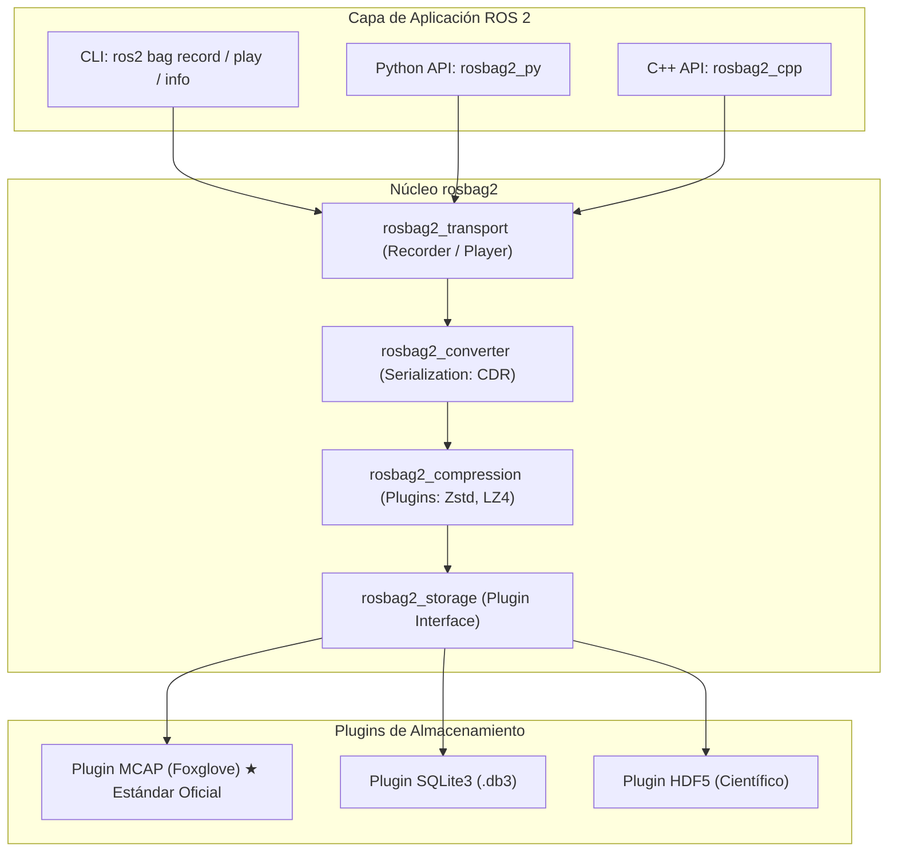
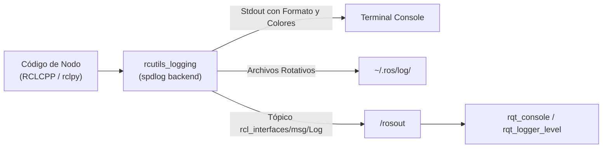
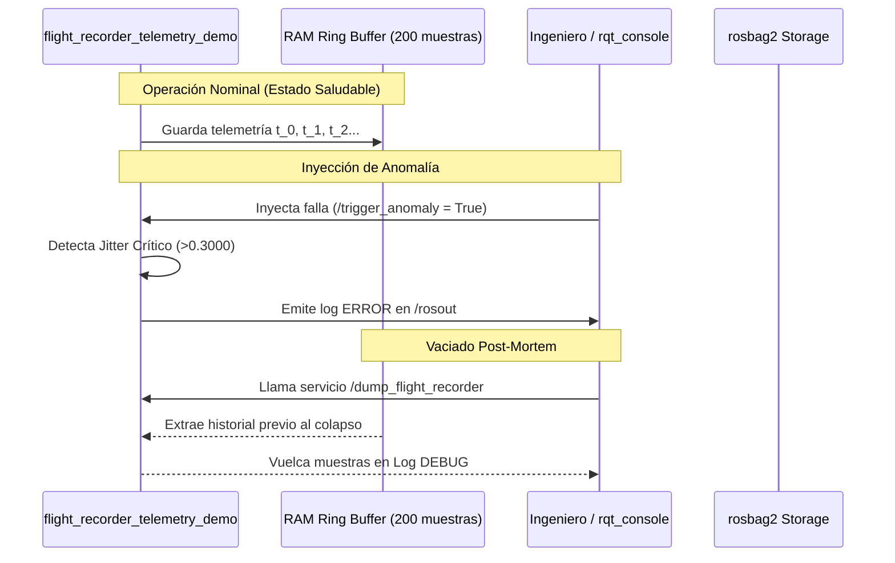

# 🎓 Guía Paso a Paso: Estado del Arte de rosbag2, Sistema de Logging y Depuración Avanzada en ROS 2

¡Bienvenido! En este taller práctico explorarás el **estado del arte de las herramientas de registro (logging), grabación (rosbag2) e introspección determinista** en el ecosistema **ROS 2 (Jazzy / Rolling)**.

Aprenderás a depurar robots complejos no mediante ensayo y error a ciegas, sino utilizando técnicas avanzadas de **análisis post-mortem**, **cajas negras de vuelo (Flight Recorders)**, **modificación dinámica de niveles de registro en caliente** y **reproducción paso a paso con el nuevo estándar de almacenamiento MCAP**.

---

## 🎯 Resultados de Aprendizaje Evaluables (RAE) y Criterios ABET

**RAE 1 (Primer Corte):** *Comprender la arquitectura distribuida, redes, comunicación técnica y experimentación en el ecosistema ROS 2.*

### Indicadores de Desempeño ABET Asociados:
* **Indicador 1.1 (ABET SO1 - Resolución de Problemas):** Diagnostica anomalías de sincronización, jittering y fallos lógicos en sistemas robóticos mediante el análisis estructurado de trazas de logging y datos registrados.
* **Indicador 6.1 (ABET SO6 - Experimentación y Análisis de Datos):** Diseña esquemas de grabación selectiva (filtros, compresión y QoS) y ejecuta reproducción determinista para validar hipótesis experimentales sin degradar el rendimiento del robot.
* **Indicador 7.1 (ABET SO7 - Adquisición de Nuevos Conocimientos):** Integra herramientas modernas de la industria (estándar de almacenamiento MCAP, visualizadores Foxglove/PlotJuggler y API programática `rosbag2_py`) para acelerar el ciclo de desarrollo robótico.

---

## 🧠 Estado del Arte: De ROS 1 a ROS 2 Jazzy

### 1. La Revolución de `rosbag2` y el Estándar MCAP

En ROS 1, la herramienta `rosbag` utilizaba un formato binario cerrado (`.bag`) que requería cargar todas las definiciones de mensajes compiladas en el entorno local para poder leerlo. 

En **ROS 2**, `rosbag2` fue completamente rediseñado como una **arquitectura basada en plugins** desacoplada:



#### Comparativa Técnica: SQLite3 vs MCAP (Foxglove)

| Característica | SQLite3 (`.db3`) | MCAP (`.mcap`) ★ Estado del Arte |
| :--- | :--- | :--- |
| **Esquemas Embebidos** | ❌ No (requiere ROS instalado para entender mensajes) | ✅ **Sí** (100% autocontenido con schemas ROS 2 / Protobuf / JSON) |
| **Indexación y Búsqueda** | Basado en índices B-Tree SQL (puede corromperse con cierres abruptos) | ✅ **Índice lineal de chunks sin escaneo completo** (cero corrupción al cortar energía) |
| **Rendimiento de Escritura** | Limitado por bloqueos de transacciones I/O de base de datos | ✅ **Zero-copy streaming** optimizado para alta tasa de datos (cámaras/LiDAR) |
| **Visualización Web/Externa**| Requiere plugins pesados | ✅ Compatible nativo con **Foxglove Studio, PlotJuggler, Rerun y navegadores** |
| **Compresión por Chunks** | Limitada | ✅ Compresión interna transparente con **Zstandard (Zstd)** |

---

### 2. El Subsistema de Logging en ROS 2

El sistema de logging de ROS 2 no es un simple `print()`. Está estructurado sobre la biblioteca de alto rendimiento `rcutils` y el backend `spdlog`.



#### Niveles de Severidad y Casos de Uso

1. **`DEBUG` (10):** Trazas matemáticas por ciclo (ej. valor de cada matriz jacobiana, timestamps exactos de paquetes de red). *Desactivado en producción para no degradar el determinismo en tiempo real.*
2. **`INFO` (20):** Mensajes informativos de progreso (ej. "Nodo inicializado", "Meta alcanzada").
3. **`WARN` (30):** Condiciones inesperadas pero recuperables (ej. "Tag visual perdido temporalmente", "Jitter de articulación elevado").
4. **`ERROR` (40):** Fallas funcionales de un componente que impiden completar la tarea actual (ej. "Timeout en servicio del Kinova", "Límite de articulación alcanzado").
5. **`FATAL` (50):** Condiciones críticas de hardware o seguridad que exigen la parada de emergencia inmediata (E-Stop).

---

## 🛠️ Heurísticas de la Skill de Robótica (SuperStudent)

> [!IMPORTANT]
> **Reglas de Oro de Registro y Diagnóstico:**
> 1. **Debug por capas:** Nunca culpes al algoritmo de control sin antes verificar la capa de transporte y sincronización con logs estructurados.
> 2. **No contamines la red WiFi:** En un laboratorio multi-robot, **nunca** grabes tópicos de imágenes crudas (`sensor_msgs/msg/Image`). Graba siempre la versión comprimida (`sensor_msgs/msg/CompressedImage`) o la telemetría procesada (`PoseStamped`, `Odometry`).
> 3. **Respeta los perfiles de QoS:** Al grabar o reproducir tópicos con durabilidad `TRANSIENT_LOCAL` (como mapas o parámetros estáticos), la bolsa debe capturar y reproducir con el mismo perfil de QoS para que los nuevos nodos reciban el mensaje histórico.
> 4. **Aplica Throttling a los logs:** Un `get_logger().info()` dentro de un bucle de control a 1000 Hz saturará la CPU y congelará el hilo de ejecución. Usa **logs limitados en frecuencia** (`throttle_duration_sec`).

---

## 📋 Estructura Práctica del Taller

```
Fase 0: Preparación y verificación del entorno
Fase 1: Control dinámico de Logs en tiempo de ejecución (CLI y RQT)
Fase 2: Grabación quirúrgica con rosbag2 (MCAP, Regex, Compresión y QoS)
Fase 3: Reproducción determinista, control interactivo y reloj simulado
Fase 4: Patrón Flight Recorder (Caja Negra) e Inyección de Fallas
Fase 5: Extracción programática de datos en Python con rosbag2_py
```

---

## 0. Preparación del Entorno

Abre una terminal y prepara las variables de entorno de ROS 2 Jazzy y el workspace del proyecto:

```bash
source /opt/ros/jazzy/setup.bash
cd ~/ros2_ws/src/burger_delivery
```

Verifica la disponibilidad de los plugins de `rosbag2` y el ejecutable de telemetría:

```bash
ros2 bag record --help | grep -i "storage"
# Deberías ver disponibles los plugins 'mcap' y 'sqlite3'
```

---

## 1. Fase 1: Control Dinámico de Logs en Caliente

### 🧠 El Concepto
En misiones robóticas reales, **no puedes detener el robot y recompilar el código** sólo para añadir un log de depuración. ROS 2 permite alterar el nivel de verbosidad de cualquier nodo **en tiempo de ejecución** mediante parámetros y servicios.

### 🛠️ Ejercicio 1.1: Lanzar el nodo de telemetría con nivel estándar

En la **Terminal 1**, lanza el nodo emulador con nivel `INFO`:

```bash
python3 scripts/flight_recorder_telemetry_demo.py --ros-args --log-level INFO
```

Observa que sólo aparecen los mensajes periódicos de estado cada 2 segundos.

### 🛠️ Ejercicio 1.2: Inspeccionar `/rosout` y cambiar a nivel `DEBUG` en vivo

Abre la **Terminal 2**. Vamos a inspeccionar el tópico agregado de logs:

```bash
# Ver el flujo estructurado de logs de todos los nodos en la red:
ros2 topic echo /rosout
```

Ahora, cambia dinámicamente el nivel de registro del nodo a `DEBUG` sin detenerlo:

```bash
# En Terminal 2:
ros2 param set /flight_recorder_telemetry_demo log_level DEBUG
```

**Resultado:** Observa inmediatamente la **Terminal 1**. Verás fluir las trazas detalladas de cálculo cinemático y jittering a 20 Hz.

Para restaurarlo a `INFO`:
```bash
ros2 param set /flight_recorder_telemetry_demo log_level INFO
```

### 🛠️ Ejercicio 1.3: Personalizar el formato de salida en consola

ROS 2 permite personalizar el formato del log mediante la variable de entorno `RCUTILS_CONSOLE_OUTPUT_FORMAT`.

Prueba en una nueva terminal:
```bash
export RCUTILS_COLORIZED_OUTPUT=1
export RCUTILS_CONSOLE_OUTPUT_FORMAT="[{severity}] [{time}] [{name} -> {function_name}:{line_number}]: {message}"

python3 scripts/flight_recorder_telemetry_demo.py
```

> [!TIP]
> Esta variable te permite conocer al instante el archivo y línea exacta de código que emitió la alerta, acelerando el diagnóstico.

---

## 2. Fase 2: Grabación Avanzada con `rosbag2` (MCAP y Filtros)

### 🧠 El Concepto
Grabar "todo" con `ros2 bag record -a` en un robot con cámaras y LiDARs es un error grave que satura el disco y la red DDS. La práctica profesional exige **grabaciones quirúrgicas**:
- Seleccionar tópicos específicos o usar expresiones regulares (Regex).
- Utilizar el plugin de almacenamiento de última generación **MCAP**.
- Aplicar compresión por chunks con **Zstandard (zstd)**.
- Fragmentar la bolsa por tiempo o tamaño máximo (Splitting).

### 🛠️ Ejercicio 2.1: Grabación quirúrgica con MCAP y Compresión

En la **Terminal 2**, ejecuta una grabación con almacenamiento MCAP y compresión Zstd:

```bash
# Graba la estado articular (joint_states), diagnósticos y jittering del robot en formato MCAP:
ros2 bag record -s mcap \
    --compression-mode file \
    --compression-format zstd \
    --max-bag-duration 30 \
    -o dataset_telemetria_kinova \
    /burger/kinova/joint_states \
    /burger/kinova/diagnostics \
    /burger/kinova/joint_jitter \
    /burger/kinova/system_health
```

Deja correr la grabación durante 15 segundos y presiona `Ctrl+C`.

### 🛠️ Ejercicio 2.2: Grabación mediante expresiones regulares (Regex)

Si tienes múltiples robots (`/burger_car_01`, `/burger_car_02`, etc.), puedes grabarlos a todos usando regex:

```bash
ros2 bag record -s mcap -e "/burger/kinova/.*" -o dataset_flota_completa
```

### 🛠️ Ejercicio 2.3: Inspección profunda de metadatos con `ros2 bag info`

Inspecciona el archivo generado:

```bash
ros2 bag info dataset_telemetria_kinova
```

Analiza la salida en terminal:
- Identifica el plugin de almacenamiento (`mcap`).
- Revisa el conteo exacto de mensajes por tópico.
- Verifica el formato de serialización (`cdr`) y la compresión (`zstd`).

---

## 3. Fase 3: Reproducción Determinista e Interactiva

### 🧠 El Concepto
La reproducción determinista permite revivir un experimento exactamente como ocurrió. En ROS 2 Jazzy, el reproductor incorpora **controles interactivos de teclado en tiempo real**, **control de velocidad de reproducción (slow-motion)** y **sincronización de tiempo simulado**.

### 🛠️ Ejercicio 3.1: Reproducción en cámara lenta interactiva

Asegúrate de cerrar el nodo emulador en la Terminal 1 (`Ctrl+C`).

En la **Terminal 1**, lanza la reproducción a mitad de velocidad:

```bash
ros2 bag play dataset_telemetria_kinova --rate 0.5
```

Mientras se reproduce, prueba los **controles interactivos en la terminal**:
- Presiona `Espacio` para **pausar / reanudar**.
- Presiona `s` o `Flecha Derecha` mientras está pausado para **avanzar mensaje por mensaje (Single Step)**.
- Presiona `+` o `-` para **acelerar o ralentizar** la reproducción al vuelo.

En la **Terminal 2**, verifica que los datos se están publicando en vivo:
```bash
ros2 topic hz /burger/kinova/diagnostics
```

### 🛠️ Ejercicio 3.2: Reproducción con reloj de simulación (`/clock`)

Al probar algoritmos de navegación o SLAM con datos grabados, los nodos deben sincronizarse con el tiempo del bag y no con el reloj del sistema operativo.

1. Lanza el bag publicando el reloj simulado:
   ```bash
   ros2 bag play dataset_telemetria_kinova --clock 50
   ```
2. En otra terminal, cualquier nodo que ejecutes con `--ros-args -p use_sim_time:=true` consumirá el tiempo exacto del experimento histórico.

---

## 4. Fase 4: El Patrón Flight Recorder (Caja Negra) e Inyección de Fallas

### 🧠 El Concepto
En robótica industrial y espacial, un robot mantiene continuamente un **búfer circular en memoria RAM (Flight Recorder)**. Cuando ocurre una anomalía crítica (ej. desincronización de un AprilTag o jitter violento de articulación), el sistema activa una alerta y vuelca el búfer de los últimos segundos para su análisis post-mortem.



### 🛠️ Ejercicio 4.1: Inyección de falla y análisis de logs

1. Inicia el nodo de telemetría:
   ```bash
   python3 scripts/flight_recorder_telemetry_demo.py
   ```
2. En una segunda terminal, abre la consola gráfica de diagnóstico:
   ```bash
   ros2 run rqt_console rqt_console
   ```
3. En una tercera terminal, inyecta una anomalía de vibración mecánica:
   ```bash
   ros2 service call /burger/kinova/trigger_anomaly std_srvs/srv/SetBool "{data: true}"
   ```
4. Observa cómo aparecen alertas rojas de **ERROR** en `rqt_console` con el mensaje:
   `🚨 [FAULT TRIGGERED] Jitter excesivo! Posible desprendimiento de tag...`

5. Solicita el vaciado de la caja negra:
   ```bash
   # Habilitar DEBUG para visualizar el volcado:
   ros2 param set /flight_recorder_telemetry_demo log_level DEBUG

   # Invocar el volcado del Flight Recorder:
   ros2 service call /burger/kinova/dump_flight_recorder std_srvs/srv/Trigger
   ```

---

## 5. Fase 5: Extracción Programática en Python con `rosbag2_py`

### 🧠 El Concepto
El estado del arte de la ciencia de datos en robótica no depende de reproducir bolsas en tiempo real para capturar CSVs. Mediante la API `rosbag2_py`, puedes abrir directamente un archivo MCAP o SQLite en milisegundos desde un script de Python, deserializar los mensajes y generar métricas estadísticas o gráficas de publicación.

### 🛠️ Ejercicio 5.1: Script lector de telemetría MCAP

Crea un script de inspección rápida [`scripts/read_mcap_telemetry.py`](file:///home/roncanciovl/ros2_ws/src/burger_delivery/scripts/read_mcap_telemetry.py):

```python
#!/usr/bin/env python3
import sys
import rclpy
from rclpy.serialization import deserialize_message
from rosidl_runtime_py.utilities import get_message
import rosbag2_py

def analyze_bag(bag_path: str):
    # Configurar opciones de almacenamiento
    storage_options = rosbag2_py.StorageOptions(uri=bag_path, storage_id='mcap')
    converter_options = rosbag2_py.ConverterOptions(
        input_serialization_format='cdr',
        output_serialization_format='cdr'
    )

    reader = rosbag2_py.SequentialReader()
    reader.open(storage_options, converter_options)

    # Obtener catálogo de tópicos y tipos
    topics_and_types = reader.get_all_topics_and_types()
    type_map = {topic.name: topic.type for topic in topics_and_types}

    print(f"📖 Analizando bolsa: {bag_path}")
    print(f"📌 Tópicos registrados: {list(type_map.keys())}\n")

    msg_count = 0
    jitter_values = []

    while reader.has_next():
        (topic, data, timestamp_ns) = reader.read_next()
        msg_type = get_message(type_map[topic])
        msg = deserialize_message(data, msg_type)

        if topic == '/burger/kinova/joint_jitter':
            jitter_values.append(msg.data)
        msg_count += 1

    print(f"✅ Total de mensajes leídos: {msg_count}")
    if jitter_values:
        avg_jitter = sum(jitter_values) / len(jitter_values)
        max_jitter = max(jitter_values)
        print(f"📊 Jitter Promedio: {avg_jitter:.5f} | Jitter Máximo: {max_jitter:.5f}")

if __name__ == '__main__':
    if len(sys.argv) < 2:
        print("Uso: python3 scripts/read_mcap_telemetry.py <path_al_bag>")
    else:
        analyze_bag(sys.argv[1])
```

Ejecuta el script sobre el dataset grabado en la Fase 2:
```bash
python3 scripts/read_mcap_telemetry.py dataset_telemetria_kinova
```

---

## 🏆 Mini-Retos Evaluables

### 🛠️ Mini-Reto 1: Captura de Incidente y Reproducción en Remapping
1. Inicia el nodo `flight_recorder_telemetry_demo.py`.
2. Inicia una grabación MCAP comprimida con Zstd en la carpeta `dataset_incidente_mcap`.
3. Inyecta la falla con el servicio `/trigger_anomaly` durante 5 segundos y luego normaliza el sistema.
4. Detén la grabación.
5. Reproduce el bag **remapeando** el tópico de odometría hacia un nuevo tópico de prueba:
   ```bash
   ros2 bag play dataset_incidente_mcap --remap /burger/kinova/joint_states:=/burger/kinova/joint_states_replay
   ```
6. Entrega una captura de pantalla donde se observe con `ros2 topic list` y `ros2 topic echo` que `/burger/kinova/joint_states_replay` contiene los datos registrados.

---

## 📊 Rúbrica de Evaluación ABET (Assessment)

| Criterio / Indicador | Insuficiente (0.0 - 2.9) | En Desarrollo (3.0 - 3.9) | Competente (4.0 - 4.7) | Excelente (4.8 - 5.0) |
| :--- | :--- | :--- | :--- | :--- |
| **Diagnóstico de Logging (SO1 - Ind 1.1)** | No comprende los niveles de log; no logra cambiar la severidad ni filtrar alertas en `rqt_console`. | Identifica los niveles de severidad pero requiere reiniciar el nodo para aplicar cambios. | Modifica niveles de log en caliente con `ros2 param set` y explica el origen del error en `/rosout`. | Domina la configuración dinámica de logs, formateo con `rcutils` y volcado estructurado post-mortem. |
| **Grabación Quirúrgica y MCAP (SO6 - Ind 6.1)** | Graba con `rosbag -a` sin compresión, saturando la red o corrompiendo archivos. | Graba tópicos individuales en SQLite pero no domina compresión ni filtros por expresiones regulares. | Configura grabaciones con formato MCAP, compresión Zstd y filtros por tópicos/QoS. | Justifica rigurosamente el impacto de la compresión por chunks y diseña datasets óptimos para experimentación. |
| **Reproducción y API (SO7 - Ind 7.1)** | No logra reproducir bolsas ni sincronizar relojes de tiempo simulado. | Reproduce bolsas a velocidad estándar pero no utiliza controles interactivos ni remapping. | Utiliza controles interactivos (`rate`, step, pause) y remapeo de tópicos en tiempo de ejecución. | Implementa scripts en Python con `rosbag2_py` para análisis automatizado de datos sin playback en la red. |

---

## 📚 Referencias y Lecturas Complementarias
- *ROS 2 Design: rosbag2 storage plugins and recording architecture.* (Open Robotics).
- *Foxglove MCAP File Format Specification for Robotics & Autonomous Systems.*
- *SuperStudent Troubleshooting Heuristics for Collaborative Robotics.* (`education/metodologias/SKILL_SUPERSTUDENT.md`).
- *ROS 2 Jazzy Documentation: Logging and Logger Configuration.*
